# PEditor 3.0 主界面深度优化变量函数关系流程图

> 本文件用于记录本次基于当前上传代码进行的主界面优化。后续继续改动前，应先参考本文件，尤其注意模板选择固定首行、输入项行控件、复制按钮横向滚动卡片之间的联动关系。

## 1. 主界面总体结构

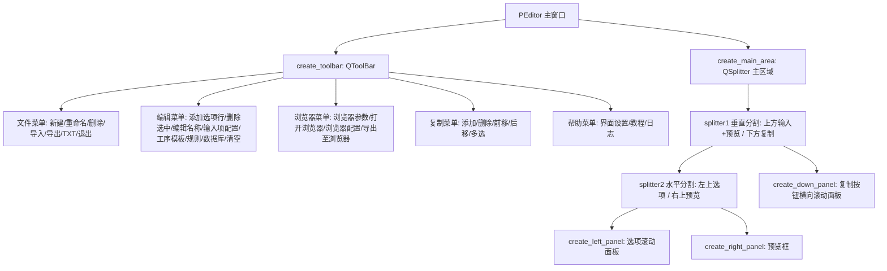

## 2. 模板选择固定首行

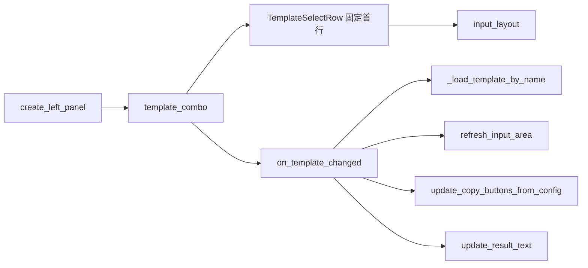

### 说明

- `template_combo` 已从 `QToolBar` 移入左侧选项面板。
- `TemplateSelectRow` 是默认固定第一行，不参与拖拽排序、不参与 `collect_input_values()`。
- 顶部工具栏不再显示模板选择框。
- 浏览器参数用到的 `browser_driver_edit`、`browser_binary_edit`、`browser_url_edit` 仍作为状态控件存在，但已隐藏，避免主界面左上角出现无意义输入框。

## 3. 输入选项区流程

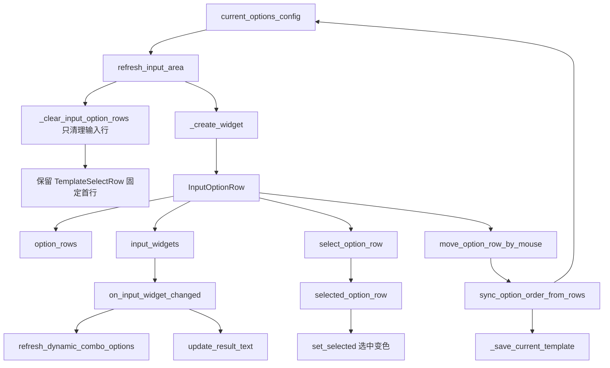

### 关键变量影响

| 变量 | 作用 | 改动影响 |
|---|---|---|
| `template_combo` | 当前模板选择，位于固定首行 | 影响当前模板切换、输入项重建、复制按钮重建、预览刷新 |
| `template_row` | 左侧滚动面板的固定第一行 | 不参与排序，不参与输入值采集 |
| `current_options_config` | 当前模板的输入项配置 | 影响输入项生成、顺序保存、规则字段池、模板保存 |
| `option_rows` | 当前显示的输入行对象 | 影响选择高亮、拖拽排序、输入值采集 |
| `selected_option_row` | 当前选中的输入行 | 影响删除选中、编辑选项名称 |
| `input_widgets` | 输入控件列表 | 影响输入变化监听、清空输入、动态下拉项刷新 |

## 4. 输入行选中变色修正

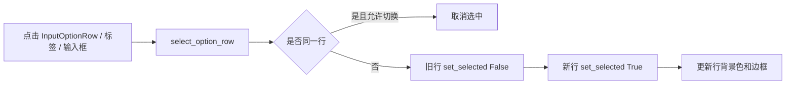

### 说明

- `InputOptionRow.set_selected()` 改为直接设置当前行和拖动柄样式。
- 选中状态有蓝色边框和浅蓝背景。
- 再次点击同一行会取消选中；点击输入控件时会保持选中。

## 5. 复制按钮横向滚动区

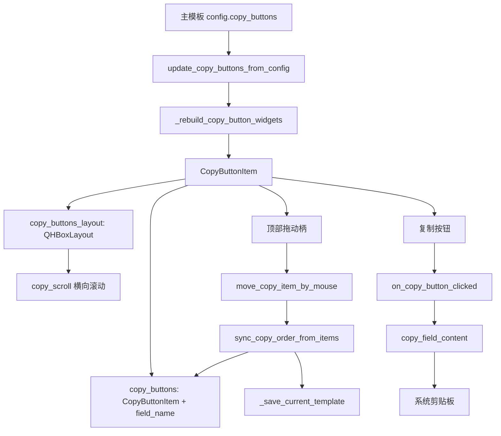

### 复制按钮区设计

- `copy_scroll` 使用横向滚动，不再强制把内容压缩到视口宽度。
- 每个复制项由 `CopyButtonItem` 表示。
- 每个复制项纵向排列：顶部为拖动排序标记 `☰`，下方为复制按钮。
- 多个复制项整体横向排列，按钮较多时通过横向滚动查看。
- 复制按钮仍然只读取主模板 `copy_buttons`，不会从字段池自动恢复，避免删除后刷新又出现。

## 6. 复制按钮选择、多选、拖拽和保存

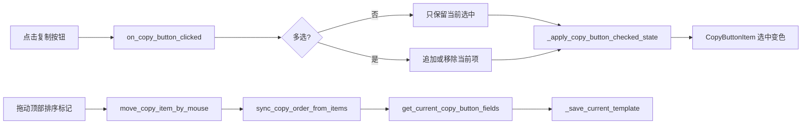

## 7. 预览与导出流程

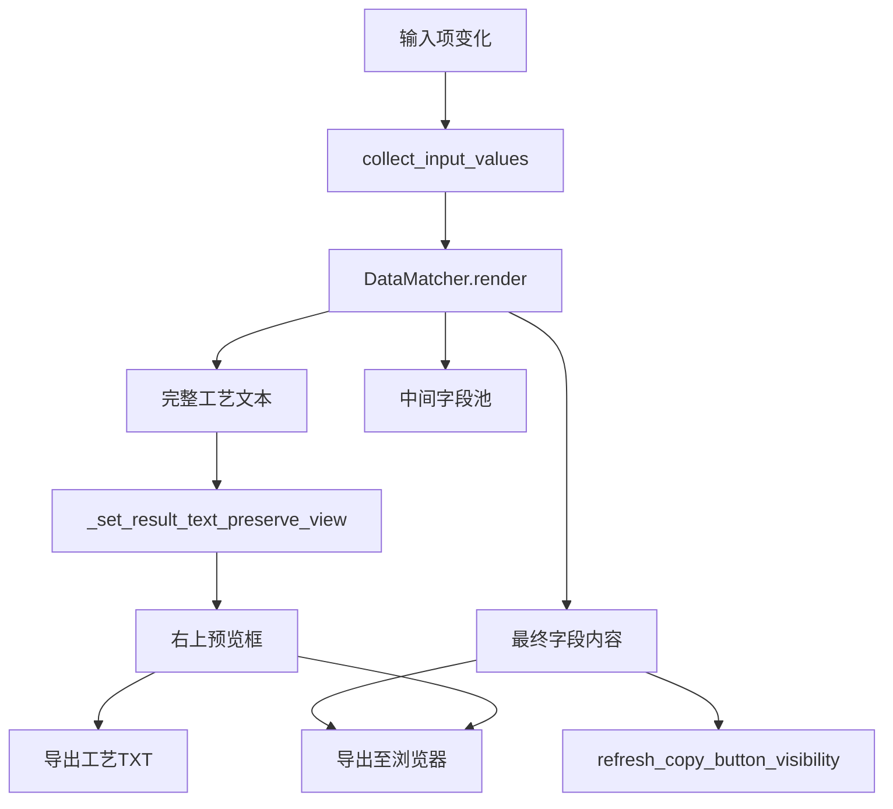

## 8. 浏览器参数流程

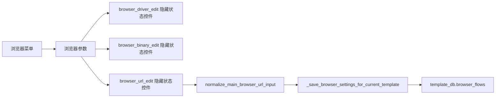

## 9. 后续修改注意事项

1. 不要再把 `template_combo` 放回工具栏；模板选择固定在左侧选项面板第一行。
2. 不要让 `_clear_input_option_rows()` 删除 `TemplateSelectRow`。
3. 不要把 `browser_driver_edit`、`browser_binary_edit`、`browser_url_edit` 加入主界面布局；它们只是隐藏状态控件。
4. 复制按钮区应继续使用 `CopyButtonItem`，保证顶部拖动柄和横向滚动逻辑不丢失。
5. 修改复制按钮排序时，应同步调用 `sync_copy_order_from_items(save=True)` 或 `_save_current_template()`。
6. 修改输入项排序时，应同步调用 `sync_option_order_from_rows(save=True)`。

## 8. 本次补充优化：模板固定行、选中宽度、测试数据库

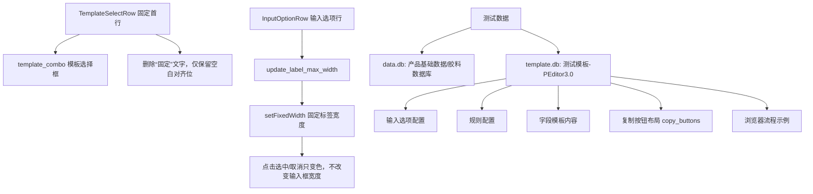

### 8.1 模板固定首行调整

- `TemplateSelectRow` 中删除了可见的“固定”两个字。
- 为了保持模板行与普通输入行左侧对齐，保留了一个空白占位控件，但该控件不显示文字、不显示边框。
- `template_combo` 仍然是固定第一行，不参与 `collect_input_values()`，也不参与拖拽排序。

### 8.2 选项点击后宽度变化的处理

- 原因：输入行点击选中时会刷新样式，若标签只设置 `maximumWidth`，布局可能重新计算标签和输入框的可用宽度，造成视觉上的宽度跳动。
- 处理：`InputOptionRow.update_label_max_width()` 改为按左侧滚动面板宽度计算 `label_width`，并使用 `self.label.setFixedWidth(label_width)` 固定标签宽度。
- 结果：点击选中/取消选中只改变背景色和边框色，不再改变输入框宽度。

### 8.3 测试数据库与模板

本次生成了两份测试文件，放在程序同级目录，便于直接启动后测试：

| 文件 | 内容 | 用途 |
|---|---|---|
| `data.db` | `产品基础数据`、`胶料数据库` 两张测试数据表 | 测试下拉数据源、数据库查询规则 |
| `template.db` | `测试模板-PEditor3.0` | 测试输入项、规则、字段模板、复制按钮布局、浏览器流程示例 |

测试模板包含：

- 输入项：`产品型号`、`牌号`、`数量`、`操作者`、`是否二段硫化`。
- 规则：产品型号查工艺类型/温度/工时，牌号查胶料说明/质量关注点，数量计算抽检数量，复选框生成二段硫化要求。
- 字段模板：`基本信息`、`胶料检查`、`检验要求`、`二段硫化段落`、`浏览器填报摘要`。
- 复制按钮布局：按 `基本信息 → 胶料检查 → 检验要求 → 二段硫化段落 → 浏览器填报摘要` 横向排列。
- 浏览器流程：包含 3 个示例输入步骤，定位值需要按真实网页修改。

## 9. 字体与紧凑程度设置优化

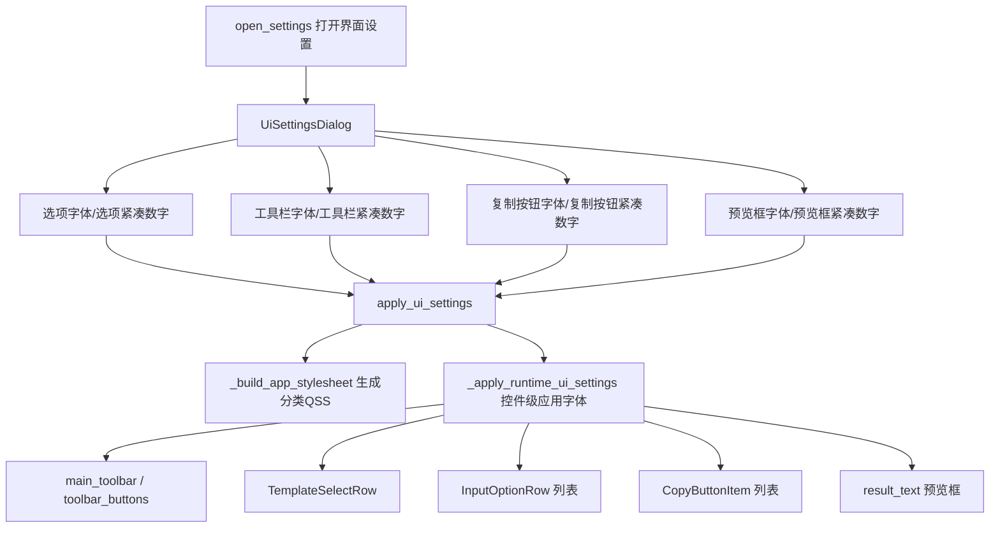

### 9.1 设置项变更

原来只有一个 `font_size` 和一个文字型 `button_compactness`，现在改为 8 个独立数字项：

| 设置键 | 控制范围 | 说明 |
|---|---|---|
| `option_font_size` | 左侧输入选项区 | 控制模板固定行、选项标签、输入框/下拉框字体 |
| `option_compactness` | 左侧输入选项区 | 数字越小越紧凑，影响选项行边距、间距、行高 |
| `toolbar_font_size` | 顶部工具栏 | 控制 `QToolBar/QToolButton/QMenu` 字体 |
| `toolbar_compactness` | 顶部工具栏 | 数字越小越紧凑，影响工具栏菜单按钮高度和内边距 |
| `copy_font_size` | 下方复制按钮区 | 控制复制按钮卡片、拖动柄、复制按钮字体 |
| `copy_compactness` | 下方复制按钮区 | 数字越小越紧凑，影响复制卡片边距、拖动柄高度、按钮高度 |
| `preview_font_size` | 右上预览框 | 控制工艺预览文本字号 |
| `preview_compactness` | 右上预览框 | 控制预览框文本内边距 |

### 9.2 字体设置不生效的处理

本次不再只依赖全局 `QApplication.setStyleSheet()`，而是同时使用两种方式：

1. `_build_app_stylesheet()` 生成分类 QSS，分别控制工具栏、选项行、复制按钮和预览框。
2. `_apply_runtime_ui_settings()` 直接对已存在控件调用 `setFont()` 和 `setMinimumHeight()`，避免 `InputOptionRow.set_selected()`、`CopyButtonItem.set_selected()` 的局部样式覆盖导致字体设置不稳定。

后续如果新增主界面控件，需要根据控件所属区域加入对应分类，否则可能不受界面设置控制。

### 9.3 预览框边框隐藏

- `result_text` 设置 `objectName='previewTextEdit'`。
- `create_right_panel()` 中对 `result_text` 调用 `setFrameShape(QFrame.NoFrame)`。
- `_build_app_stylesheet()` 与 `_apply_runtime_ui_settings()` 均设置 `border: none`，确保预览框内部文本框无边框显示。

## 9. 2026-05-14 字体设置闪退修复

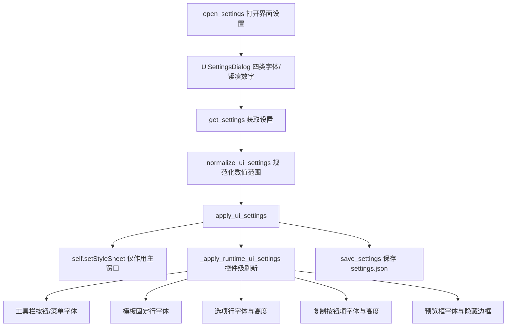

### 本次闪退原因防护

- `apply_ui_settings()` 不再直接使用 `QApplication.setStyleSheet()` 影响整个应用，改为 `self.setStyleSheet()`，避免设置对话框关闭过程中被全局样式刷新牵连。
- `_apply_runtime_ui_settings()` 对工具栏、模板行、选项行、复制按钮、预览框分别容错刷新；如果某个控件已经被 `deleteLater()` 标记或被 Qt 删除，会跳过该控件，不再让异常冒泡导致主程序退出。
- `open_settings()` 增加异常捕获，应用设置失败时弹窗提示并打印 traceback，不再直接闪退。
- `copy_buttons` 遍历兼容 `[(CopyButtonItem, field_name)]` 和旧中间版本 `[CopyButtonItem]` 两种残留结构，避免解包异常。
- 预览框继续使用 `QFrame.NoFrame`、`lineWidth=0`、`viewport` 无边框样式隐藏边框。

## 10. 本次补充优化：总字体缩放与 QFont 统一字号控制

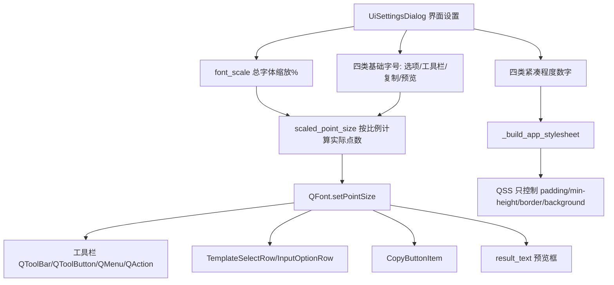

### 10.1 字号控制原则

- 所有字号统一通过 `QFont.setPointSize()` 设置。
- 样式表中不再写 `font-size`，避免 `px` 与 `pt` 混用导致“字号调大反而变小”。
- `font_scale` 是总字体缩放百分比，实际字号由 `scaled_point_size(settings, key, default)` 计算。
- 四类基础字号仍然保留，用于单独控制选项、工具栏、复制按钮、预览框的相对大小。

### 10.2 设置保存与应用流程

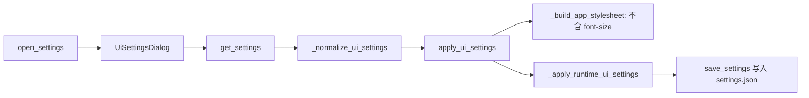

### 10.3 后续修改注意事项

1. 不要在 QSS 中重新加入 `font-size`。
2. 新增需要受界面设置控制的控件时，应在 `_apply_runtime_ui_settings()` 或对应行控件的 `apply_ui_settings()` 中用 `QFont.setPointSize()` 设置。
3. 需要改变控件间距或高度时，仍可修改紧凑程度相关计算；但字号不要混入 padding 或 px 字体设置。
4. 预览框边框隐藏保留在 QSS 与 `QFrame.NoFrame` 两层处理中，但字号只由 QFont 控制。

## 11. 本次补充优化：控件随字体自适应宽高与固定宽文本换行

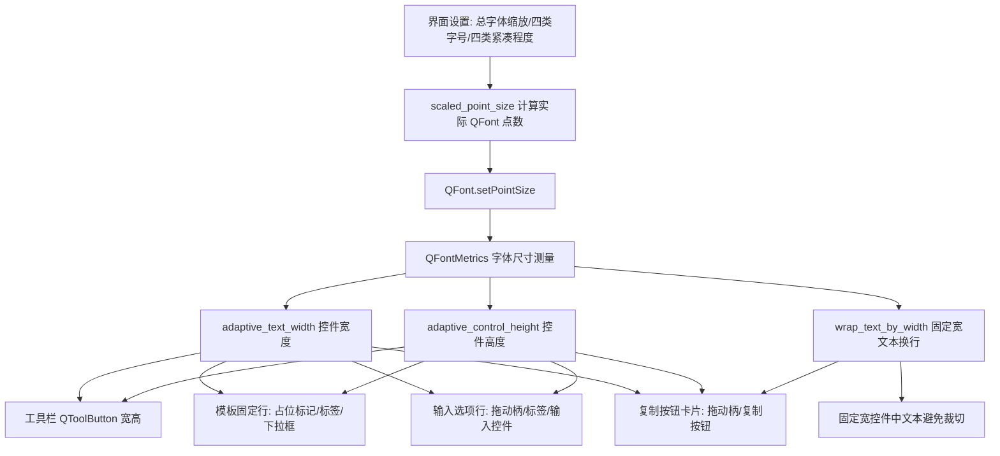

### 11.1 新增/调整的辅助函数

| 函数 | 作用 | 影响区域 |
|---|---|---|
| `font_metrics_for()` | 根据控件或字体返回 `QFontMetrics` | 所有自适应尺寸计算 |
| `text_width_for()` | 兼容不同 PyQt5 版本计算文本宽度 | 工具栏、标签、复制按钮 |
| `adaptive_control_height()` | 根据字体行高和紧凑程度计算控件高度 | 工具栏、输入控件、复制按钮、模板行 |
| `adaptive_text_width()` | 根据文本宽度、字体、紧凑程度计算控件宽度 | 工具栏按钮、模板标签、复制按钮 |
| `wrap_text_by_width()` | 对固定宽度文本插入换行 | 复制按钮文字，避免字号变大后被裁切 |

### 11.2 主界面自适应范围

- 工具栏按钮：在 `_apply_runtime_ui_settings()` 中根据按钮文字、工具栏字体和紧凑程度设置最小宽度、最小高度。
- 模板固定行：`TemplateSelectRow.update_adaptive_size()` 会调整左侧占位标记宽度、模板标签宽度、下拉框宽高。
- 输入选项行：`InputOptionRow.update_adaptive_size()` 会调整拖动柄宽度、标签固定宽度、输入框/下拉框高度；标签 `QLabel.setWordWrap(True)` 保留，用于长标签自动换行。
- 复制按钮卡片：`CopyButtonItem.update_adaptive_size()` 会根据字段名、字体和滚动区宽度计算按钮宽度和高度；字段名过长时用 `wrap_text_by_width()` 插入换行。
- 预览框：仍由预览框字体大小和紧凑程度控制字体与内边距，边框继续隐藏。

### 11.3 后续修改注意事项

1. 如果新增固定宽度按钮或标签，应优先使用 `adaptive_text_width()` 和 `adaptive_control_height()` 计算尺寸。
2. 如果固定宽度控件可能显示长中文或长字段名，应使用 `wrap_text_by_width()` 或 `QLabel.setWordWrap(True)`，避免字体放大后文字被裁切。
3. 不要为了适配字体重新在 QSS 中写 `font-size`；字号仍只通过 `QFont.setPointSize()` 控制。
4. 不是所有控件都需要固定宽度自适应。表格、预览框、输入框主体等可伸缩控件仍交给布局自动拉伸。

## 12. 本次补充优化：输入值持久化、子窗口字体控制与复制选项编辑菜单

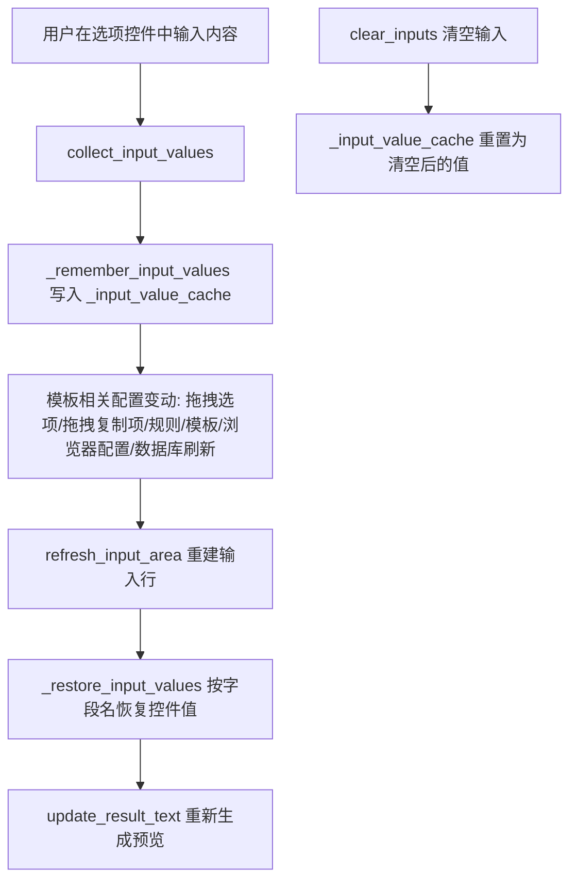

### 12.1 输入内容不被配置操作清空

- `_input_value_cache` 用于保存当前输入内容。
- `_remember_input_values()` 在配置类操作前保存当前输入。
- `_restore_input_values()` 在输入行被重建后按字段名恢复控件值。
- 选项拖动排序、复制按钮拖动排序、输入项配置、规则修改、模板编辑、浏览器配置、数据库刷新等流程都不应主动清空用户已输入内容。
- 只有 `clear_inputs()` 执行真正清空，并同步把 `_input_value_cache` 更新为清空后的状态。

### 12.2 输入控件字体与自动换行

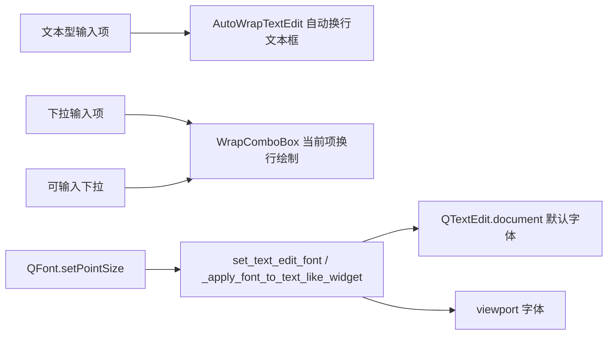

- 文本输入项由单行 `QLineEdit` 改为 `AutoWrapTextEdit`，解决字号变大后文字被裁切、不能换行的问题。
- 普通下拉框使用 `WrapComboBox` 重绘当前项文本，使长文本在控件高度允许时换行显示。
- `set_widget_point_size()` 和 `set_text_edit_font()` 同步设置 QTextEdit 的控件、document、viewport 字体，避免“产品型号”等输入框文字比其他字体小。

### 12.3 子窗口统一字体与自适应尺寸

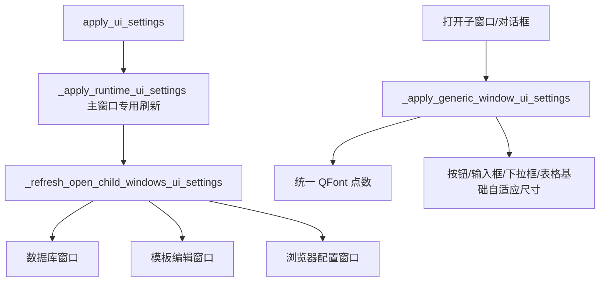

- 浏览器配置窗口、模板编辑窗口、规则窗口、数据库窗口、日志窗口、教程窗口、浏览器参数窗口均通过 `_apply_generic_window_ui_settings()` 应用统一字体缩放。
- 子窗口通用自适应只做基础最小高度、最小宽度和表格行高适配；主界面输入行和复制项仍使用各自专用的 `apply_ui_settings()` 与 `update_adaptive_size()`。

### 12.4 复制菜单调整

- 工具栏“复制”改为“复制选项编辑”。
- 复制选项编辑菜单删除“前移/后移”菜单项，排序仅保留拖动排序。
- 子菜单文字删除“按钮”二字：保留“添加工序”“删除选中”“多选复制”。
- `move_selected_copy_buttons()` 保留为兼容旧逻辑，但主界面入口不再提供左右移动菜单。

### 12.5 后续修改注意事项

1. 任何会重建输入行的函数，重建前应调用 `_remember_input_values()`，重建后应调用 `_restore_input_values()`。
2. 不要在配置窗口关闭、模板内容变化、规则变化、浏览器流程变化时清空输入控件。
3. 新增子窗口后，应在显示前调用 `_apply_generic_window_ui_settings(window)`。
4. 新增文本型输入控件优先使用 `AutoWrapTextEdit`；新增下拉显示长文本时优先使用 `WrapComboBox`。

## 13. 本次补充优化：输入框高度、手动宽度分配与浏览器配置滚动表单

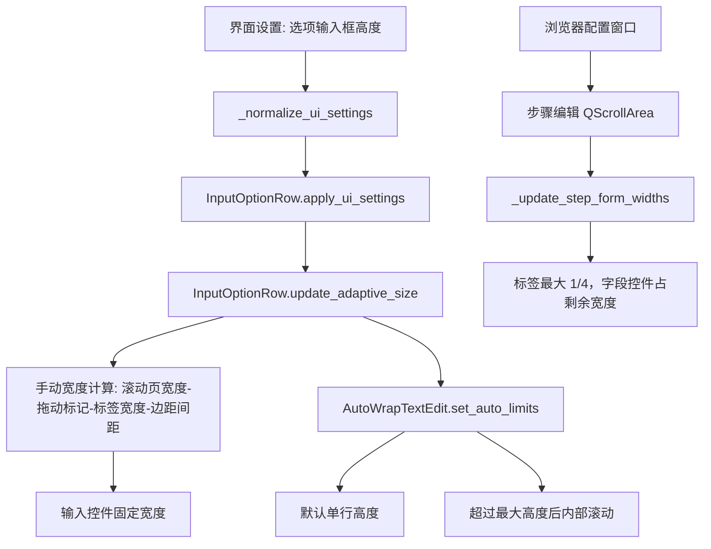

### 13.1 首页输入选项宽度策略

- `InputOptionRow._available_row_width()` 获取首页输入选项滚动页 viewport 宽度。
- `InputOptionRow.update_label_max_width()` 将标签最大宽度限制为滚动页宽度的四分之一；超过后由 `QLabel.setWordWrap(True)` 自动换行。
- `InputOptionRow.update_adaptive_size()` 按以下公式手动计算输入控件宽度：

```text
输入控件宽度 = 滚动页宽度 - 拖动标记宽度 - 标签宽度 - 行布局左右边距 - 两段间距
```

- 输入控件使用 `setFixedWidth()` 接收计算后的宽度，减少 PyQt 弹性布局在字号变化、拖拽刷新时产生的宽度抖动。

### 13.2 输入框高度策略

- 文本型输入项仍使用 `AutoWrapTextEdit`，但初始高度不再按内容默认拉大。
- `AutoWrapTextEdit.set_auto_limits(single_line_height, max_height)` 控制：
  - 默认高度 = 与下拉框一致的单行高度；
  - 内容换行后自动增高；
  - 超过“选项输入框高度”后启用内部滚动条。
- “选项输入框高度”在界面设置面板中配置，并随 `_ui_settings` 保存。

### 13.3 点击输入控件选中本行

- `InputOptionRow.eventFilter()` 同时监听输入控件本体、`QTextEdit.viewport()`、可输入下拉框内部 `lineEdit()`。
- 鼠标点击或获得焦点时调用 `select_option_row(row, toggle=False)`，使点击输入框、下拉框、文本编辑区域都能选中对应行。

### 13.4 浏览器配置窗口滚动步骤编辑区

- `webcontrol.BrowserFlowWindow.init_ui()` 中的“步骤编辑”区域已放入 `QScrollArea`。
- 当步骤编辑字段过多或字号放大时，编辑区纵向滚动浏览，不再把所有控件挤在同一高度内。
- `BrowserFlowWindow._update_step_form_widths()` 按“标签最大 1/4，字段控件占剩余宽度”的策略调整步骤表单宽度。

### 13.5 后续修改注意事项

1. 后续新增首页输入控件时，应放入 `InputOptionRow`，不要直接依赖 `QHBoxLayout.addWidget(widget, 1)` 的弹性宽度。
2. 后续修改选项标签宽度时，优先修改 `update_label_max_width()` 中的 `available_width // 4` 上限规则。
3. 后续调整文本输入框最大高度时，优先修改界面设置中的“选项输入框高度”，不要在 `AutoWrapTextEdit` 中写死高度。
4. 浏览器配置窗口步骤编辑区新增控件后，应确保控件被加入 `self.step_form`，从而自动受 `_update_step_form_widths()` 控制。

## 14. 本次补充优化：标签缩放、行高回缩与子窗口表单标签宽度

```mermaid
flowchart TB
    splitter_drag[拖动首页分割区域] --> viewport_resize[input_scroll viewport Resize]
    viewport_resize --> refresh_rows[_refresh_main_adaptive_rows]
    refresh_rows --> template_row[TemplateSelectRow.update_adaptive_size]
    refresh_rows --> option_row[InputOptionRow.update_adaptive_size]
    option_row --> row_width[行宽固定为滚动页可用宽度]
    option_row --> label_width[标签宽度重新按 1/4 上限计算]
    option_row --> editor_width[输入控件宽度重新计算]
    option_row --> row_height[行高 = max(标签换行高度, 输入控件高度, 拖动标记高度)]
    row_height --> row_max[最大行高 = max(选项输入框高度设置值, 标签换行高度)]

    child_form[子窗口 QFormLayout] --> form_rule[标签最大 1/4，短标签固定自然宽度]
    form_rule --> no_squeeze[避免标签被挤成两行]
```

### 14.1 首页输入行缩放规则

- `InputOptionRow._available_row_width()` 现在扣除了输入滚动页布局左右边距，避免行控件把 `QScrollArea` 内容区撑大。
- `InputOptionRow.update_adaptive_size()` 会将整行宽度固定为滚动页可用宽度，并重新计算拖动标记、标签和输入控件宽度。
- `PEditor.eventFilter()` 监听 `input_scroll.viewport()` 的 resize 事件，拖动分割区域后会调用 `_refresh_main_adaptive_rows()`，保证标签和输入框能随区域变大也能随区域变小。

### 14.2 行高与最大高度规则

- 输入项文本框仍保持单行初始高度。
- 选项行实际高度按 `max(标签换行高度, 输入控件高度, 拖动标记高度)` 计算，避免刚打开程序时背景高度大于输入框过多。
- 选项行最大高度按 `max(界面设置中的选项输入框高度, 标签文字换行后的高度)` 计算；标签换行较多时不会被裁切，输入框内容过多时仍进入内部滚动。

### 14.3 对齐规则

- 首页输入选项行中，拖动标记和标签均按左对齐显示。
- 模板固定行采用同样的左侧占位、标签、下拉框手动宽度计算策略。

### 14.4 子窗口类似问题处理

- `_apply_generic_window_ui_settings()` 中对子窗口 `QFormLayout` 改为 `DontWrapRows`，并为标签设置稳定的最小/最大宽度。
- 短标签按自然宽度显示，不再被压缩成两行；只有超过表单可用宽度四分之一的长标签才在标签内部自动换行。
- `webcontrol.BrowserFlowWindow._update_step_form_widths()` 同步采用相同策略，避免浏览器配置“步骤编辑”标签被挤压。

## 启动失败修复记录（本次）

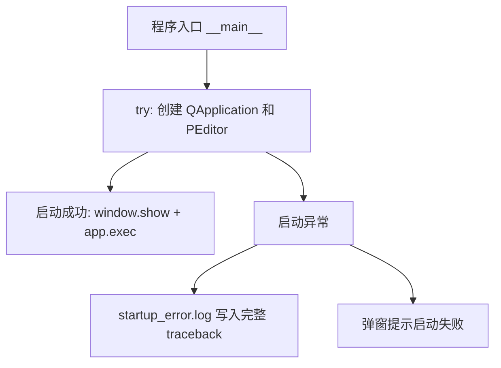

### 本次修复点

1. `AutoWrapTextEdit.update_auto_height()` 增加 `_height_updating` 防重入标记，避免 `resizeEvent -> setFixedHeight -> resizeEvent` 反复触发导致启动卡住或窗口打不开。
2. `InputOptionRow.update_adaptive_size()`、`TemplateSelectRow.update_adaptive_size()`、`CopyButtonItem.update_adaptive_size()` 增加 `_adaptive_updating` 防重入标记，并且只有宽高真正变化时才调用 `setFixedWidth/setFixedHeight`。
3. `BrowserFlowWindow._update_step_form_widths()` 增加 `_updating_step_form_widths` 防重入标记，窗口缩放时改为 `QTimer.singleShot(0, ...)` 延后刷新，避免布局刷新期间反复触发 resize。
4. `load_template_list()` 在程序启动选中默认模板时临时阻断 `template_combo` 信号，避免启动阶段重复执行 `on_template_changed()` 导致重复重建输入区。
5. 程序入口增加 `startup_error.log` 输出。若后续仍发生启动失败，可直接把 exe 同目录下的 `startup_error.log` 发回定位。

## 2026-05-14 输入行高度与缩放调试更新

### 更新目标

1. 输入项文本框默认高度与下拉菜单保持一致，默认在输入行中垂直居中。
2. 当文本内容高度小于当前输入框高度时，不额外撑大；当内容超过当前高度时自动增高，达到“选项输入框高度”设置值后改为内部滚动。
3. 拖动主界面分割区域时，模板行、输入选项行和复制项必须能随滚动区宽度变大，也能主动缩小。
4. 浏览器配置窗口的步骤编辑滚动区同步使用宽度刷新逻辑，避免子控件固定宽度只增不减。

### 关键函数关系

```mermaid
flowchart TB
    input_scroll_resize[首页输入滚动区尺寸变化] --> PEditor_eventFilter[PEditor.eventFilter]
    PEditor_eventFilter --> refresh_rows[_refresh_main_adaptive_rows]
    refresh_rows --> set_panel_width[input_scroll_panel.setFixedWidth(viewport_width)]
    refresh_rows --> template_update[TemplateSelectRow.update_adaptive_size]
    refresh_rows --> option_update[InputOptionRow.update_adaptive_size]

    option_update --> label_width[update_label_max_width: 标签最大为滚动页宽度1/4]
    option_update --> editor_width[输入控件宽度=滚动页宽度-拖动标记-标签-边距]
    option_update --> editor_height[update_editor_adaptive_size]
    editor_height --> auto_text[AutoWrapTextEdit.update_auto_height]
    auto_text --> one_line[内容未超过单行: 保持单行高度]
    auto_text --> grow[内容超过: 增高到设置上限]
    auto_text --> scroll[超过设置上限: 内部滚动]

    browser_step_scroll[浏览器配置步骤编辑滚动区尺寸变化] --> Browser_eventFilter[BrowserFlowWindow.eventFilter]
    Browser_eventFilter --> step_widths[_update_step_form_widths]
    step_widths --> step_panel_width[step_scroll_panel.setFixedWidth(viewport_width)]
    step_widths --> step_label_width[标签宽度最多1/4]
    step_widths --> step_field_width[字段控件固定为剩余宽度]
```

### 调试结论

- 首页输入行不能只依赖 PyQt 的弹性布局，否则子控件固定宽度会把滚动页最小宽度撑大，导致分割区域缩小时行控件不跟随缩小。
- 本次改为在滚动区 resize 时先固定 `input_scroll_panel` 为当前 viewport 宽度，再逐行重新计算控件宽度。
- 文本输入项使用 `AutoWrapTextEdit`，高度由 `single_line_height`、文档真实高度和 `option_input_height` 三者共同控制。
- 浏览器配置窗口中的步骤编辑区同样固定滚动页宽度，并重新计算表单标签和字段控件宽度，避免类似只变大不变小的问题。

## 2026-05-14 分隔栏拖动尺寸叠加修复

### 问题原因

拖动首页分隔栏时，输入行在 `resizeEvent`、滚动区 `eventFilter`、`setFixedWidth/setFixedHeight` 之间反复触发布局刷新。上一轮固定宽度、固定高度没有在下一轮计算前完全释放，部分计算又会读取当前控件尺寸作为备用值，容易出现“越拖越大、只能变大不能缩小”的现象。

### 新处理流程

```mermaid
flowchart TB
    resize[分隔栏/滚动区尺寸变化] --> schedule[_schedule_refresh_main_adaptive_rows 合并刷新]
    schedule --> refresh[_refresh_main_adaptive_rows]
    refresh --> reset[reset_adaptive_constraints 清空旧宽高限制]
    reset --> viewport[读取 input_scroll.viewport 当前宽度]
    viewport --> panel[input_scroll_panel 固定为当前可视宽度]
    panel --> row[InputOptionRow.update_adaptive_size]
    row --> base[只用 viewport 宽度作为本轮计算基准]
    base --> label[标签宽度 = min(自然宽度, viewport/4)]
    base --> editor[输入控件宽度 = viewport - 标记 - 标签 - 边距]
    base --> height[行高 = 标记/标签/输入控件高度最大值]
```

### 本次代码约束

1. `InputOptionRow.resizeEvent()` 和 `TemplateSelectRow.resizeEvent()` 不再主动调用自适应计算，避免自身 `setFixedWidth()` 再次触发布局循环。
2. 每次重算前先执行 `reset_adaptive_constraints()`，清空上一次 `setFixedWidth()` / `setFixedHeight()` 造成的最小最大尺寸约束。
3. `_refresh_main_adaptive_rows()` 增加 `_schedule_refresh_main_adaptive_rows()` 合并刷新，避免一次拖动产生多次排队重算。
4. `InputOptionRow._available_row_width()` 只以 `input_scroll.viewport().width()` 为核心基准，不再把上一轮行宽作为优先参考。
5. 浏览器配置窗口 `BrowserFlowWindow._update_step_form_widths()` 同步清理标签和字段控件旧宽度，再按当前滚动区宽度重新分配。

## 2026-05-14 长文本换行、数值容错与拖动抖动修复

### 1. 输入长文本异常换行修复

```mermaid
flowchart LR
    InputOptionRow[InputOptionRow.update_editor_adaptive_size] --> editor_width[本轮计算 editor_width]
    editor_width --> set_available_text_width[AutoWrapTextEdit.set_available_text_width]
    set_available_text_width --> doc_width[document.setTextWidth]
    doc_width --> update_auto_height[update_auto_height]
    update_auto_height --> row_height[输入行高度]
```

修复原则：文本框换行宽度只使用本轮由滚动区可视宽度计算出的 `editor_width`，不再使用上一轮 `viewport().width()` 或旧的文档宽度，避免长文本在固定旧宽度处异常换行。

### 2. 数量等字段输入非数字时的规则容错

```mermaid
flowchart LR
    formula[数学公式: round/roundup/int/float] --> safe_number[安全数值函数]
    safe_number --> numeric_ok{可转数字?}
    numeric_ok -->|是| result[正常计算]
    numeric_ok -->|否| fallback[返回原始文本/空文本]
```

`datamatch.py` 与 `webengine.py` 中的 `round()`、`roundup()`、`int()`、`float()` 已增加非数字容错。用户在“数量”等输入项输入长文本时，不再因为 `decimal.InvalidOperation` 造成公式错误或导出流程中断。

### 3. 拖动分隔栏时选项行抖动修复

```mermaid
flowchart TB
    resize[滚动区 Resize] --> schedule[延迟合并刷新]
    schedule --> viewport_width[读取当前 viewport 宽度]
    viewport_width --> reset[清除旧 fixed 宽高]
    reset --> recalc[重新计算标签/输入框/行高]
```

输入区滚动条改为稳定占位，避免内容高度变化导致滚动条显隐反复改变 viewport 宽度；浏览器配置窗口的步骤编辑滚动区也采用相同处理，并将尺寸刷新改为防抖调度。

## 15. 本次补充修复：长文本换行、单行高度、下拉菜单换行

```mermaid
flowchart TB
    InputOptionRow[InputOptionRow.update_adaptive_size] --> editor_width[本轮计算出的 editor_width]
    editor_width --> AutoWrapTextEdit[AutoWrapTextEdit.set_available_text_width]
    AutoWrapTextEdit --> no_doc_width[取消 QTextDocument 固定 textWidth]
    no_doc_width --> widget_width[显示换行交给 QTextEdit.WidgetWidth]
    editor_width --> metrics_height[QFontMetrics 按当前宽度计算文本高度]
    metrics_height --> auto_height[update_auto_height]
    auto_height --> single_height[文字高度未超过单行高度: 保持单行高度]
    auto_height --> grow_height[文字高度超过当前高度: 逐步增高]
    auto_height --> max_height[达到选项输入框高度: 内部滚动]

    QComboBox[QComboBox/WrapComboBox] --> configure_combo_word_wrap[configure_combo_word_wrap]
    configure_combo_word_wrap --> ComboWordWrapDelegate[ComboWordWrapDelegate]
    ComboWordWrapDelegate --> popup_wrap[下拉列表项按当前下拉宽度换行]
```

### 15.1 修复原因

- 原先 `AutoWrapTextEdit` 通过 `QTextDocument.setTextWidth()` 固定文档宽度，并在计算高度时调用 `document.adjustSize()`。
- 当分隔栏或窗口宽度变化后，上一轮文档宽度可能仍参与下一轮布局，导致长文本在旧位置异常换行。
- `adjustSize()` 还可能把文档的 ideal width 写回，造成单行文字也被算成更高高度。

### 15.2 新逻辑

1. 显示层：`QTextEdit` 继续使用 `WidgetWidth`，由控件当前实际宽度负责换行。
2. 高度层：不再用 `QTextDocument.adjustSize()` 推导高度，改用 `QFontMetrics.boundingRect()` 按本轮 `editor_width` 计算文本高度。
3. 单行逻辑：当计算出的文字高度没有超过单行高度时，不修改行高；只有真实需要多行显示时才增高。
4. 滚动逻辑：只有超过“选项输入框高度”设置值时才开启文本框内部滚动。
5. 下拉菜单：新增 `ComboWordWrapDelegate`，下拉列表项高度和绘制都允许换行，避免长选项被单行裁切。

### 15.3 后续修改注意事项

- 不要重新在 `AutoWrapTextEdit` 中长期固定 `QTextDocument.textWidth()`。
- 不要在自动高度计算中调用 `document.adjustSize()`。
- 输入行宽度仍应以 `input_scroll.viewport().width()` 为唯一基准。
- 若修改下拉框样式，应保留 `configure_combo_word_wrap()` 对 `ComboWordWrapDelegate` 的设置。

## 10. 2026-05-14 输入文本换行与下拉项换行修复

```mermaid
flowchart TB
    InputOptionRow[InputOptionRow.update_editor_adaptive_size] --> editor_width[本轮计算出的输入控件宽度]
    editor_width --> AutoWrapTextEdit[AutoWrapTextEdit.set_available_text_width]
    AutoWrapTextEdit --> doc_width[document.setTextWidth 当前真实文本宽度]
    doc_width --> height_calc[按当前宽度重新计算文本高度]
    height_calc --> single_baseline[单行基准高度]
    single_baseline --> row_height[只在内容高度超过单行基准时增高]
    row_height --> max_height[达到选项输入框高度后启用内部滚动]

    editor_width --> ComboWrap[configure_combo_word_wrap]
    ComboWrap --> ComboDelegate[ComboWordWrapDelegate]
    ComboDelegate --> popup_width[下拉列表按当前控件宽度绘制]
    popup_width --> popup_height[下拉项按换行后高度显示]
```

### 本次修复要点

1. `AutoWrapTextEdit` 不再把 `QTextDocument.textWidth` 固定为 `-1`。每次行宽变化时，都使用当前输入框真实文本宽度重新 `setTextWidth()`，避免全屏或宽区域下连续长文本不按控件宽度换行。
2. 输入框高度不再直接用旧文档布局或旧控件宽度判断。先计算单行基准高度，只有当前文本按真实宽度排版后的高度超过单行基准时才增高；达到“选项输入框高度”后才出现内部滚动条。
3. `ComboWordWrapDelegate` 的宽度来源改为当前下拉框/列表的 `_pe_wrap_width`，不使用上一轮 `sizeHint` 或内容自然宽度叠加，避免下拉项越撑越宽而看起来不换行。
4. `webcontrol.py` 的浏览器配置窗口下拉项同步使用换行代理，保证子窗口中的下拉菜单也按当前控件宽度换行。

## 本次补充优化：可输入下拉菜单换行、字体重排、表单标签宽度

```mermaid
flowchart TB
    EditableWrapComboBox[EditableWrapComboBox 可输入换行下拉框] --> AutoWrapTextEdit[内部 AutoWrapTextEdit 多行输入层]
    EditableWrapComboBox --> WrapComboBox[保留下拉列表能力]
    InputOptionRow[InputOptionRow.update_editor_adaptive_size] --> EditableWrapComboBox
    InputOptionRow --> current_width[本轮输入控件真实宽度]
    current_width --> set_auto_layout[set_auto_layout 同步文本宽度/单行高度/最大高度]
    set_auto_layout --> current_text_wrap[当前输入文字立即按范围换行]
    set_auto_layout --> popup_wrap[下拉列表按当前下拉框宽度换行]

    apply_ui_settings[apply_ui_settings 字体变化] --> row_update[逐行 update_adaptive_size]
    row_update --> recompute_width[按当前字体 QFontMetrics 重新计算宽度]
    recompute_width --> rewrap_text[重新换行显示]

    UiSettingsDialog[界面设置窗口] --> polish_form[_polish_settings_form]
    polish_form --> stable_labels[标签共享宽度，避免被挤成两行]
    child_windows[其他子窗口 QFormLayout] --> generic_form_width[_apply_generic_window_ui_settings]
    generic_form_width --> readable_layout[标签不拥挤，控件使用剩余宽度]
```

### 说明

1. 原生 `QComboBox` 的可输入区域是 `QLineEdit`，天然只能单行显示；本次新增 `EditableWrapComboBox`，在编辑区域覆盖 `AutoWrapTextEdit`，使“可输入下拉菜单”当前输入文字也能像普通输入文本框一样自动换行。
2. 字体变化后，所有输入行重新以当前 `QFontMetrics` 和当前控件宽度计算换行，不再沿用旧字体宽度。
3. 下拉列表弹出宽度固定为当前下拉框宽度附近，不再被最长选项撑大；超出部分由换行代理绘制。
4. 设置窗口和通用子窗口表单改为共享标签宽度，短标签不再被挤成两行，长标签才允许换行。

## 15. 本次补充修复：可输入下拉菜单选择、即时换行和拖拽卡死

```mermaid
flowchart TB
    EditableWrapComboBox[EditableWrapComboBox 可输入下拉菜单] --> inner_edit[AutoWrapTextEdit 覆盖编辑区]
    EditableWrapComboBox --> popup_view[下拉列表 view]
    popup_view --> _on_view_pressed[_on_view_pressed 点击下拉项]
    EditableWrapComboBox --> _on_popup_activated[_on_popup_activated 激活下拉项]
    _on_view_pressed --> _sync_inner_from_index[_sync_inner_from_index]
    _on_popup_activated --> _sync_inner_from_index
    _sync_inner_from_index --> inner_edit
    _sync_inner_from_index --> currentTextChanged[currentTextChanged 触发预览更新]

    inner_edit --> _on_inner_text_changed[_on_inner_text_changed 输入文本变化]
    _on_inner_text_changed --> update_inner_editor_geometry[update_inner_editor_geometry 立即按当前宽度重排]
    update_inner_editor_geometry --> _request_parent_layout[_request_parent_layout 通知 InputOptionRow 重算高度]
    _request_parent_layout --> InputOptionRow[InputOptionRow.update_adaptive_size]

    handle_mouse_move[拖动柄 mouseMove] --> buttons_check{左键是否仍按下}
    buttons_check -->|否| clear_drag_state[清空 drag_start 和 mouse_dragging]
    buttons_check -->|是| move_row[执行拖拽排序]
```

### 15.1 修复点

1. `EditableWrapComboBox` 增加 `activated` 和 `view().pressed` 双重同步，避免覆盖的多行编辑区导致下拉项点击后没有写回当前值。
2. 输入长文本时，`AutoWrapTextEdit` 内容变化后会立即调用 `update_inner_editor_geometry()` 并通知父级 `InputOptionRow.update_adaptive_size()`，不再等拖动窗口后才换行。
3. 输入选项拖动柄和复制项拖动柄在 `mouseMove` 中检查左键是否仍按下。如果用户拖动分隔栏时鼠标经过拖动柄，不会误进入排序流程，降低卡死风险。
4. 主界面分隔栏 resize 刷新从 20 ms 合并为 60 ms，并缓存本轮可视宽度，减少拖动过程中的重复布局计算。

### 15.2 后续注意

- 可输入下拉菜单的显示值以 `EditableWrapComboBox.inner_text_edit()` 为准，采集输入值时仍通过 `currentText()` 获取。
- 修改下拉菜单显示逻辑时，必须同时检查 `_sync_inner_from_index()`、`_on_inner_text_changed()`、`configure_combo_word_wrap()` 三处，避免选择项、手动输入和下拉列表显示不同步。

## 12. 本次补充优化：最小稳定布局宽度与工具栏菜单稳定

```mermaid
flowchart TB
    viewport_width[input_scroll.viewport 当前宽度] --> effective_width[effective_width=max(viewport_width, option_row_min_layout_width)]
    effective_width --> input_scroll_panel[input_scroll_panel 固定为有效宽度]
    input_scroll_panel --> TemplateSelectRow[模板固定行按有效宽度布局]
    input_scroll_panel --> InputOptionRow[输入选项行按有效宽度布局]
    InputOptionRow --> label_width[标签最大宽度=有效宽度/4]
    InputOptionRow --> editor_width[输入控件宽度=有效宽度-拖动标记-标签-边距]
    editor_width --> text_wrap[文本按稳定宽度换行]

    viewport_width --> narrow{视口是否小于最小稳定宽度}
    narrow -->|是| min_layout[行内控件保持最小稳定宽度，不再继续压缩]
    narrow -->|否| normal_layout[随视口正常变宽/变窄]

    toolbar_menu[工具栏菜单按钮] --> fixed_width[固定菜单按钮宽度]
    fixed_width --> stable_arrow[菜单三角指示位置稳定]
```

### 12.1 输入区最小稳定宽度

- 新增 `input_option_min_layout_width`，作为主界面输入区最小稳定布局宽度。
- `PEditor.option_row_min_layout_width()` 会结合当前选项字体大小计算最终最小宽度。
- 当左侧分割区域小于该宽度时，`input_scroll_panel` 使用最小稳定宽度，并通过水平滚动查看内容。
- `InputOptionRow` 和 `TemplateSelectRow` 均使用 `effective_width=max(视口宽度, 最小稳定宽度)` 作为唯一布局基准。
- 这样可避免长文本在极窄宽度下反复换行、反复改行高，造成拖动分隔栏卡死。

### 12.2 浏览器配置窗口同步策略

- `webcontrol.py` 新增 `step_editor_min_layout_width`。
- 浏览器配置窗口的步骤编辑滚动区小于该宽度时，不再继续压缩表单标签和控件，而是使用水平滚动查看。
- 防止子窗口中长输入模板、备注、下拉框在窄宽度下反复重排。

### 12.3 工具栏菜单三角位置稳定

- 工具栏 `QToolButton` 改为按字体计算后固定宽度。
- QSS 中显式设置 `QToolButton::menu-indicator` 位于按钮右侧。
- 拖动复制项或输入选项后，即使模板保存和布局刷新，也不再改变菜单按钮宽度，从而减少三角图标位置跳动。
