# PEditor 3.0 主界面深度优化变量函数关系流程图

> 本文件用于记录本次基于当前上传代码进行的主界面优化。后续继续改动前，应先参考本文件，尤其注意模板选择固定首行、输入项行控件、复制按钮横向滚动卡片之间的联动关系。

## 1. 主界面总体结构

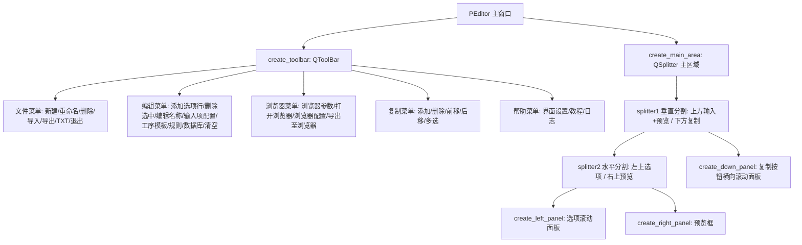

## 2. 模板选择固定首行

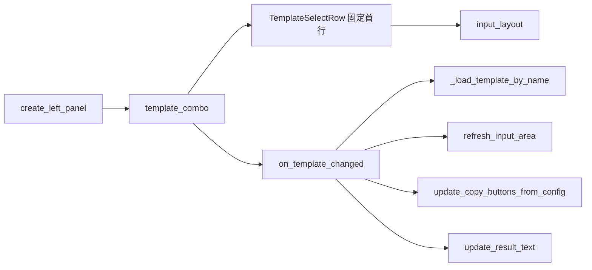

### 说明

- `template_combo` 已从 `QToolBar` 移入左侧选项面板。
- `TemplateSelectRow` 是默认固定第一行，不参与拖拽排序、不参与 `collect_input_values()`。
- 顶部工具栏不再显示模板选择框。
- 浏览器参数用到的 `browser_driver_edit`、`browser_binary_edit`、`browser_url_edit` 仍作为状态控件存在，但已隐藏，避免主界面左上角出现无意义输入框。

## 3. 输入选项区流程

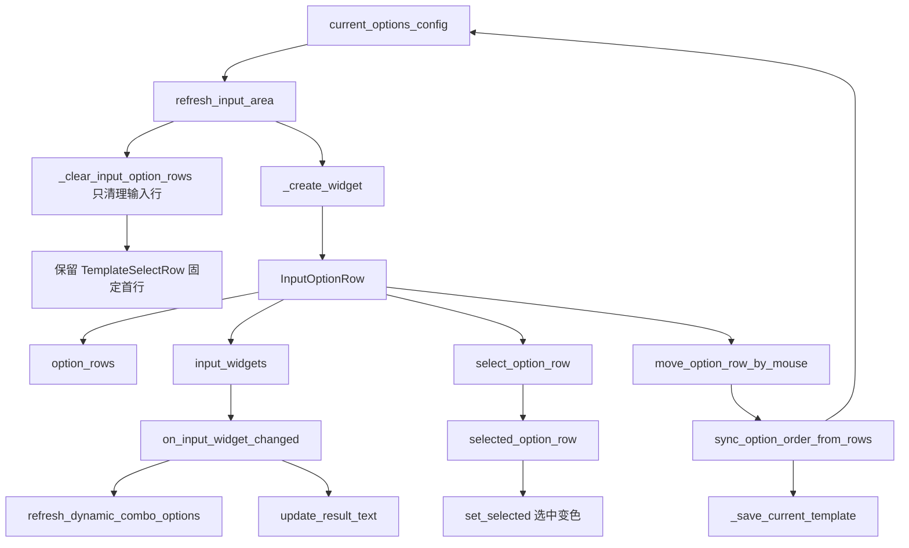

### 关键变量影响

| 变量 | 作用 | 改动影响 |
|---|---|---|
| `template_combo` | 当前模板选择，位于固定首行 | 影响当前模板切换、输入项重建、复制按钮重建、预览刷新 |
| `template_row` | 左侧滚动面板的固定第一行 | 不参与排序，不参与输入值采集 |
| `current_options_config` | 当前模板的输入项配置 | 影响输入项生成、顺序保存、规则字段池、模板保存 |
| `option_rows` | 当前显示的输入行对象 | 影响选择高亮、拖拽排序、输入值采集 |
| `selected_option_row` | 当前选中的输入行 | 影响删除选中、编辑选项名称 |
| `input_widgets` | 输入控件列表 | 影响输入变化监听、清空输入、动态下拉项刷新 |

## 4. 输入行选中变色修正

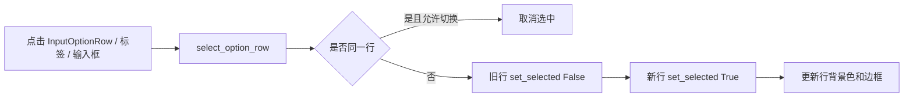

### 说明

- `InputOptionRow.set_selected()` 改为直接设置当前行和拖动柄样式。
- 选中状态有蓝色边框和浅蓝背景。
- 再次点击同一行会取消选中；点击输入控件时会保持选中。

## 5. 复制按钮横向滚动区

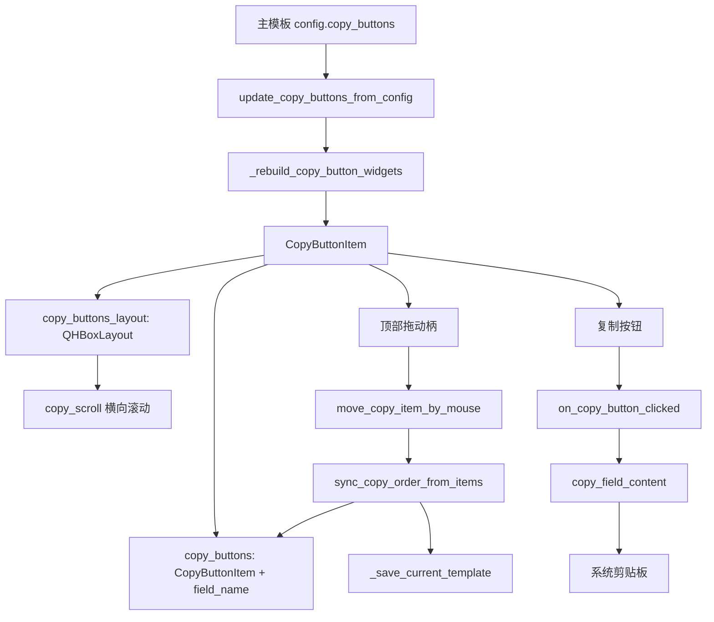

### 复制按钮区设计

- `copy_scroll` 使用横向滚动，不再强制把内容压缩到视口宽度。
- 每个复制项由 `CopyButtonItem` 表示。
- 每个复制项纵向排列：顶部为拖动排序标记 `☰`，下方为复制按钮。
- 多个复制项整体横向排列，按钮较多时通过横向滚动查看。
- 复制按钮仍然只读取主模板 `copy_buttons`，不会从字段池自动恢复，避免删除后刷新又出现。

## 6. 复制按钮选择、多选、拖拽和保存

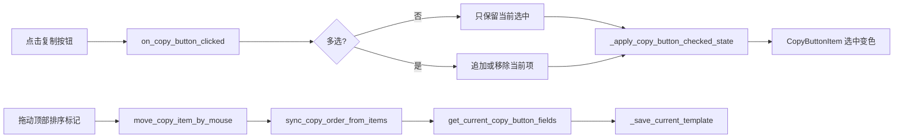

## 7. 预览与导出流程

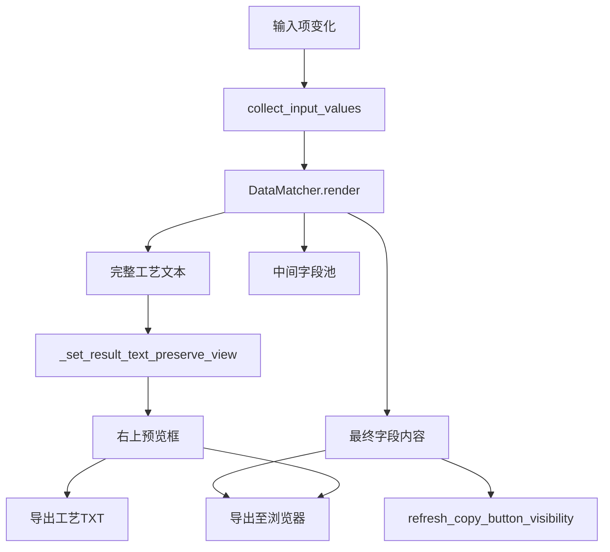

## 8. 浏览器参数流程

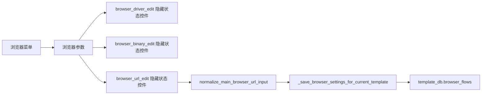

## 9. 后续修改注意事项

1. 不要再把 `template_combo` 放回工具栏；模板选择固定在左侧选项面板第一行。
2. 不要让 `_clear_input_option_rows()` 删除 `TemplateSelectRow`。
3. 不要把 `browser_driver_edit`、`browser_binary_edit`、`browser_url_edit` 加入主界面布局；它们只是隐藏状态控件。
4. 复制按钮区应继续使用 `CopyButtonItem`，保证顶部拖动柄和横向滚动逻辑不丢失。
5. 修改复制按钮排序时，应同步调用 `sync_copy_order_from_items(save=True)` 或 `_save_current_template()`。
6. 修改输入项排序时，应同步调用 `sync_option_order_from_rows(save=True)`。

## 8. 本次补充优化：模板固定行、选中宽度、测试数据库

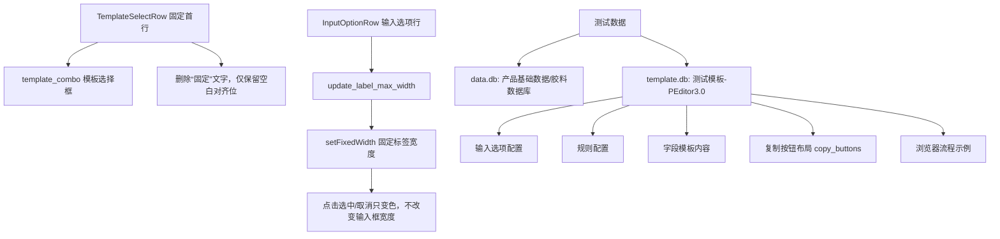

### 8.1 模板固定首行调整

- `TemplateSelectRow` 中删除了可见的“固定”两个字。
- 为了保持模板行与普通输入行左侧对齐，保留了一个空白占位控件，但该控件不显示文字、不显示边框。
- `template_combo` 仍然是固定第一行，不参与 `collect_input_values()`，也不参与拖拽排序。

### 8.2 选项点击后宽度变化的处理

- 原因：输入行点击选中时会刷新样式，若标签只设置 `maximumWidth`，布局可能重新计算标签和输入框的可用宽度，造成视觉上的宽度跳动。
- 处理：`InputOptionRow.update_label_max_width()` 改为按左侧滚动面板宽度计算 `label_width`，并使用 `self.label.setFixedWidth(label_width)` 固定标签宽度。
- 结果：点击选中/取消选中只改变背景色和边框色，不再改变输入框宽度。

### 8.3 测试数据库与模板

本次生成了两份测试文件，放在程序同级目录，便于直接启动后测试：

| 文件 | 内容 | 用途 |
|---|---|---|
| `data.db` | `产品基础数据`、`胶料数据库` 两张测试数据表 | 测试下拉数据源、数据库查询规则 |
| `template.db` | `测试模板-PEditor3.0` | 测试输入项、规则、字段模板、复制按钮布局、浏览器流程示例 |

测试模板包含：

- 输入项：`产品型号`、`牌号`、`数量`、`操作者`、`是否二段硫化`。
- 规则：产品型号查工艺类型/温度/工时，牌号查胶料说明/质量关注点，数量计算抽检数量，复选框生成二段硫化要求。
- 字段模板：`基本信息`、`胶料检查`、`检验要求`、`二段硫化段落`、`浏览器填报摘要`。
- 复制按钮布局：按 `基本信息 → 胶料检查 → 检验要求 → 二段硫化段落 → 浏览器填报摘要` 横向排列。
- 浏览器流程：包含 3 个示例输入步骤，定位值需要按真实网页修改。

## 9. 字体与紧凑程度设置优化

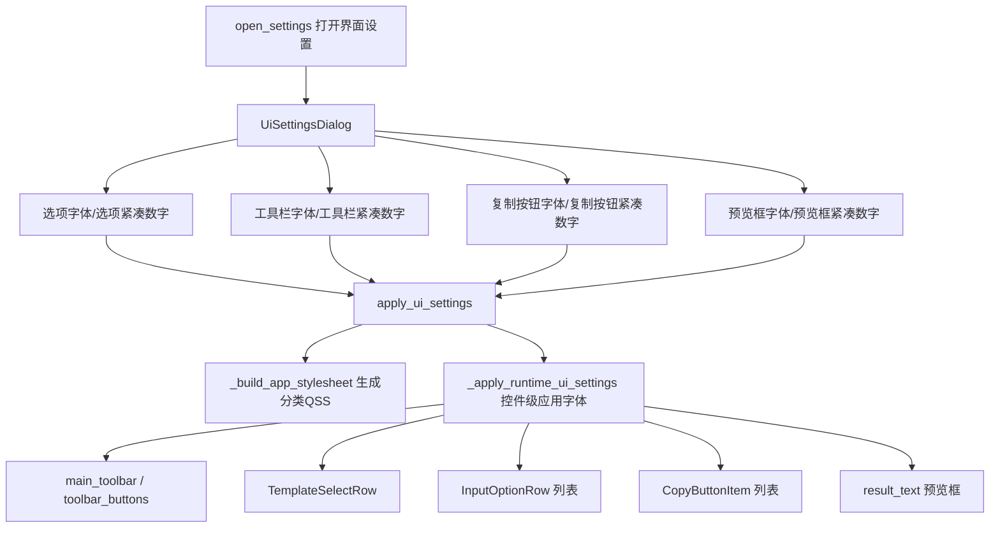

### 9.1 设置项变更

原来只有一个 `font_size` 和一个文字型 `button_compactness`，现在改为 8 个独立数字项：

| 设置键 | 控制范围 | 说明 |
|---|---|---|
| `option_font_size` | 左侧输入选项区 | 控制模板固定行、选项标签、输入框/下拉框字体 |
| `option_compactness` | 左侧输入选项区 | 数字越小越紧凑，影响选项行边距、间距、行高 |
| `toolbar_font_size` | 顶部工具栏 | 控制 `QToolBar/QToolButton/QMenu` 字体 |
| `toolbar_compactness` | 顶部工具栏 | 数字越小越紧凑，影响工具栏菜单按钮高度和内边距 |
| `copy_font_size` | 下方复制按钮区 | 控制复制按钮卡片、拖动柄、复制按钮字体 |
| `copy_compactness` | 下方复制按钮区 | 数字越小越紧凑，影响复制卡片边距、拖动柄高度、按钮高度 |
| `preview_font_size` | 右上预览框 | 控制工艺预览文本字号 |
| `preview_compactness` | 右上预览框 | 控制预览框文本内边距 |

### 9.2 字体设置不生效的处理

本次不再只依赖全局 `QApplication.setStyleSheet()`，而是同时使用两种方式：

1. `_build_app_stylesheet()` 生成分类 QSS，分别控制工具栏、选项行、复制按钮和预览框。
2. `_apply_runtime_ui_settings()` 直接对已存在控件调用 `setFont()` 和 `setMinimumHeight()`，避免 `InputOptionRow.set_selected()`、`CopyButtonItem.set_selected()` 的局部样式覆盖导致字体设置不稳定。

后续如果新增主界面控件，需要根据控件所属区域加入对应分类，否则可能不受界面设置控制。

### 9.3 预览框边框隐藏

- `result_text` 设置 `objectName='previewTextEdit'`。
- `create_right_panel()` 中对 `result_text` 调用 `setFrameShape(QFrame.NoFrame)`。
- `_build_app_stylesheet()` 与 `_apply_runtime_ui_settings()` 均设置 `border: none`，确保预览框内部文本框无边框显示。

## 9. 2026-05-14 字体设置闪退修复

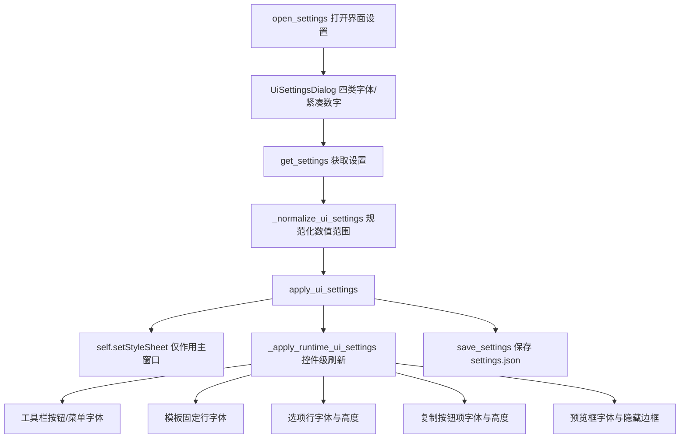

### 本次闪退原因防护

- `apply_ui_settings()` 不再直接使用 `QApplication.setStyleSheet()` 影响整个应用，改为 `self.setStyleSheet()`，避免设置对话框关闭过程中被全局样式刷新牵连。
- `_apply_runtime_ui_settings()` 对工具栏、模板行、选项行、复制按钮、预览框分别容错刷新；如果某个控件已经被 `deleteLater()` 标记或被 Qt 删除，会跳过该控件，不再让异常冒泡导致主程序退出。
- `open_settings()` 增加异常捕获，应用设置失败时弹窗提示并打印 traceback，不再直接闪退。
- `copy_buttons` 遍历兼容 `[(CopyButtonItem, field_name)]` 和旧中间版本 `[CopyButtonItem]` 两种残留结构，避免解包异常。
- 预览框继续使用 `QFrame.NoFrame`、`lineWidth=0`、`viewport` 无边框样式隐藏边框。
