# PEditor 4.0 变量、函数与数据流关系图

> **代码基准**：以用户本次上传的 `PEditor_v4.0_修改线程版(1).zip` 完整源码为唯一修改基准。  
> **用途**：后续修改代码前，先根据本文件确认变量来源、参数传递链、数据库读写点以及受影响功能。  
> **维护原则**：本文件描述“当前实现”，不按历史版本逐条追加旧修改记录。

### 4.0 变更影响总览

| 改动 | 新增或调整的状态 | 直接函数 | 下游影响 |
|---|---|---|---|
| 清理失效复制按钮 | `TemplateEditorWindow.template_saved`、有效字段集合 | `on_process_template_saved()`、`update_copy_buttons_from_config()`、`_sanitize_copy_button_fields()` | 主模板 `copy_buttons`、复制区显示、字段改回旧名后的行为 |
| 浏览器导入线程化 | `BrowserTaskController`、`BrowserTaskWorker`、`_browser_input_backup` | `export_current_to_browser()`、`BrowserFlowWindow.test_import()` | 主界面响应、正式导入、范围测试、日志和完成提示 |
| 强制结束自动控制 | `BrowserTaskController._force_terminating`、`BrowserEngine._recovery_pending` | `force_terminate()`、`recover_driver_if_unresponsive()` | 立即终止线程；3秒后无响应则重建驱动并保留 Chrome |
| 隐藏 ChromeDriver 控制台 | Windows `CREATE_NO_WINDOW` | `_create_driver()` | 只影响 ChromeDriver 子进程窗口，不改变浏览器流程配置 |
| 关闭主面板仅关闭 Driver | `BrowserEngine.driver`、ChromeDriver 服务进程、`browser_process_id` | `PEditor.closeEvent()`、`BrowserEngine.shutdown_driver_only()`、`_terminate_driver_process_only()` | 主程序退出时停止自动控制和 ChromeDriver，保留已打开的 Chrome 窗口及页面；不调用 `driver.quit()`，不结束 Chrome 进程 |
| 记忆上次模板 | `settings.json.last_template_name` | `load_settings()`、`load_template_list()`、`save_settings()`、`closeEvent()` | 程序启动默认模板；不改变模板数据库结构 |
| 精简结果弹窗 | 浏览器日志缓冲区、配置窗口日志框 | `_append_browser_log()`、导入完成/失败回调 | 弹窗只显示状态，步骤与错误详情进入日志框 |

4.0 不修改 `template.db` 三张表的结构，也不修改主模板、工序模板和浏览器流程 JSON 的既有字段，因此 3.9 及更早版本中已可用的模板不需要转换。

---

## 1. 阅读方法

本文件从四个角度描述当前程序：

1. **模块依赖**：哪个文件负责界面、计算、持久化和浏览器执行。
2. **数据流**：输入值、模板、规则、渲染结果和浏览器流程参数如何传递。
3. **函数调用链**：入口函数调用哪些下游函数。
4. **改动影响面**：修改变量或数据结构后，哪些功能必须同步检查。

后续改代码时，应先定位改动属于以下哪条主链：

```text
主模板配置链
输入值与规则渲染链
工序字段模板链
复制字段与浏览器字段链
浏览器流程配置链
浏览器流程执行链
统计变量与循环链
数据库管理链
界面设置链
```

---

## 2. 项目模块总关系

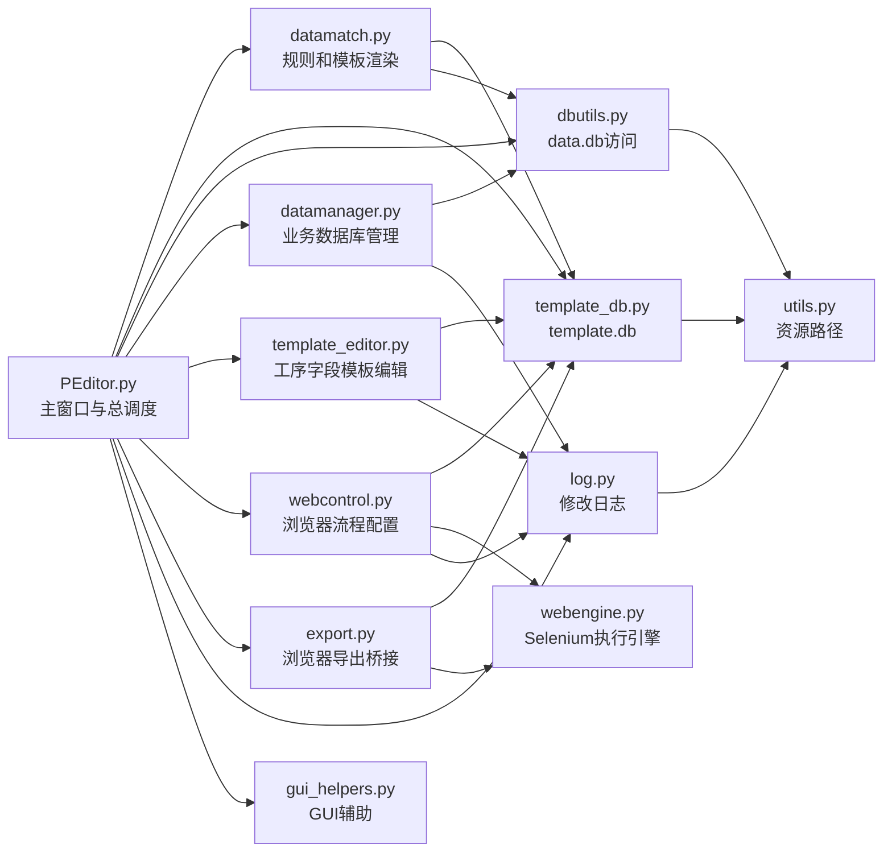
```mermaid
flowchart LR
    UI[PEditor.py\n主窗口与总调度]
    MATCH[datamatch.py\n规则和模板渲染]
    TDB[template_db.py\ntemplate.db]
    DB[dbutils.py\ndata.db访问]
    DM[datamanager.py\n业务数据库管理]
    TE[template_editor.py\n工序字段模板编辑]
    WC[webcontrol.py\n浏览器流程配置]
    EX[export.py\n浏览器导出桥接]
    WE[webengine.py\nSelenium执行引擎]
    LOG[log.py\n修改日志]
    GUI[gui_helpers.py\nGUI辅助]
    UTIL[utils.py\n资源路径]

    UI --> MATCH
    UI --> TDB
    UI --> DB
    UI --> DM
    UI --> TE
    UI --> WC
    UI --> EX
    UI --> LOG
    UI --> GUI

    MATCH --> TDB
    MATCH --> DB
    DM --> DB
    DM --> LOG
    TE --> TDB
    TE --> LOG
    WC --> TDB
    WC --> WE
    WC --> LOG
    EX --> TDB
    EX --> WE

    TDB --> UTIL
    DB --> UTIL
    LOG --> UTIL
```

### 2.1 各模块职责边界

| 文件 | 核心职责 | 不应承担的职责 |
|---|---|---|
| `PEditor.py` | 主窗口、模板切换、输入控件、预览、复制按钮、子窗口调度、浏览器正式导出 | 不直接实现 Selenium 具体动作 |
| `datamatch.py` | 规则计算、公式解析、数据库函数、字段条件、工序文本渲染 | 不保存界面状态，不执行浏览器动作 |
| `template_db.py` | `template.db` 的主模板、工序模板、浏览器流程读写 | 不解释模板内容 |
| `dbutils.py` | `data.db` 的底层 SQL 执行和事务 | 不处理业务界面 |
| `datamanager.py` | 数据表、行、列、CSV 的可视化管理 | 不参与主模板渲染流程调度 |
| `template_editor.py` | 编辑工序字段、字段顺序和显示条件，并向主窗口发送实时内容 | 不执行最终规则渲染 |
| `webcontrol.py` | 浏览器流程编辑界面、步骤配置收集、自动保存、测试导入 | 不实现动作底层 Selenium 行为 |
| `export.py` | 把主窗口数据组织成 `payload`，调用全局 `BrowserEngine` | 不修改模板数据 |
| `webengine.py` | 浏览器连接、元素操作、模板替换、条件分支、循环和流程执行 | 不创建主窗口控件 |
| `log.py` | 记录配置和数据库改动 | 不影响业务结果 |
| `gui_helpers.py` | 信号阻断和文本换行标志 | 不保存状态 |
| `utils.py` | 开发环境与打包环境资源路径统一 | 不包含业务逻辑 |

---

## 3. 持久化数据结构

## 3.1 `template.db`

`TemplateDB.init_db()` 创建三张表：

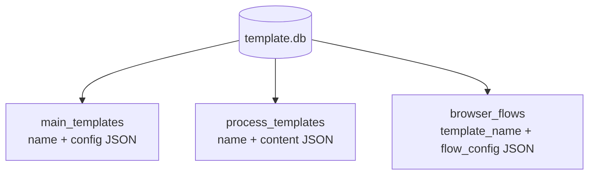
```mermaid
flowchart TB
    TDB[(template.db)]
    TDB --> MAIN[main_templates\nname + config JSON]
    TDB --> PROC[process_templates\nname + content JSON]
    TDB --> FLOW[browser_flows\ntemplate_name + flow_config JSON]
```

### `main_templates.config`

```python
{
    "options": [...],
    "rules": [...],
    "copy_buttons": [...]
}
```

| 字段 | 写入入口 | 读取入口 | 影响功能 |
|---|---|---|---|
| `options` | `PEditor._save_current_template()` | `_load_template_by_name()`、`refresh_input_area()` | 首页输入控件、动态下拉、字段池 |
| `rules` | `PEditor._save_current_template()` | `_load_template_by_name()`、`DataMatcher.render()` | 中间字段、最终字段、条件、浏览器输入 |
| `copy_buttons` | `PEditor._save_current_template()` | `update_copy_buttons_from_config()` | 复制按钮显示、顺序和浏览器同源字段范围 |

### `process_templates.content`

```python
{
    "available_fields": {"字段名": "字段模板正文"},
    "available_field_names": ["字段名", ...],
    "selected_fields": ["字段名", ...],
    "preview_format": "拼接后的原始模板",
    "field_conditions": {"字段名": "条件表达式"}
}
```

| 字段 | 主要用途 | 改动影响 |
|---|---|---|
| `available_fields` | 字段原始正文和公式模板 | 预览、复制字段、浏览器字段值 |
| `available_field_names` | 字段池顺序和补充名称 | 复制按钮新增菜单、浏览器字段插入列表 |
| `selected_fields` | 最终工艺文本拼接顺序 | 预览正文、字段可见性计算 |
| `preview_format` | 无可见字段时的兼容预览文本 | 旧模板回退显示 |
| `field_conditions` | 控制字段是否显示 | 主预览、`final_fields`、复制按钮可见性 |

### `browser_flows.flow_config`

```python
{
    "browser": {...},
    "steps": [step_1, step_2, ...]
}
```

`TemplateDB.update_main_template()` 在模板重命名时会调用 `rename_browser_flow()`，因此主模板名称和浏览器流程的 `template_name` 必须保持一致。

## 3.2 `data.db`

`data.db` 由 `Database` 和 `DataManagerWindow` 管理，表结构由用户动态创建。

数据被以下功能读取：

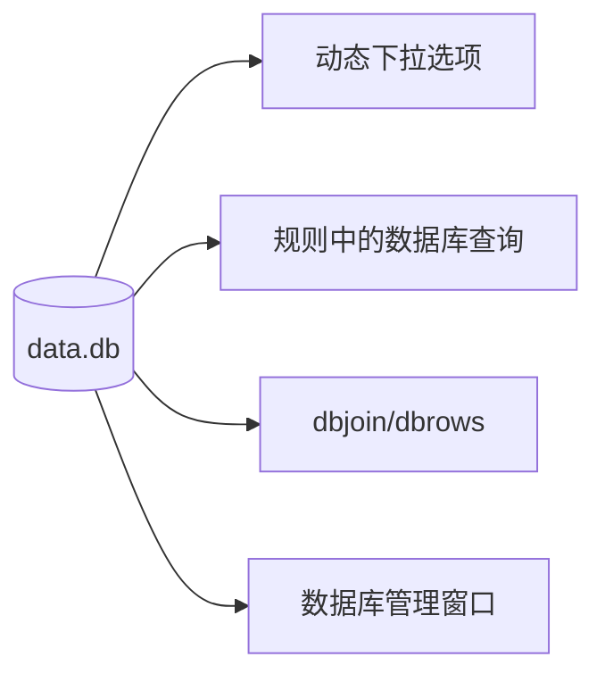
```mermaid
flowchart LR
    DATA[(data.db)] --> COMBO[动态下拉选项]
    DATA --> RULE[规则中的数据库查询]
    DATA --> DBJOIN[dbjoin/dbrows]
    DATA --> MANAGER[数据库管理窗口]
```

## 3.3 其他文件

| 文件 | 写入函数 | 读取函数 | 影响范围 |
|---|---|---|---|
| `settings.json` | `PEditor.save_settings()` | `PEditor.load_settings()` | 字号、紧凑程度、主题颜色、`last_template_name` |
| `modify_log.txt` | `ChangeLogger.write()` | `ChangeLogger.read_text()` | 仅用于审计和查看，不参与计算 |

---

## 4. 主程序启动与核心状态

## 4.1 `PEditor.__init__()` 初始化顺序

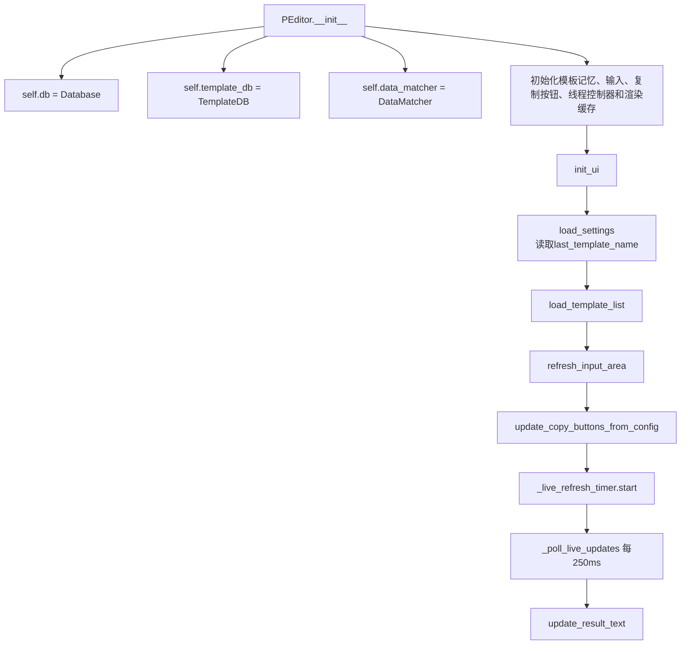
```mermaid
flowchart TB
    START[PEditor.__init__]
    START --> DB1[self.db = Database]
    START --> DB2[self.template_db = TemplateDB]
    START --> MATCH[self.data_matcher = DataMatcher]
    START --> STATE[初始化模板记忆、输入、复制按钮、线程控制器和渲染缓存]
    STATE --> UI[init_ui]
    UI --> SETTINGS[load_settings\n读取last_template_name]
    SETTINGS --> LOAD[load_template_list]
    LOAD --> INPUT[refresh_input_area]
    INPUT --> COPY[update_copy_buttons_from_config]
    COPY --> TIMER[_live_refresh_timer.start]
    TIMER --> POLL[_poll_live_updates 每250ms]
    POLL --> RENDER[update_result_text]
```

## 4.2 主窗口关键状态变量

| 变量 | 来源 | 消费函数 | 修改后主要影响 |
|---|---|---|---|
| `current_template_name` | 模板选择框 | 几乎所有模板、预览和浏览器函数 | 当前全部业务上下文 |
| `current_options_config` | `main_templates.config.options` | `refresh_input_area()`、保存模板 | 输入控件种类、顺序、数据源 |
| `current_rules_config` | `main_templates.config.rules` | `DataMatcher.render()` | 所有计算字段 |
| `option_rows` | `refresh_input_area()` | `collect_input_values()`、排序、选中 | 首页输入值采集 |
| `input_widgets` | `refresh_input_area()` | 兼容采集与清空逻辑 | 输入控件访问 |
| `_input_value_cache` | 输入变化或重建前保存 | `refresh_input_area()`、模板切换 | 配置窗口关闭后是否保留输入 |
| `_live_process_content` | 工序模板窗口实时信号 | `_get_active_process_content_override()` | 未保存时的实时预览 |
| `_last_render_result_text` | `update_result_text()` | TXT导出、浏览器导出、测试导入 | 完整工艺文本 |
| `_last_final_fields` | `update_result_text()` | 复制按钮、浏览器导出、测试导入 | 可见字段最终结果 |
| `_last_data_pool` | `update_result_text()` | 浏览器表达式、变量查找 | 规则计算后的中间字段 |
| `_last_input_values` | `update_result_text()` | 浏览器导出、同源字段缓存 | 当前原始输入快照 |
| `_last_export_signature` | `_build_render_signature()` | 避免重复刷新预览 | 更新频率和界面性能 |
| `browser_flow_window` | `open_browser_flow_editor()` | 正式导出读取未关闭窗口配置 | 当前未保存流程是否立即生效 |
| `_last_template_name` | `settings.json.last_template_name` | `load_template_list()`、`closeEvent()` | 下次启动默认模板 |
| `_browser_input_backup` | 正式导入启动前的 `collect_input_values()` 深拷贝 | 当前导入快照和结束清理 | 线程期间界面输入不被覆盖，也不改变本次导入 |
| `_browser_log_buffer` | 浏览器工作线程日志信号 | `open_browser_flow_editor()`、`BrowserFlowWindow.log()` | 配置窗口关闭时暂存详细日志 |
| `browser_task_controller` | `BrowserTaskController(export.get_engine())` | 正式导入、停止、主窗口退出 | 工作线程完整生命周期 |
| `driver_recovery_controller` | 强制结束后的3秒定时回调 | `DriverRecoveryController.start()`、`closeEvent()` | 驱动响应检查和异步重建，不阻塞主界面 |

### `BrowserEngine` 强制结束相关状态

| 变量 | 设置位置 | 清理位置 | 影响 |
|---|---|---|---|
| `_recovery_pending` | `begin_driver_recovery()` | `recover_driver_if_unresponsive()` 的 `finally`、程序退出 | 3秒监测期间禁止新流程启动 |
| `browser_process_id` | 首次启动 Chrome、驱动重建 | `disconnect()`、`shutdown()`、`shutdown_driver_only()` | 强制重建时用于识别原 Chrome；主面板关闭时只清空内存记录，不结束该 Chrome 进程 |
| `current_config.debug_address` | `launch_browser()` | `shutdown()`、`shutdown_driver_only()` | 驱动重建时用于连接原浏览器；主面板关闭后随程序内存状态一起清空，不影响已打开页面 |
| `driver` | `launch_browser()`、驱动重建 | `disconnect()`、`shutdown()`、`shutdown_driver_only()` | `shutdown_driver_only()` 先置空引用，再只结束 ChromeDriver 服务进程，防止退出后继续控制浏览器 |

---

## 5. 模板切换数据流

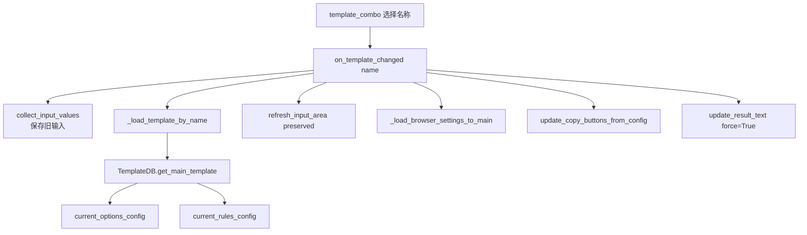
```mermaid
flowchart TB
    SELECT[template_combo 选择名称]
    SELECT --> CHANGE[on_template_changed name]
    CHANGE --> PRESERVE[collect_input_values\n保存旧输入]
    CHANGE --> LOAD[_load_template_by_name]
    LOAD --> MAINDB[TemplateDB.get_main_template]
    MAINDB --> OPT[current_options_config]
    MAINDB --> RULES[current_rules_config]
    CHANGE --> REBUILD[refresh_input_area preserved]
    CHANGE --> BROWSER[_load_browser_settings_to_main]
    CHANGE --> COPY[update_copy_buttons_from_config]
    CHANGE --> RESULT[update_result_text force=True]
```

### 改动注意

- 修改模板加载结构时，必须同步 `_load_template_by_name()` 和 `_save_current_template()`。
- `template_combo.itemData()` 缓存主模板配置；保存后必须调用 `_sync_current_template_combo_item()`，否则界面缓存和数据库内容会不一致。
- 模板切换前调用 `collect_input_values()`，用于尽量保留输入；修改输入控件类型时要同步 `_set_widget_value()` 和 `collect_input_values()`。

---

## 6. 首页输入控件与动态下拉数据流

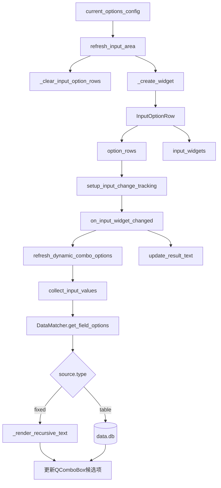
```mermaid
flowchart TB
    OPT[current_options_config]
    OPT --> REFRESH[refresh_input_area]
    REFRESH --> CLEAR[_clear_input_option_rows]
    REFRESH --> CREATE[_create_widget]
    CREATE --> ROW[InputOptionRow]
    ROW --> ROWS[option_rows]
    ROW --> WIDGETS[input_widgets]
    ROWS --> TRACK[setup_input_change_tracking]
    TRACK --> CHANGE[on_input_widget_changed]
    CHANGE --> DYNAMIC[refresh_dynamic_combo_options]
    CHANGE --> RENDER[update_result_text]

    DYNAMIC --> COLLECT[collect_input_values]
    COLLECT --> OPTIONS[DataMatcher.get_field_options]
    OPTIONS --> FIXED{source.type}
    FIXED -->|fixed| FORMULA[_render_recursive_text]
    FIXED -->|table| DATA[(data.db)]
    FORMULA --> COMBO[更新QComboBox候选项]
    DATA --> COMBO
```

### 输入值采集格式

`collect_input_values()` 按控件类型生成：

```python
{
    "选项标签": "字符串值"
}
```

- `QTextEdit` → `toPlainText()`
- `QLineEdit` → `text()`
- `QComboBox` → `currentText()`
- `QCheckBox` → 字符串 `"True"` 或 `"False"`

### 改动影响

| 修改项 | 必须检查的函数 |
|---|---|
| 新增输入控件类型 | `_create_widget()`、`collect_input_values()`、`_set_widget_value()`、`clear_inputs()`、字体适配函数 |
| 修改选项标签 | 规则字段名、模板占位符、动态下拉公式、输入缓存键 |
| 修改动态下拉刷新时机 | `on_input_widget_changed()`、`refresh_dynamic_combo_options()`、防递归变量 `_updating_option_sources` |
| 修改固定选项公式语法 | `DataMatcher.get_field_options()`、`_render_recursive_text()` |

---

## 7. 规则、模板与预览的完整数据流

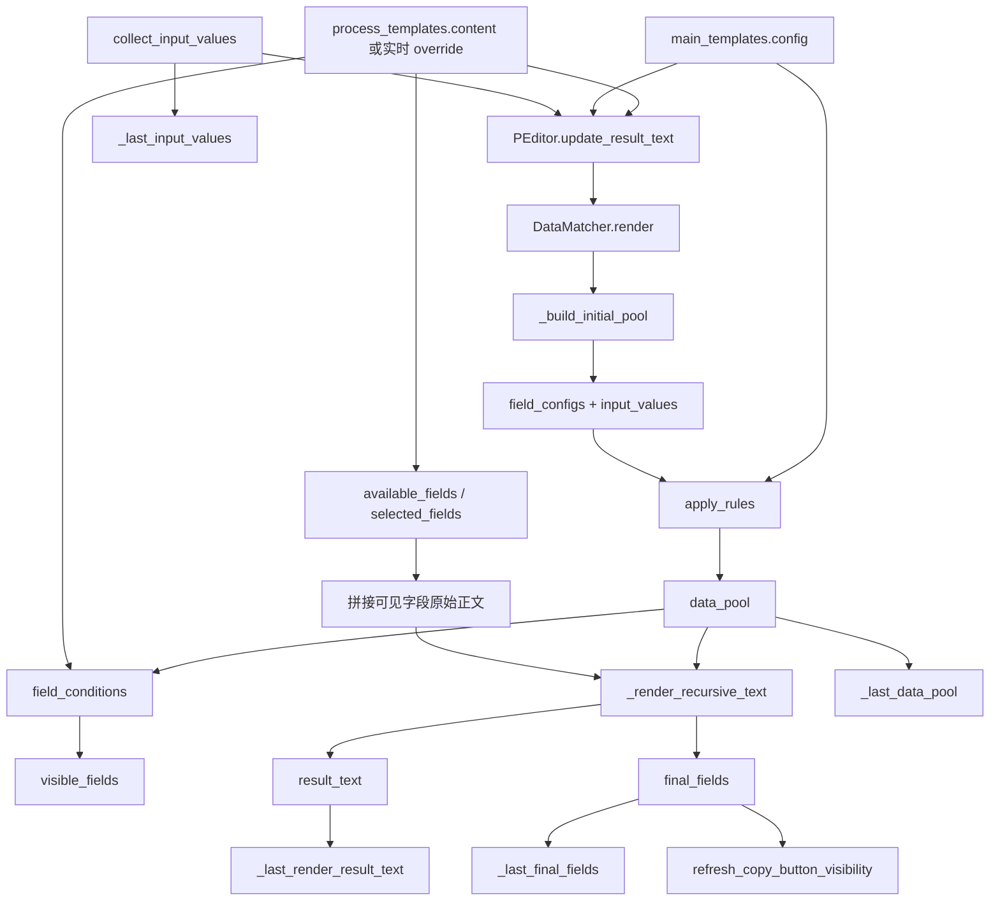
```mermaid
flowchart TB
    INPUT[collect_input_values]
    MAIN[main_templates.config]
    PROC[process_templates.content 或实时 override]

    INPUT --> UPDATE[PEditor.update_result_text]
    MAIN --> UPDATE
    PROC --> UPDATE
    UPDATE --> RENDER[DataMatcher.render]

    RENDER --> INIT[_build_initial_pool]
    INIT --> POOL0[field_configs + input_values]
    POOL0 --> RULES[apply_rules]
    MAIN --> RULES
    RULES --> POOL[data_pool]

    PROC --> CONDITIONS[field_conditions]
    POOL --> CONDITIONS
    CONDITIONS --> VISIBLE[visible_fields]

    PROC --> RAW[available_fields / selected_fields]
    RAW --> TEMPLATE[拼接可见字段原始正文]
    TEMPLATE --> RECURSIVE[_render_recursive_text]
    POOL --> RECURSIVE
    RECURSIVE --> RESULT[result_text]
    RECURSIVE --> FINAL[final_fields]

    RESULT --> CACHE1[_last_render_result_text]
    FINAL --> CACHE2[_last_final_fields]
    POOL --> CACHE3[_last_data_pool]
    INPUT --> CACHE4[_last_input_values]
    FINAL --> COPYVIS[refresh_copy_button_visibility]
```

## 7.1 `DataMatcher.render()` 参数与返回值

```python
render(
    main_template_name,
    input_values,
    main_config_override=None,
    process_content_override=None,
) -> (result, data_pool, final_fields)
```

| 参数 | 正常来源 | override用途 |
|---|---|---|
| `main_template_name` | `PEditor.current_template_name` | 决定读取哪组模板 |
| `input_values` | `collect_input_values()` | 当前用户输入 |
| `main_config_override` | 通常为空 | 临时测试主配置 |
| `process_content_override` | `_live_process_content` 或复制单字段临时内容 | 未保存实时预览、单字段同源渲染 |

返回值：

| 返回值 | 含义 | 下游用途 |
|---|---|---|
| `result` | 可见字段拼接后的完整工艺文本 | 主预览、TXT、浏览器 `{__RESULT__}` |
| `data_pool` | 初始字段和规则按顺序执行后的中间池 | 后续规则、条件、浏览器表达式 |
| `final_fields` | 每个可见字段独立递归渲染后的最终值 | 复制按钮、浏览器字段输入 |

## 7.2 字段值解析优先级

在 `DataMatcher.render()` 内，字段解析顺序为：

```text
data_pool
    ↓ 若不存在
input_values
    ↓ 若不存在
available_fields 原始配置
    ↓
空字符串
```

因此：

- 规则输出字段可以覆盖同名输入字段。
- 规则输出字段可以覆盖同名工序字段原始内容。
- 修改规则输出字段名，可能同时改变字段条件、预览、复制按钮和浏览器步骤。

## 7.3 规则按顺序执行

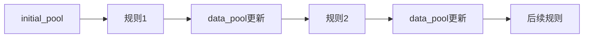
```mermaid
flowchart LR
    START[initial_pool]
    START --> R1[规则1]
    R1 --> P1[data_pool更新]
    P1 --> R2[规则2]
    R2 --> P2[data_pool更新]
    P2 --> RN[后续规则]
```

`apply_rules()` 每执行一条规则就立即写回 `data_pool`，后面的规则可以读取前面规则的输出。因此**规则顺序是业务逻辑的一部分**。

### 规则操作影响

| 操作 | 输入 | 输出 | 依赖 |
|---|---|---|---|
| 直接传递 | `data_pool[input_field]` | `data_pool[output_field]` | 字段名称 |
| 数学公式 | 公式中引用当前 `data_pool` | 字符串结果 | 表达式解析函数 |
| 数据库查询 | 输入字段值、表、查询列、返回列 | 第一条匹配值 | `Database.fetch_all()` |

## 7.4 `dbjoin/dbrows` 数据流

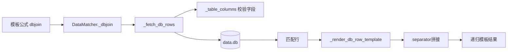
```mermaid
flowchart LR
    EXPR[模板公式 dbjoin]
    EXPR --> DBJOIN[DataMatcher._dbjoin]
    DBJOIN --> FETCH[_fetch_db_rows]
    FETCH --> COLS[_table_columns 校验字段]
    FETCH --> DATA[(data.db)]
    DATA --> ROWS[匹配行]
    ROWS --> ROWTPL[_render_db_row_template]
    ROWTPL --> JOIN[separator拼接]
    JOIN --> TEXT[递归模板结果]
```

修改数据库表名、查询列或字段名时，要同时检查：

- 输入项的数据表数据源；
- 规则中的数据库查询；
- 工序字段正文中的 `dbjoin/dbrows`；
- 固定选项公式中的 `dbjoin/dbrows`。

---

## 8. 工序模板实时编辑链

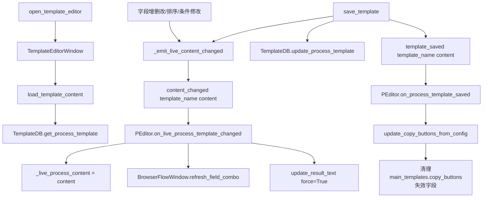
```mermaid
flowchart TB
    OPEN[open_template_editor]
    OPEN --> EDITOR[TemplateEditorWindow]
    EDITOR --> LOAD[load_template_content]
    LOAD --> PROCDB[TemplateDB.get_process_template]

    USER[字段增删改/排序/条件修改]
    USER --> EMIT[_emit_live_content_changed]
    EMIT --> SIGNAL[content_changed template_name content]
    SIGNAL --> MAIN[PEditor.on_live_process_template_changed]
    MAIN --> LIVE[_live_process_content = content]
    MAIN --> FIELDS[BrowserFlowWindow.refresh_field_combo]
    MAIN --> RENDER[update_result_text force=True]

    SAVE[save_template]
    SAVE --> WRITE[TemplateDB.update_process_template]
    SAVE --> EMIT
    SAVE --> SAVED[template_saved template_name content]
    SAVED --> CLEAN[PEditor.on_process_template_saved]
    CLEAN --> FILTER[update_copy_buttons_from_config]
    FILTER --> MAINDB[清理main_templates.copy_buttons失效字段]
```

### 实时内容与数据库内容的选择

`PEditor._get_active_process_content_override()` 只有在以下条件同时满足时返回实时内容：

1. 工序模板窗口仍存在；
2. 当前模板名称与编辑器模板名称一致；
3. `_live_process_content` 不为空。

否则使用 `TemplateDB.get_process_template()` 中已保存内容。

### 改动影响

- 修改 `TemplateEditorWindow.get_current_content()` 的字段结构时，必须同步 `DataMatcher.render()`、`PEditor._get_all_process_field_names()` 和模板导入导出。
- 修改实时信号参数时，必须同步 `on_live_process_template_changed(template_name, content)`。
- 未保存内容也会影响主预览和正式浏览器导出，因此不要只在 `save_template()` 后刷新。
- 失效复制按钮只在 `template_saved` 后持久化清理；未保存的临时重命名不会误删主模板按钮。

---

## 9. 复制字段与浏览器字段同源链

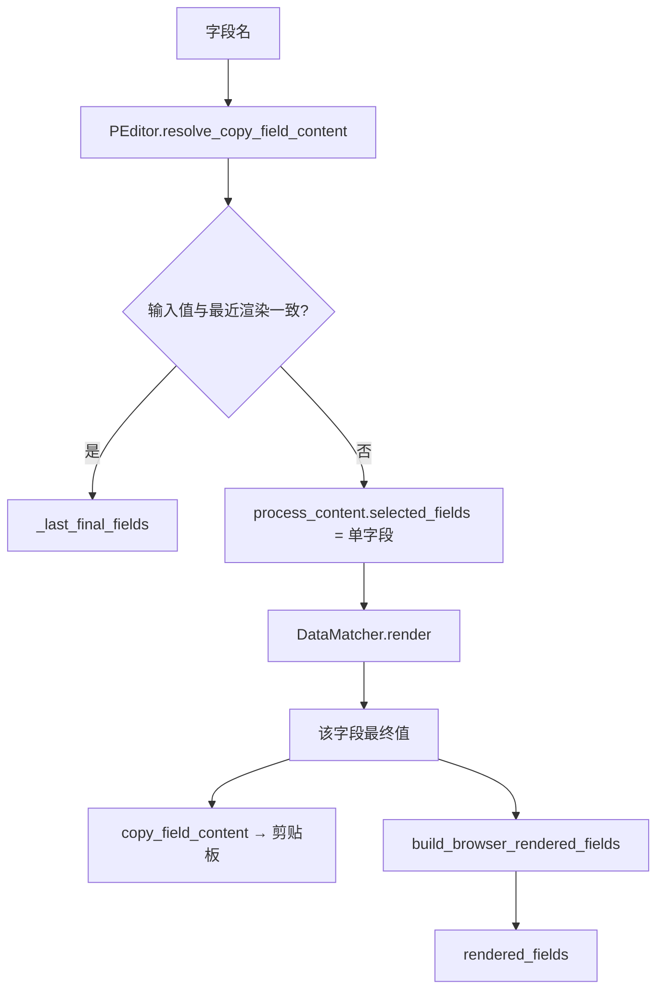
```mermaid
flowchart TB
    FIELD[字段名]
    FIELD --> RESOLVE[PEditor.resolve_copy_field_content]
    RESOLVE --> CACHE{输入值与最近渲染一致?}
    CACHE -->|是| FINAL[_last_final_fields]
    CACHE -->|否| OVERRIDE[process_content.selected_fields = 单字段]
    OVERRIDE --> RENDER[DataMatcher.render]
    RENDER --> VALUE[该字段最终值]

    VALUE --> CLIP[copy_field_content → 剪贴板]
    VALUE --> BUILD[build_browser_rendered_fields]
    BUILD --> RENDERED[rendered_fields]
```

### 关键目的

复制按钮和正式浏览器导入共用 `resolve_copy_field_content()`，避免两套公式解析造成内容不一致。

### 改动影响

| 修改位置 | 影响 |
|---|---|
| `resolve_copy_field_content()` | 复制内容和正式浏览器字段同时变化 |
| `_get_all_process_field_names()` | 浏览器预渲染字段覆盖范围、字段插入列表 |
| `DataMatcher.render()` | 主预览、复制按钮、浏览器字段全部变化 |
| `build_browser_rendered_fields()` | 正式浏览器导出字段查找优先级 |

---

## 10. 正式浏览器导出数据流

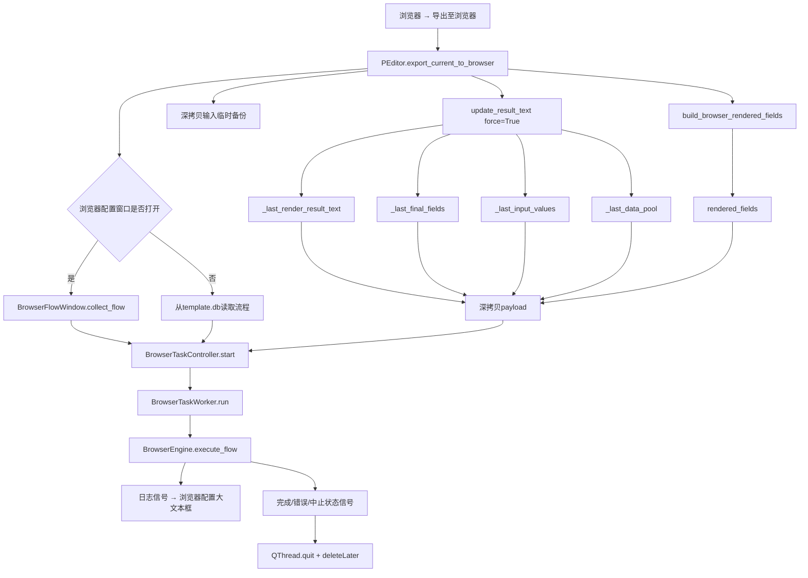
```mermaid
flowchart TB
    CLICK[浏览器 → 导出至浏览器]
    CLICK --> FUNC[PEditor.export_current_to_browser]
    FUNC --> UPDATE[update_result_text force=True]
    FUNC --> BACKUP[深拷贝输入临时备份]
    FUNC --> OPENFLOW{浏览器配置窗口是否打开}
    OPENFLOW -->|是| COLLECT[BrowserFlowWindow.collect_flow]
    OPENFLOW -->|否| DBFLOW[从template.db读取流程]
    FUNC --> RF[build_browser_rendered_fields]

    UPDATE --> RESULT[_last_render_result_text]
    UPDATE --> FINAL[_last_final_fields]
    UPDATE --> INPUT[_last_input_values]
    UPDATE --> POOL[_last_data_pool]
    RF --> RENDERED[rendered_fields]

    RESULT --> SNAPSHOT[深拷贝payload]
    FINAL --> SNAPSHOT
    INPUT --> SNAPSHOT
    POOL --> SNAPSHOT
    RENDERED --> SNAPSHOT
    COLLECT --> THREAD[BrowserTaskController.start]
    DBFLOW --> THREAD
    SNAPSHOT --> THREAD
    THREAD --> WORKER[BrowserTaskWorker.run]
    WORKER --> ENGINE[BrowserEngine.execute_flow]
    ENGINE --> LOG[日志信号 → 浏览器配置大文本框]
    ENGINE --> DONE[完成/错误/中止状态信号]
    DONE --> CLEAN[QThread.quit + deleteLater]
```

## 10.1 正式导出的 `payload`

```python
{
    "template_name": template_name,
    "result_text": result_text,
    "rendered_fields": rendered_fields,
    "final_fields": final_fields,
    "input_values": input_values,
    "data_pool": data_pool,
}
```

`BrowserEngine._payload_lookup_static()` 查找普通字段时的优先级：

```text
payload 顶层变量
    ↓
rendered_fields
    ↓
final_fields
    ↓
data_pool
    ↓
input_values
```

特殊字段包括：

```text
__RESULT__ / RESULT_TEXT
__TEMPLATE__ / TEMPLATE_NAME
__NL__ / NL / __BR__ / 换行
__INDEX__ / __LOOP_INDEX__
```

正式导入和测试导入都在启动线程前构造 `rendered_fields`，并与 `result_text`、`final_fields`、`input_values`、`data_pool` 一起深拷贝。工作线程只读该次快照；主界面之后的输入、模板切换或流程编辑不会改变已经开始的任务。

---

## 11. 浏览器流程配置的正向与反向数据流

## 11.1 从数据库加载到界面

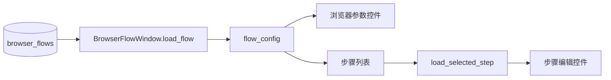
```mermaid
flowchart LR
    DB[(browser_flows)] --> LOAD[BrowserFlowWindow.load_flow]
    LOAD --> FLOW[flow_config]
    FLOW --> BROWSER[浏览器参数控件]
    FLOW --> LIST[步骤列表]
    LIST --> SELECT[load_selected_step]
    SELECT --> EDITORS[步骤编辑控件]
```

## 11.2 从界面保存到数据库


```mermaid
flowchart LR
    EDITORS[步骤编辑控件]
    EDITORS --> DICT[current_step_dict]
    DICT --> CURRENT[flow_config.steps 当前项]
    CURRENT --> AUTO[_save_flow_config_silent]
    AUTO --> COLLECT[浏览器设置 + steps]
    COLLECT --> DB[TemplateDB.update_browser_flow]
```

`current_step_dict()` 是步骤字段从界面进入配置 JSON 的唯一集中入口。新增步骤参数时至少要同步：

```text
1. __init__/init_ui 中创建控件
2. _new_step 中设置默认值
3. current_step_dict 中收集值
4. load_selected_step 中回填值
5. update_action_visibility 中控制显示
6. execute_flow 或动作辅助函数中读取值
7. 教程与本流程图
```

## 11.3 浏览器流程配置结构

### 浏览器参数

```python
{
    "connect_mode": "launch",
    "chromedriver_path": "",
    "chrome_binary": "",
    "debug_address": "127.0.0.1:9222",
    "debug_port": 9222,
    "start_url": "",
    "implicit_wait": 0.5,
}
```

### 步骤通用字段

| 字段组 | 字段 | 主要读取位置 |
|---|---|---|
| 标识 | `name`, `action`, `condition_expr`, `note` | `execute_flow()`、步骤列表 |
| 主定位 | `locator_type`, `locator_value` | 元素查找动作 |
| 目标定位 | `target_locator_type`, `target_locator_value` | 拖拽、右键菜单、两段式下拉 |
| 输入模板 | `value_template` | 输入、键盘、JS、表格填充等 |
| 等待 | `wait_timeout`, `wait_clickable` | 等待和普通动作 |
| 分支 | `page_condition_expr`, `detect_mode`, `on_*_step`, `on_*_message` | 页面条件判断 |
| 循环 | `loop_marker`, `loop_start`, `loop_stop` | 循环开始和结束 |
| 循环表 | `loop_enabled`, `loop_row_marker`, `loop_col_marker`, `loop_row_labels`, `loop_col_labels`, `loop_values` | `_prepare_step_for_loop()` |
| 统计 | `count_result_name` | 统计元素数量 |
| 拖拽 | `drop_position`, `drag_offset_*`, `drag_steps`, `drag_*_seconds`, `drag_wait_target_ready` | `_drag_drop_element()` |
| 跳转 | `jump_step` | 跳转至步骤 |
| 窗口 | `window_match_type`, `window_match_value` | 切换窗口 |

---

## 12. 测试导入执行范围数据流

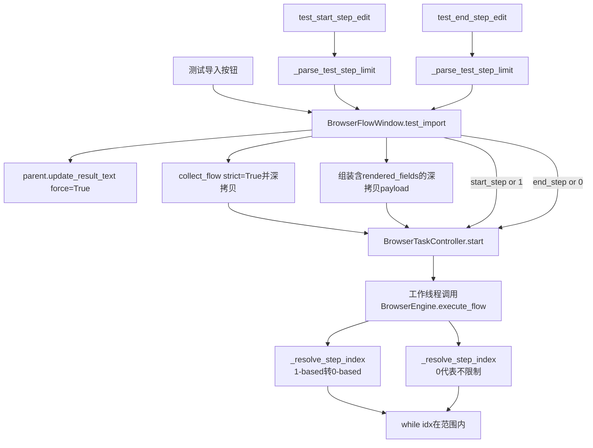
```mermaid
flowchart TB
    BTN[测试导入按钮]
    STARTUI[test_start_step_edit]
    ENDUI[test_end_step_edit]

    BTN --> TEST[BrowserFlowWindow.test_import]
    STARTUI --> PARSE1[_parse_test_step_limit]
    ENDUI --> PARSE2[_parse_test_step_limit]
    PARSE1 --> TEST
    PARSE2 --> TEST

    TEST --> UPDATE[parent.update_result_text force=True]
    TEST --> FLOW[collect_flow strict=True并深拷贝]
    TEST --> PAYLOAD[组装含rendered_fields的深拷贝payload]
    FLOW --> THREAD[BrowserTaskController.start]
    PAYLOAD --> THREAD
    TEST -->|start_step or 1| THREAD
    TEST -->|end_step or 0| THREAD
    THREAD --> EXEC[工作线程调用BrowserEngine.execute_flow]

    EXEC --> STARTIDX[_resolve_step_index\n1-based转0-based]
    EXEC --> ENDIDX[_resolve_step_index\n0代表不限制]
    STARTIDX --> LOOP[while idx在范围内]
    ENDIDX --> LOOP
```

### 输入规则

| 开始框 | 结束框 | 实际调用 |
|---|---|---|
| 空 | 空 | `start_step_no=1`, `end_step_no=0`，执行全流程 |
| 有值 | 空 | 从指定步骤执行到最后 |
| 空 | 有值 | 从第1步执行到指定结束步骤 |
| 有值 | 有值 | 执行闭区间 `[开始步骤, 结束步骤]` |

### 关键实现细节

1. 界面使用**从1开始的步骤号**。
2. `_resolve_step_index()` 转为内部从0开始的索引。
3. 开始步骤大于结束步骤时，`execute_flow()` 抛出错误。
4. 测试范围输入框目前没有进入 `collect_flow()`，因此**不会保存到 `browser_flows`**，只对本次测试有效。
5. 正式浏览器导出没有传 `start_step_no/end_step_no`，始终执行全流程。
6. 工作线程通过信号把日志写入配置窗口；弹窗只报告完成、错误或中止状态。
7. 主工具栏的强制结束不再等待安全检查点，而是调用 `BrowserTaskController.force_terminate()` 直接终止当前工作线程。
8. 强制结束后先保留 ChromeDriver 与受控 Chrome，并设置 `_recovery_pending=True`；3秒监测期内不允许启动新的自动控制。
9. 3秒后由驱动恢复线程请求 ChromeDriver `/status`：若已经响应，则继续复用；若仍无响应，则只结束旧 ChromeDriver 进程，不结束 Chrome，并通过调试端口自动建立新驱动连接。
10. 正常完成仍统一调用 `quit()` 和 `deleteLater()`；强制结束由 `QThread.finished` 回收线程状态并释放流程锁。

## 12.1 线程中止与退出清理链

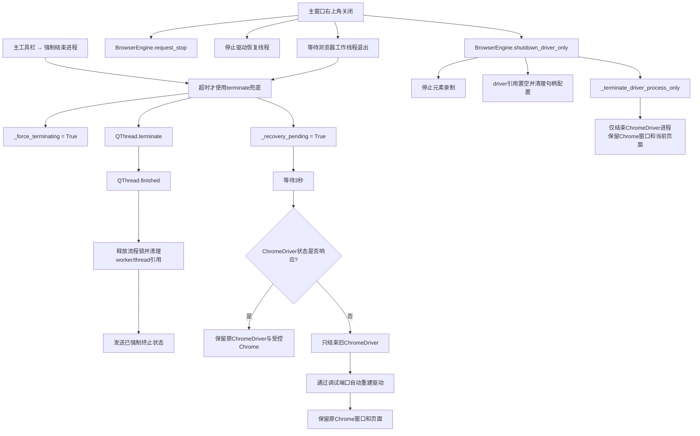
```mermaid
flowchart TB
    STOP[主工具栏 → 强制结束进程] --> FORCE[BrowserTaskController.force_terminate]
    FORCE --> FLAG[_force_terminating = True]
    FORCE --> TERM[QThread.terminate]
    TERM --> FINISHED[QThread.finished]
    FINISHED --> RELEASE[释放流程锁并清理worker/thread引用]
    RELEASE --> SIGNAL[发送已强制终止状态]

    FORCE --> PENDING[_recovery_pending = True]
    PENDING --> WAIT3[等待3秒]
    WAIT3 --> PROBE{ChromeDriver状态是否响应?}
    PROBE -->|是| KEEP[保留原ChromeDriver与受控Chrome]
    PROBE -->|否| KILLDRIVER[只结束旧ChromeDriver]
    KILLDRIVER --> RECONNECT[通过调试端口自动重建驱动]
    RECONNECT --> KEEPCHROME[保留原Chrome窗口和页面]

    CLOSE[主窗口右上角关闭] --> REQUEST[BrowserEngine.request_stop]
    CLOSE --> RECOVERYSTOP[停止驱动恢复线程]
    CLOSE --> DRIVERONLY[BrowserEngine.shutdown_driver_only]
    DRIVERONLY --> RECORDSTOP[停止元素录制]
    DRIVERONLY --> CLEARREF[driver引用置空并清理句柄配置]
    DRIVERONLY --> KILLONLY[_terminate_driver_process_only]
    KILLONLY --> KEEPWINDOW[仅结束ChromeDriver进程
保留Chrome窗口和当前页面]
    CLOSE --> WAIT[等待浏览器工作线程退出]
    WAIT --> FORCE[超时才使用terminate兜底]
```

### 关闭主面板仅关闭 Driver 的变量与函数影响

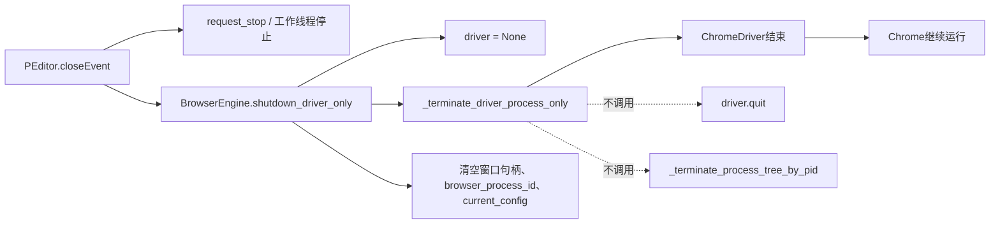
```mermaid
flowchart LR
    EVENT[PEditor.closeEvent] --> STOP[request_stop / 工作线程停止]
    EVENT --> ONLY[BrowserEngine.shutdown_driver_only]
    ONLY --> DRIVERREF[driver = None]
    ONLY --> PROCESS[_terminate_driver_process_only]
    ONLY --> STATE[清空窗口句柄、browser_process_id、current_config]
    PROCESS --> DRIVEREND[ChromeDriver结束]
    PROCESS -.不调用.-> QUIT[driver.quit]
    PROCESS -.不调用.-> BROWSERKILL[_terminate_process_tree_by_pid]
    DRIVEREND --> CHROMEKEEP[Chrome继续运行]
```

- `driver`：主窗口退出后立即置为 `None`，后续任何残留回调都无法继续通过该引擎发送 Selenium 指令。
- ChromeDriver 服务进程：只终止服务进程本身，不使用 `/T` 结束其子进程树，避免连带关闭 Chrome。
- `browser_process_id`：只清空 Python 内存中的记录，不调用 `_terminate_process_tree_by_pid()`。
- `main_window_handle`、`preferred_window_handle`、`current_config`：随 Driver 会话一起清理，避免程序退出阶段保留无效会话状态。
- 原 `disconnect()` 和 `shutdown()` 保持不变，其他显式“完全断开/完全关闭”流程的语义不受本次修改影响。

### 范围执行的上下文限制

范围执行只是改变初始 `idx` 和结束边界，不会预执行被跳过的步骤，也不会重建其副作用。因此：

- 从“统计元素数量”之后开始，前面的统计变量不会自动存在。
- 从循环体内部开始，`loop_stack` 为空，`[[i]]` 等循环标记不会被替换。
- 直接从“循环结束”开始会报“前面没有对应循环开始”。
- 前面步骤负责切换窗口或 iframe 时，从后面开始测试不会自动进入相同页面上下文。
- 前面步骤负责登录、打开弹窗或生成表格时，范围测试依赖浏览器当前已经处于正确状态。

后续若希望“从中间步骤测试时自动恢复上下文”，必须单独设计上下文初始化机制，不能只修改 `start_step_no`。

---

## 13. BrowserEngine 流程执行总链

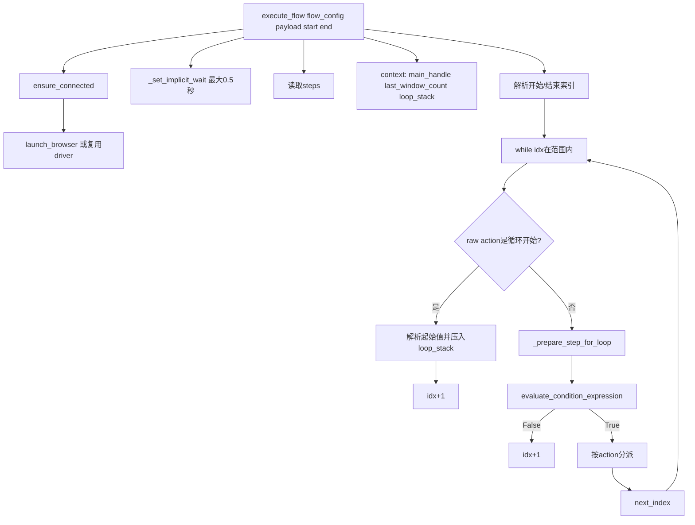
```mermaid
flowchart TB
    EXEC[execute_flow flow_config payload start end]
    EXEC --> CONNECT[ensure_connected]
    CONNECT --> LAUNCH[launch_browser 或复用driver]
    EXEC --> WAIT[_set_implicit_wait 最大0.5秒]
    EXEC --> STEPS[读取steps]
    EXEC --> CTX[context: main_handle last_window_count loop_stack]
    EXEC --> RANGE[解析开始/结束索引]
    RANGE --> WHILE[while idx在范围内]

    WHILE --> LOOPSTART{raw action是循环开始?}
    LOOPSTART -->|是| PUSH[解析起始值并压入loop_stack]
    PUSH --> NEXT[idx+1]
    LOOPSTART -->|否| PREP[_prepare_step_for_loop]
    PREP --> CONDITION[evaluate_condition_expression]
    CONDITION -->|False| SKIP[idx+1]
    CONDITION -->|True| DISPATCH[按action分派]
    DISPATCH --> NEXTIDX[next_index]
    NEXTIDX --> WHILE
```

### 执行上下文 `context`

```python
{
    "main_handle": 主窗口句柄,
    "last_window_count": 最近窗口数量,
    "loop_stack": [循环上下文, ...],
}
```

循环上下文：

```python
{
    "start_idx": 循环开始步骤索引,
    "marker": "i",
    "start": 起始数字,
    "current": 当前数字,
}
```

### 浏览器引擎实例状态

| 变量 | 作用 | 受影响功能 |
|---|---|---|
| `driver` | Selenium会话 | 全部浏览器动作 |
| `main_window_handle` | 主窗口基准 | 切回主窗口、等待窗口关闭 |
| `preferred_window_handle` | 当前目标窗口 | 每步执行前的会话修复 |
| `current_config` | 最近启动参数 | 连接状态记录 |
| `current_implicit_wait` | 当前隐式等待 | 元素查找失败速度 |

---

## 14. 动作分派与参数影响表

| 动作 | 主要步骤参数 | 主要函数 | 改动后影响 |
|---|---|---|---|
| 点击元素 | 主定位、`use_js_click` | `_click_element()` | 普通点击、ExtJS兜底、JS兜底 |
| 输入文本 | 主定位、`value_template`、字符策略 | `render_value_template()` → `_input_text()` | 字段替换和文本输入 |
| 多选元素/多行选择 | 输入模板、主定位 | `_multi_select()` | 多行定位值选择 |
| 右键点击 | 主定位 | `_right_click_element()` | 右键菜单触发 |
| 全选操作 | 主定位 | `_send_select_all()` | Ctrl+A稳定性 |
| 键盘按键 | 输入模板、按键模式、长按时间 | `_send_key_action()` | 键盘流程 |
| 右键菜单项点击 | 主定位、目标定位 | `_right_click_menu_item()` | 两阶段元素操作 |
| 下拉菜单两段式操作 | 主定位、目标定位 | `_dropdown_two_stage()` | 自定义下拉 |
| JavaScript命令 | 主定位、`value_template` | `_execute_custom_javascript()` | `[[字段名]]`安全转义 |
| 去除自动编号 | 主定位或body | `_clear_auto_numbering()` | 编辑器列表转段落 |
| 鼠标连击 | 主定位、按键类型、次数 | `_mouse_multi_click()` | 双击/多击 |
| 统计元素数量 | 主定位、绑定变量名 | `_count_elements()`、`_store_payload_variable()` | 循环边界和后续模板变量 |
| 拖拽元素 | 双定位、位置、步数、耗时、等待 | `_drag_drop_element()` | 拖放可靠性和速度 |
| 等待元素 | 主定位、超时、可点击 | `wait_for_element()` | 页面同步 |
| 等待元素消失 | 主定位、超时 | `wait_for_element_gone()` | 遮罩/进度条同步 |
| 等待新窗口 | 超时、窗口数上下文 | `execute_flow()`内等待 | 新窗口流程 |
| 等待窗口关闭 | 超时、主窗口句柄 | `_wait_until_back_to_main()` | 弹窗关闭后恢复 |
| 切换窗口 | 匹配类型和值 | `switch_window_by_rule()` | 目标窗口状态 |
| 切换iframe | 主定位 | `driver.switch_to.frame()` | 后续元素作用域 |
| 切回默认文档 | 无 | `driver.switch_to.default_content()` | iframe作用域复位 |
| 页面条件判断 | 表达式或定位、三分支步骤 | `_evaluate_page_condition()`、`_handle_branch_result()` | 条件跳转和提示 |
| 循环开始 | 标记、起始值 | `_resolve_loop_bound()`、压栈 | 循环变量初始化 |
| 循环结束 | 标记、结束值 | `_resolve_loop_bound()`、回跳 | 循环次数 |
| 跳转至步骤 | `jump_step` | `_resolve_step_index()` | 控制流 |
| 添加表格 | 主定位 | `_add_table()` | 网页表格初始化 |
| 自动填单元格 | 主定位、输入模板 | `_fill_table_cells()` | 批量输入 |

---

## 15. 统计元素数量 → 变量 → 循环的数据流

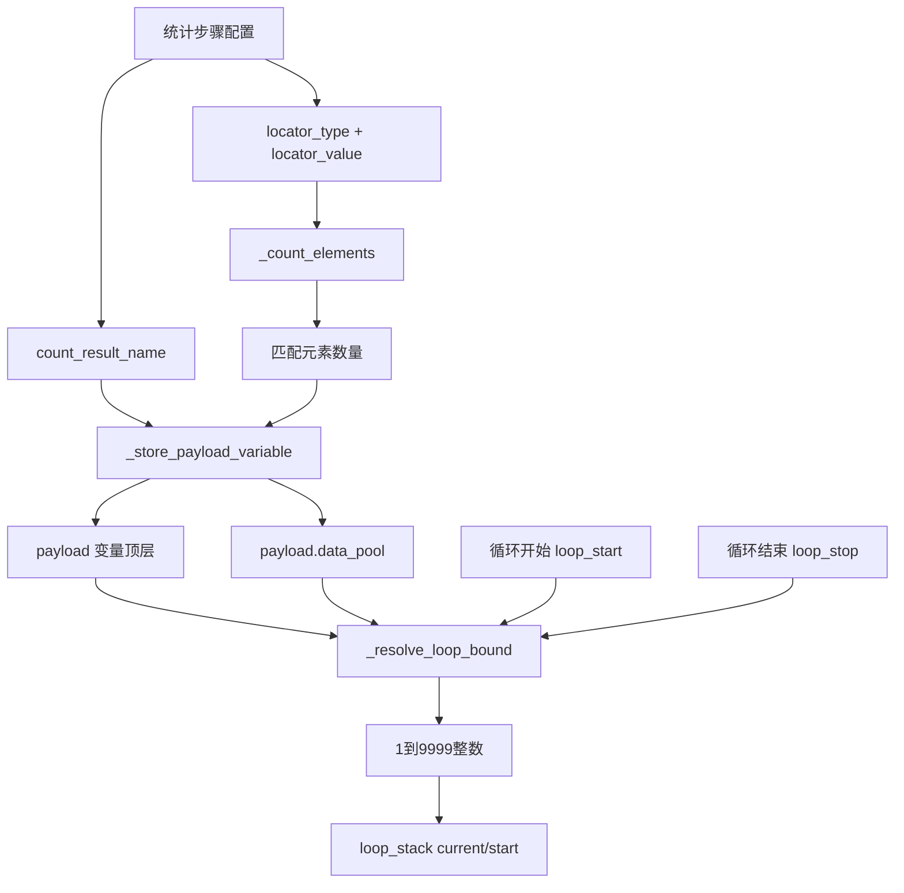
```mermaid
flowchart TB
    CFG[统计步骤配置]
    CFG --> LOC[locator_type + locator_value]
    CFG --> NAME[count_result_name]
    LOC --> COUNT[_count_elements]
    COUNT --> NUM[匹配元素数量]
    NAME --> STORE[_store_payload_variable]
    NUM --> STORE
    STORE --> TOP[payload 变量顶层]
    STORE --> POOL[payload.data_pool]

    LOOPSTART[循环开始 loop_start]
    LOOPEND[循环结束 loop_stop]
    TOP --> RESOLVE[_resolve_loop_bound]
    POOL --> RESOLVE
    LOOPSTART --> RESOLVE
    LOOPEND --> RESOLVE
    RESOLVE --> INT[1到9999整数]
    INT --> STACK[loop_stack current/start]
```

## 15.1 变量保存位置

执行：

```python
_store_payload_variable(payload, "n", count)
```

结果同时写入：

```python
payload["n"] = count
payload["data_pool"]["n"] = count
```

变量名会由 `_normalize_flow_variable_name()` 规范化，因此以下写法都会保存为 `n`：

```text
n
{n}
[[n]]
```

## 15.2 循环边界解析顺序

`_resolve_loop_bound(value, payload, context)` 依次尝试：

```text
原始文本
    ↓ 替换当前循环变量 [[i]]
payload中同名变量
    ↓
按普通模板语法渲染
    ↓
转换为 int(float(...))
    ↓
限制到1~9999
```

因此循环起始值和结束值可以是：

```text
1
n
{n}
[[n]]
```

### 重要影响

- 统计步骤必须在使用变量的循环边界之前实际执行。
- 同名统计变量会覆盖 `payload` 顶层和 `data_pool` 中原值。
- 变量最小被限制为1；统计到0个元素后，若直接用于循环边界，会被解析为1，而不是0次循环。
- 若需要支持“0个元素不执行循环”，不能只修改界面输入范围，必须调整 `_resolve_loop_bound()` 和循环控制逻辑。
- 修改变量名规则时要同步 `_normalize_flow_variable_name()`、`_payload_lookup_static()` 和教程写法。

---

## 16. 循环块、循环变量和循环内容表

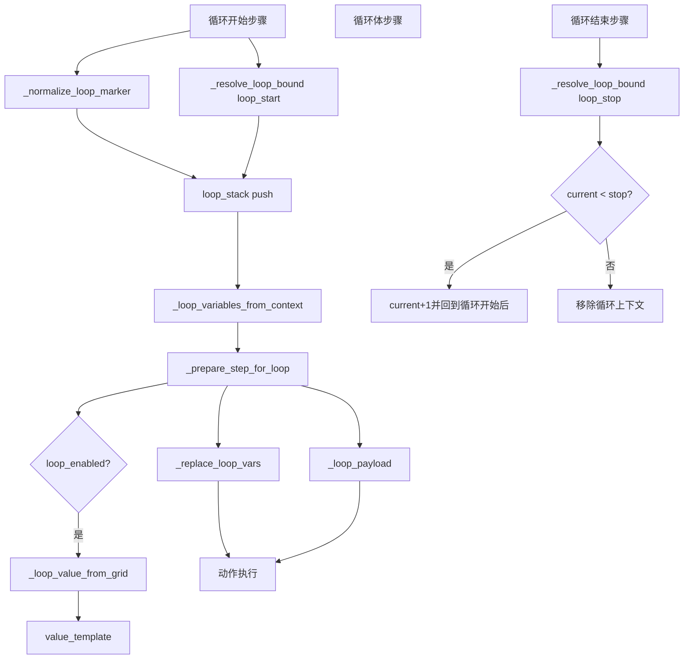
```mermaid
flowchart TB
    START[循环开始步骤]
    START --> MARKER[_normalize_loop_marker]
    START --> BOUND[_resolve_loop_bound loop_start]
    MARKER --> STACK[loop_stack push]
    BOUND --> STACK

    BODY[循环体步骤]
    STACK --> VARS[_loop_variables_from_context]
    VARS --> PREP[_prepare_step_for_loop]
    PREP --> REPLACE[_replace_loop_vars]
    PREP --> LPAYLOAD[_loop_payload]
    PREP --> GRID{loop_enabled?}
    GRID -->|是| CELL[_loop_value_from_grid]
    CELL --> VALUE[value_template]
    REPLACE --> RUN[动作执行]
    LPAYLOAD --> RUN

    END[循环结束步骤]
    END --> STOP[_resolve_loop_bound loop_stop]
    STOP --> COMPARE{current < stop?}
    COMPARE -->|是| INC[current+1并回到循环开始后]
    COMPARE -->|否| POP[移除循环上下文]
```

## 16.1 循环变量注入范围

`_loop_payload()` 把循环变量写入：

```text
payload顶层
input_values
final_fields
data_pool
```

因此循环变量既可以被普通 `{字段名}` 模板读取，也可以被条件表达式读取。

`_replace_loop_vars()` 只替换当前循环上下文中已存在的 `[[变量]]`，未知的 `[[字段名]]` 会保留，供 JavaScript 专用模板继续处理。

## 16.2 循环内容表取值

当步骤 `loop_enabled=True` 时：

```text
当前循环变量
    ↓
loop_row_marker / loop_col_marker
    ↓
loop_row_labels / loop_col_labels
    ↓
loop_values 对应单元格
    ↓
覆盖当前步骤 value_template
```

修改循环内容表结构时，必须同步：

- `webcontrol.py` 中表格读取和回填函数；
- `_new_step()` 默认字段；
- `current_step_dict()`；
- `load_selected_step()`；
- `webengine.py._loop_value_from_grid()`；
- 旧流程兼容字段 `loop_columns`。

---

## 17. 拖拽元素参数链

```mermaid
flowchart LR
    UI[拖拽配置控件]
    UI --> STEP[current_step_dict]
    STEP --> FLOW[flow_config.steps]
    FLOW --> EXEC[execute_flow]
    EXEC --> DRAG[_drag_drop_element]

    DRAG --> SOURCE[查找源元素]
    DRAG --> TARGET[查找目标元素]
    DRAG --> POINT[计算释放位置]
    DRAG --> HOLD[按住等待]
    HOLD --> MOVE[分steps段移动]
    MOVE --> READY{释放前重新识别目标?}
    READY -->|是| REFIND[等待新目标可见可用]
    READY -->|否| HOVER[原位置悬停]
    REFIND --> RELEASE[悬停后释放]
    HOVER --> RELEASE
```

| 参数 | 默认值 | 影响 |
|---|---:|---|
| `drag_steps` | 24 | 路径分段数量；越大越平滑，但动作链更长 |
| `drag_move_seconds` | 0.8 | 全路径移动总耗时 |
| `drag_hold_seconds` | 0.2 | 按住源元素后等待 |
| `drag_hover_seconds` | 0.4 | 到达目标后释放前等待 |
| `drag_wait_target_ready` | `True` | 释放前重新定位目标并等待其可用 |
| `drop_position` | 中间 | 上方、下方、中间、自定义偏移 |
| `drag_offset_x/y` | 0 | 自定义释放偏移 |

修改拖拽默认值时，必须同时改 `_new_step()` 和界面控件初始值，避免新步骤默认值和未加载界面默认值不同。

---

## 18. 页面条件、跳转和流程索引

```mermaid
flowchart TB
    STEP[页面条件判断步骤]
    STEP --> EXPR{page_condition_expr有值?}
    EXPR -->|是| EVAL[evaluate_condition_expression]
    EXPR -->|否| FIND[按定位查找元素]
    FIND --> MODE{立即判断/等待判断}
    EVAL --> RESULT[found或not_found]
    MODE --> RESULT2[found/not_found/timeout]
    RESULT --> BRANCH[_handle_branch_result]
    RESULT2 --> BRANCH
    BRANCH --> MESSAGE[提示和alert]
    BRANCH --> TARGET[_resolve_step_index]
    TARGET --> NEXT[next_index]
```

步骤号在配置中是从1开始，内部索引从0开始。以下字段都经 `_resolve_step_index()`：

```text
on_found_step
on_not_found_step
on_timeout_step
jump_step
start_step_no
end_step_no
```

修改步骤插入、删除或排序逻辑时，要特别检查这些绝对步骤号是否需要同步调整。当前代码不会自动重写其他步骤中的跳转目标。

---

## 19. 浏览器窗口与 iframe 状态影响

浏览器流程依赖 Selenium 当前上下文，主要状态包括：

```text
当前窗口
preferred_window_handle
main_window_handle
当前iframe层级
当前页面DOM
```

### 状态变更动作

| 动作 | 状态变化 | 后续依赖 |
|---|---|---|
| 切换窗口 | 修改当前窗口和首选窗口 | 所有后续定位 |
| 切回主窗口 | 当前窗口回到 `main_window_handle` | 后续主页面动作 |
| 切换iframe | Selenium进入frame | 后续定位只在该frame内 |
| 切回默认文档 | 离开所有iframe | 后续顶层DOM定位 |
| 等待窗口关闭 | 尝试恢复主窗口 | 弹窗流程 |

因此调整测试执行范围或跳转步骤时，不仅要看变量，还要确认窗口和 iframe 状态是否已建立。

---

## 20. 数据库管理变更传播链

```mermaid
flowchart TB
    USER[DataManagerWindow增删改]
    USER --> MODEL[PandasModel / Database]
    MODEL --> DATA[(data.db)]
    MODEL --> SIGNAL[data_changed]
    SIGNAL --> MAIN[PEditor.on_external_data_changed]
    MAIN --> DYNAMIC[refresh_dynamic_combo_options]
    MAIN --> RENDER[update_result_text force=True]
```

数据库结构变化可能影响：

```text
输入项数据库下拉
规则数据库查询
工序模板 dbjoin/dbrows
固定选项公式 dbjoin/dbrows
当前预览和浏览器导出
```

重命名或删除列时，程序不会自动修改模板字符串和规则配置中的列名，需要人工同步。

---

## 21. 界面设置数据流

```mermaid
flowchart LR
    FILE[(settings.json)] --> LOAD[load_settings]
    LOAD --> NORMAL[_normalize_ui_settings]
    NORMAL --> APPLY[apply_ui_settings]
    APPLY --> QSS[_build_app_stylesheet]
    APPLY --> RUNTIME[_apply_runtime_ui_settings]
    RUNTIME --> MAIN[主界面控件]
    RUNTIME --> CHILD[_refresh_open_child_windows_ui_settings]
    APPLY --> SAVE[save_settings]
    SAVE --> FILE
```

### 关键约束

- 字号使用 `QFont.setPointSize()`，不要在 QSS 中重新加入 `font-size`。
- 新控件若需要随界面设置变化，要加入 `_apply_runtime_ui_settings()` 或子窗口通用适配。
- 表格标题颜色由 `color_table_header_bg` 和 `color_table_header_text` 控制，会影响数据库、规则、浏览器循环表等表格。

---

## 22. 关键变量改动影响矩阵

| 改动对象 | 直接函数 | 间接受影响功能 | 风险级别 |
|---|---|---|---|
| `current_template_name` | 模板加载、保存、三个数据库表查询 | 全部模板上下文 | 极高 |
| `current_options_config` 结构 | 输入区构建、主模板保存 | 输入值、规则字段池、动态下拉 | 高 |
| `current_rules_config` 结构 | 规则编辑、`DataMatcher.apply_rules()` | 预览、复制、浏览器 | 极高 |
| `available_fields` | 工序编辑、渲染 | 公式、复制、浏览器字段 | 极高 |
| `selected_fields` | `DataMatcher.render()` | 完整预览和字段可见性 | 高 |
| `field_conditions` | 条件计算 | 复制按钮显示、`final_fields` | 高 |
| `_last_final_fields` | 预览缓存 | 复制和浏览器输入 | 高 |
| `rendered_fields` | 正式导出payload | 浏览器字段优先值 | 高 |
| `flow_config.steps` 字段 | `webcontrol`保存与`webengine`执行 | 浏览器全部动作 | 极高 |
| `action` 字符串 | 动作列表、显示逻辑、执行分派 | 流程兼容性 | 极高 |
| `count_result_name` | 统计变量写入 | 循环和后续表达式 | 高 |
| `loop_start/loop_stop` | 循环边界解析 | 循环次数和范围 | 极高 |
| `loop_stack` | 执行引擎内部上下文 | 嵌套循环、变量替换 | 极高 |
| `start_step_no/end_step_no` | 测试导入、执行索引 | 部分流程测试和上下文缺失 | 高 |
| `locator_type/value` | 元素查找 | 绝大多数浏览器动作 | 高 |
| `wait_timeout` | 元素等待 | 稳定性和失败耗时 | 中高 |
| `implicit_wait` | 全局查找等待 | 全流程性能；执行时最高0.5秒 | 中高 |
| `browser_flow_window` | 正式导出是否使用内存流程 | 未保存配置即时生效 | 高 |
| `_live_process_content` | 实时模板override | 未保存内容预览与导出 | 高 |

---

## 23. 常见功能改动的同步清单

## 23.1 新增一个浏览器动作

必须检查：

```text
webcontrol.py
  ACTION_常量
  STEP_ACTIONS
  _new_step（如有新增字段）
  init_ui（新增控件）
  current_step_dict
  load_selected_step
  update_action_visibility
  _connect_auto_save_signals（新增控件时）

webengine.py
  execute_flow动作分支
  必要的底层辅助函数

文档
  PEditor_教程.txt
  项目背景.txt
  变量函数关系流程图.md
```

## 23.2 新增一个步骤参数

```text
界面控件创建
→ 默认值
→ 加载回填
→ 收集保存
→ 自动保存信号
→ 动作执行读取
→ 模板导入导出兼容
```

任一步缺失都会出现以下问题之一：

- 界面能填但不保存；
- 保存后重新打开丢失；
- JSON中有值但执行不读取；
- 旧模板缺字段时报错；
- 新步骤和旧步骤默认值不一致。

## 23.3 修改字段占位符语法

必须同时检查：

```text
DataMatcher 普通模板语法 {字段名} 和 #公式#
BrowserEngine 普通浏览器模板语法
BrowserEngine JavaScript专用语法 [[字段名]]
循环变量语法 [[i]]
统计变量名规范化
教程中的插入按钮和提示文字
```

`[[...]]` 同时承担循环变量和 JavaScript字段占位符，处理顺序不能随意改变。

## 23.4 修改模板数据库结构

必须检查：

```text
TemplateDB.init_db
所有get/add/update/delete函数
模板导入导出
模板重命名和删除联动
主窗口加载缓存
旧数据库迁移或默认值
```

## 23.5 修改测试导入范围

必须检查：

```text
test_start_step_edit / test_end_step_edit
_parse_test_step_limit
test_import
execute_flow参数
_resolve_step_index
循环上下文
窗口/iframe上下文
统计变量是否已执行
```

---

## 24. 高风险耦合点

### 24.1 主预览、复制按钮和浏览器字段

三者最终都依赖 `DataMatcher.render()`。任何公式或字段优先级修改，都不能只测试主预览。

```text
主预览：result
复制按钮：final_fields或单字段override渲染
正式浏览器：rendered_fields优先
测试浏览器：final_fields优先（当前无rendered_fields）
```

### 24.2 浏览器流程内存配置与数据库配置

正式导出时：

- 浏览器配置窗口打开 → 使用 `collect_flow()` 的内存配置；
- 窗口未打开 → `export_to_browser()` 从 `template.db` 读取。

修改自动保存或窗口关闭逻辑时，要同时测试这两种情况。

### 24.3 循环开始属于特殊预处理

`execute_flow()` 在调用 `_prepare_step_for_loop()` 前先单独处理“循环开始”。因此循环开始步骤本身不会经过普通步骤条件判断和循环变量准备流程。若后续想让循环开始支持 `condition_expr`，需要调整 `execute_flow()` 的处理顺序。

### 24.4 范围测试不恢复前置状态

开始/结束步骤只限制索引，不恢复：

```text
统计变量
循环栈
窗口
iframe
网页业务状态
前置步骤产生的DOM
```

这是范围测试功能最重要的维护边界。

### 24.5 0元素循环

`_resolve_loop_bound()` 使用 `max(1, ...)`，因此当前循环边界不允许0。统计结果为0时，直接绑定循环仍至少执行一次。后续若修改，应设计“空集合是否跳过整个循环块”的明确规则。

---

## 25. 后续改动前的检查顺序

每次更新代码前按以下顺序检查：

```mermaid
flowchart TB
    A[确认当前代码版本和基准文件]
    A --> B[定位改动所属模块]
    B --> C[查本文件中的数据来源和消费者]
    C --> D[列出需要同步的配置字段和函数]
    D --> E[只修改相关代码]
    E --> F[检查旧模板缺省值]
    F --> G[检查保存→关闭→重开]
    G --> H[检查主预览/复制/正式导出/测试导入]
    H --> I[检查循环、跳转、范围测试上下文]
    I --> J[更新本文件]
```

### 最低测试集合

1. 启动程序并切换模板。
2. 输入值后主预览正确。
3. 动态下拉不清空当前输入。
4. 规则输出和数据库查询正确。
5. 复制字段与正式浏览器输入一致。
6. 浏览器流程保存后重新打开不丢参数。
7. 测试导入四种范围组合都正确。
8. 统计变量能用于循环起始值和结束值。
9. 从中间步骤测试时明确确认前置状态是否已手动建立。
10. 拖拽动作按当前速度和等待参数执行。

---

## 26. 核心函数快速索引

| 目标 | 入口函数 | 主要下游 |
|---|---|---|
| 切换模板 | `PEditor.on_template_changed()` | `_load_template_by_name()`、`refresh_input_area()`、`update_result_text()` |
| 保存主模板 | `PEditor._save_current_template()` | `TemplateDB.update_main_template()` |
| 生成预览 | `PEditor.update_result_text()` | `DataMatcher.render()` |
| 动态下拉 | `PEditor.refresh_dynamic_combo_options()` | `DataMatcher.get_field_options()` |
| 复制字段 | `PEditor.copy_field_content()` | `resolve_copy_field_content()` |
| 正式浏览器导出 | `PEditor.export_current_to_browser()` | 深拷贝快照 → `BrowserTaskController` → `BrowserEngine.execute_flow()` |
| 打开流程编辑 | `PEditor.open_browser_flow_editor()` | `BrowserFlowWindow` |
| 保存流程 | `BrowserFlowWindow._save_flow_config_silent()` / `save_flow()` | `TemplateDB.update_browser_flow()` |
| 测试导入 | `BrowserFlowWindow.test_import()` | 深拷贝快照 → `BrowserTaskController` → `BrowserEngine.execute_flow(start_step_no, end_step_no)` |
| 执行流程 | `BrowserEngine.execute_flow()` | 各动作辅助函数 |
| 强制结束自动控制 | `PEditor.stop_browser_thread()` | `force_terminate()` → 3秒驱动监测 → 必要时重建ChromeDriver；保留Chrome |
| 记忆模板 | `PEditor.closeEvent()` | `save_settings()` → `settings.json.last_template_name` |
| 清理失效复制按钮 | `PEditor.on_process_template_saved()` | `update_copy_buttons_from_config()` → `TemplateDB.update_main_template()` |
| 统计元素 | `BrowserEngine._count_elements()` | `_store_payload_variable()` |
| 解析循环边界 | `BrowserEngine._resolve_loop_bound()` | payload查找和模板渲染 |
| 循环步骤准备 | `BrowserEngine._prepare_step_for_loop()` | 循环变量替换、循环内容表 |
| 规则计算 | `DataMatcher.apply_rules()` | 表达式或数据库查询 |
| 工序模板渲染 | `DataMatcher.render()` | 字段条件、递归占位符和公式 |
| 编辑工序模板 | `TemplateEditorWindow` | 实时信号和`update_process_template()` |
| 管理业务数据 | `DataManagerWindow` | `Database`、`data_changed` |

---

## 27. 当前源码结论

当前 PEditor 4.0 的核心数据链可以概括为：

```text
main_templates 提供输入项、规则、复制按钮
process_templates 提供字段正文、字段顺序、字段条件
用户输入进入 DataMatcher
DataMatcher 输出 result、data_pool、final_fields
主窗口缓存结果并驱动预览、复制和浏览器导出
browser_flows 提供浏览器参数和步骤
BrowserFlowWindow 负责配置读写和测试范围
BrowserTaskController负责浏览器工作线程启动、信号转发、中止和销毁
BrowserEngine 负责执行、停止检查、变量、条件、跳转和循环
统计元素数量将变量写入 payload 和 data_pool
循环起始/结束通过统一变量查找解析边界
```

后续修改时，应优先保持以下四个一致性：

1. **界面字段与流程JSON一致**；
2. **流程JSON与执行引擎读取一致**；
3. **主预览、复制字段和浏览器字段一致**；
4. **数据库持久化内容与内存当前状态一致**。
