# PEditor 3.0 主界面深度优化变量函数关系流程图

> 本文件用于记录本次基于当前上传代码进行的主界面优化。后续继续改动前，应先参考本文件，尤其注意模板选择固定首行、输入项行控件、复制按钮横向滚动卡片之间的联动关系。

## 1. 主界面总体结构

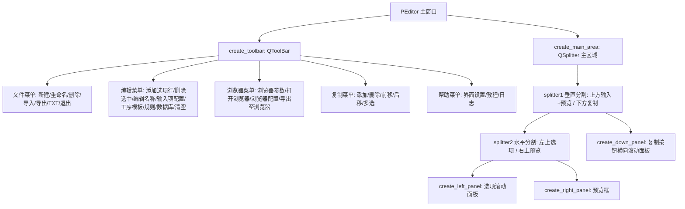

## 2. 模板选择固定首行

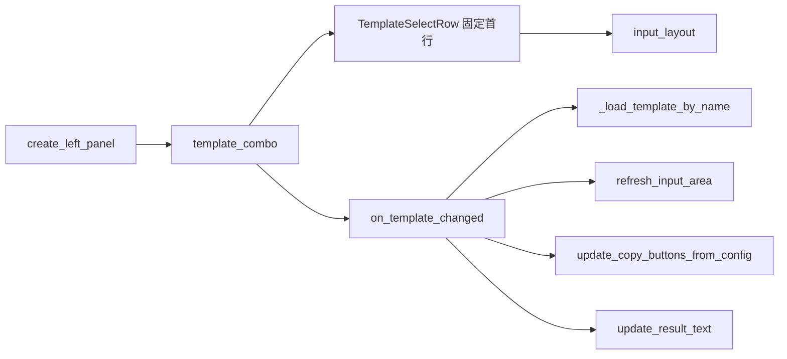

### 说明

- `template_combo` 已从 `QToolBar` 移入左侧选项面板。
- `TemplateSelectRow` 是默认固定第一行，不参与拖拽排序、不参与 `collect_input_values()`。
- 顶部工具栏不再显示模板选择框。
- 浏览器参数用到的 `browser_driver_edit`、`browser_binary_edit`、`browser_url_edit` 仍作为状态控件存在，但已隐藏，避免主界面左上角出现无意义输入框。

## 3. 输入选项区流程

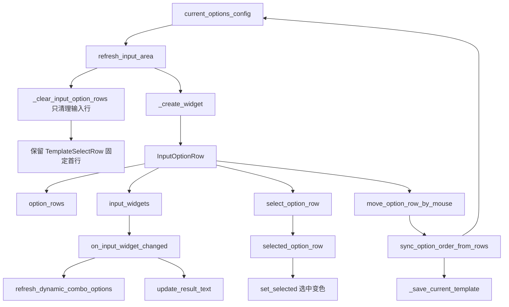

### 关键变量影响

| 变量 | 作用 | 改动影响 |
|---|---|---|
| `template_combo` | 当前模板选择，位于固定首行 | 影响当前模板切换、输入项重建、复制按钮重建、预览刷新 |
| `template_row` | 左侧滚动面板的固定第一行 | 不参与排序，不参与输入值采集 |
| `current_options_config` | 当前模板的输入项配置 | 影响输入项生成、顺序保存、规则字段池、模板保存 |
| `option_rows` | 当前显示的输入行对象 | 影响选择高亮、拖拽排序、输入值采集 |
| `selected_option_row` | 当前选中的输入行 | 影响删除选中、编辑选项名称 |
| `input_widgets` | 输入控件列表 | 影响输入变化监听、清空输入、动态下拉项刷新 |

## 4. 输入行选中变色修正

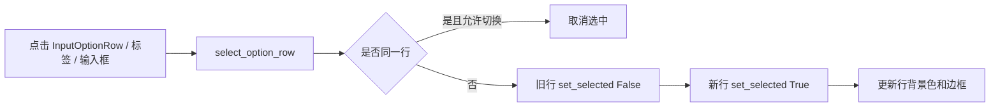

### 说明

- `InputOptionRow.set_selected()` 改为直接设置当前行和拖动柄样式。
- 选中状态有蓝色边框和浅蓝背景。
- 再次点击同一行会取消选中；点击输入控件时会保持选中。

## 5. 复制按钮横向滚动区

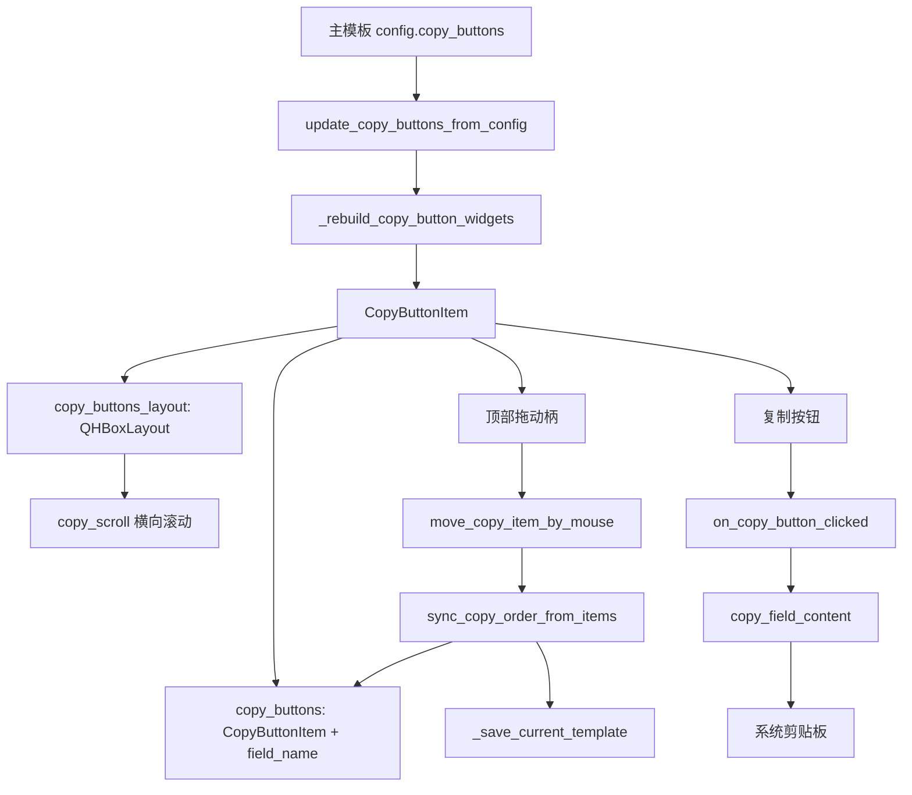

### 复制按钮区设计

- `copy_scroll` 使用横向滚动，不再强制把内容压缩到视口宽度。
- 每个复制项由 `CopyButtonItem` 表示。
- 每个复制项纵向排列：顶部为拖动排序标记 `☰`，下方为复制按钮。
- 多个复制项整体横向排列，按钮较多时通过横向滚动查看。
- 复制按钮仍然只读取主模板 `copy_buttons`，不会从字段池自动恢复，避免删除后刷新又出现。

## 6. 复制按钮选择、多选、拖拽和保存

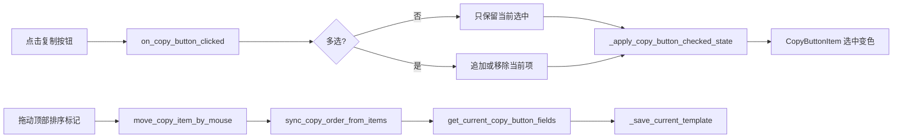

## 7. 预览与导出流程

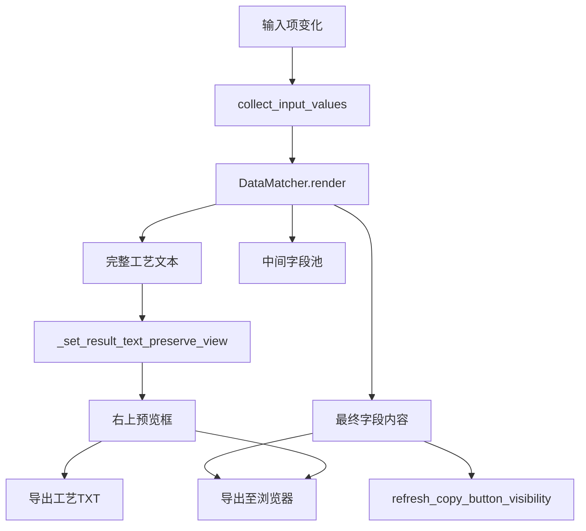

## 8. 浏览器参数流程

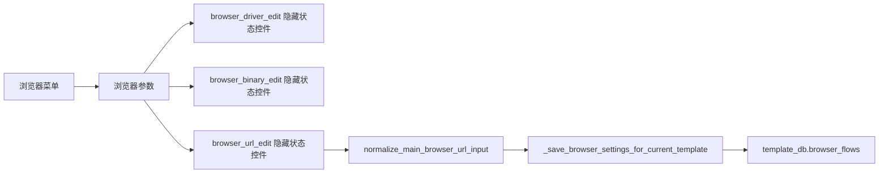

## 9. 后续修改注意事项

1. 不要再把 `template_combo` 放回工具栏；模板选择固定在左侧选项面板第一行。
2. 不要让 `_clear_input_option_rows()` 删除 `TemplateSelectRow`。
3. 不要把 `browser_driver_edit`、`browser_binary_edit`、`browser_url_edit` 加入主界面布局；它们只是隐藏状态控件。
4. 复制按钮区应继续使用 `CopyButtonItem`，保证顶部拖动柄和横向滚动逻辑不丢失。
5. 修改复制按钮排序时，应同步调用 `sync_copy_order_from_items(save=True)` 或 `_save_current_template()`。
6. 修改输入项排序时，应同步调用 `sync_option_order_from_rows(save=True)`。

## 8. 本次补充优化：模板固定行、选中宽度、测试数据库

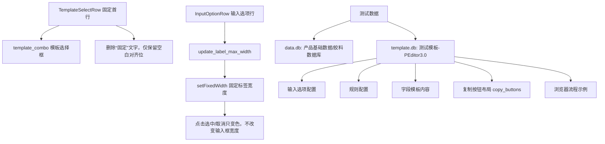

### 8.1 模板固定首行调整

- `TemplateSelectRow` 中删除了可见的“固定”两个字。
- 为了保持模板行与普通输入行左侧对齐，保留了一个空白占位控件，但该控件不显示文字、不显示边框。
- `template_combo` 仍然是固定第一行，不参与 `collect_input_values()`，也不参与拖拽排序。

### 8.2 选项点击后宽度变化的处理

- 原因：输入行点击选中时会刷新样式，若标签只设置 `maximumWidth`，布局可能重新计算标签和输入框的可用宽度，造成视觉上的宽度跳动。
- 处理：`InputOptionRow.update_label_max_width()` 改为按左侧滚动面板宽度计算 `label_width`，并使用 `self.label.setFixedWidth(label_width)` 固定标签宽度。
- 结果：点击选中/取消选中只改变背景色和边框色，不再改变输入框宽度。

### 8.3 测试数据库与模板

本次生成了两份测试文件，放在程序同级目录，便于直接启动后测试：

| 文件 | 内容 | 用途 |
|---|---|---|
| `data.db` | `产品基础数据`、`胶料数据库` 两张测试数据表 | 测试下拉数据源、数据库查询规则 |
| `template.db` | `测试模板-PEditor3.0` | 测试输入项、规则、字段模板、复制按钮布局、浏览器流程示例 |

测试模板包含：

- 输入项：`产品型号`、`牌号`、`数量`、`操作者`、`是否二段硫化`。
- 规则：产品型号查工艺类型/温度/工时，牌号查胶料说明/质量关注点，数量计算抽检数量，复选框生成二段硫化要求。
- 字段模板：`基本信息`、`胶料检查`、`检验要求`、`二段硫化段落`、`浏览器填报摘要`。
- 复制按钮布局：按 `基本信息 → 胶料检查 → 检验要求 → 二段硫化段落 → 浏览器填报摘要` 横向排列。
- 浏览器流程：包含 3 个示例输入步骤，定位值需要按真实网页修改。

## 9. 字体与紧凑程度设置优化

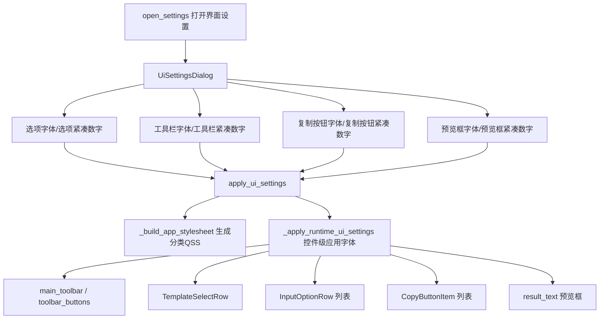

### 9.1 设置项变更

原来只有一个 `font_size` 和一个文字型 `button_compactness`，现在改为 8 个独立数字项：

| 设置键 | 控制范围 | 说明 |
|---|---|---|
| `option_font_size` | 左侧输入选项区 | 控制模板固定行、选项标签、输入框/下拉框字体 |
| `option_compactness` | 左侧输入选项区 | 数字越小越紧凑，影响选项行边距、间距、行高 |
| `toolbar_font_size` | 顶部工具栏 | 控制 `QToolBar/QToolButton/QMenu` 字体 |
| `toolbar_compactness` | 顶部工具栏 | 数字越小越紧凑，影响工具栏菜单按钮高度和内边距 |
| `copy_font_size` | 下方复制按钮区 | 控制复制按钮卡片、拖动柄、复制按钮字体 |
| `copy_compactness` | 下方复制按钮区 | 数字越小越紧凑，影响复制卡片边距、拖动柄高度、按钮高度 |
| `preview_font_size` | 右上预览框 | 控制工艺预览文本字号 |
| `preview_compactness` | 右上预览框 | 控制预览框文本内边距 |

### 9.2 字体设置不生效的处理

本次不再只依赖全局 `QApplication.setStyleSheet()`，而是同时使用两种方式：

1. `_build_app_stylesheet()` 生成分类 QSS，分别控制工具栏、选项行、复制按钮和预览框。
2. `_apply_runtime_ui_settings()` 直接对已存在控件调用 `setFont()` 和 `setMinimumHeight()`，避免 `InputOptionRow.set_selected()`、`CopyButtonItem.set_selected()` 的局部样式覆盖导致字体设置不稳定。

后续如果新增主界面控件，需要根据控件所属区域加入对应分类，否则可能不受界面设置控制。

### 9.3 预览框边框隐藏

- `result_text` 设置 `objectName='previewTextEdit'`。
- `create_right_panel()` 中对 `result_text` 调用 `setFrameShape(QFrame.NoFrame)`。
- `_build_app_stylesheet()` 与 `_apply_runtime_ui_settings()` 均设置 `border: none`，确保预览框内部文本框无边框显示。

## 9. 2026-05-14 字体设置闪退修复

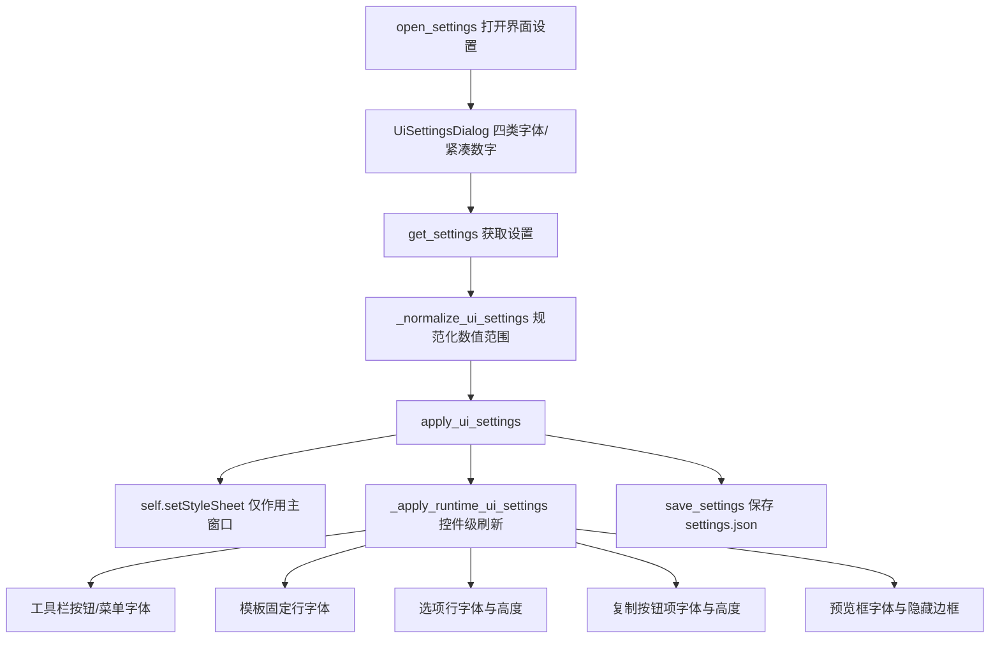

### 本次闪退原因防护

- `apply_ui_settings()` 不再直接使用 `QApplication.setStyleSheet()` 影响整个应用，改为 `self.setStyleSheet()`，避免设置对话框关闭过程中被全局样式刷新牵连。
- `_apply_runtime_ui_settings()` 对工具栏、模板行、选项行、复制按钮、预览框分别容错刷新；如果某个控件已经被 `deleteLater()` 标记或被 Qt 删除，会跳过该控件，不再让异常冒泡导致主程序退出。
- `open_settings()` 增加异常捕获，应用设置失败时弹窗提示并打印 traceback，不再直接闪退。
- `copy_buttons` 遍历兼容 `[(CopyButtonItem, field_name)]` 和旧中间版本 `[CopyButtonItem]` 两种残留结构，避免解包异常。
- 预览框继续使用 `QFrame.NoFrame`、`lineWidth=0`、`viewport` 无边框样式隐藏边框。

## 10. 本次补充优化：总字体缩放与 QFont 统一字号控制

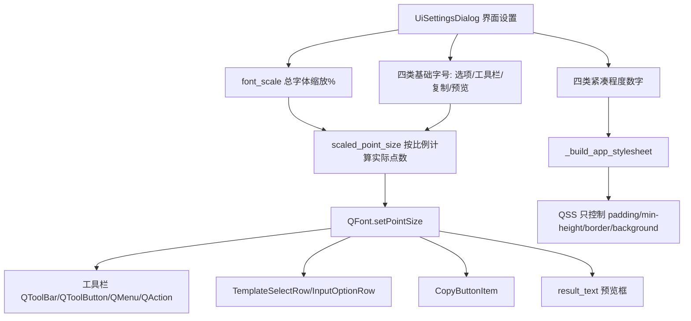

### 10.1 字号控制原则

- 所有字号统一通过 `QFont.setPointSize()` 设置。
- 样式表中不再写 `font-size`，避免 `px` 与 `pt` 混用导致“字号调大反而变小”。
- `font_scale` 是总字体缩放百分比，实际字号由 `scaled_point_size(settings, key, default)` 计算。
- 四类基础字号仍然保留，用于单独控制选项、工具栏、复制按钮、预览框的相对大小。

### 10.2 设置保存与应用流程

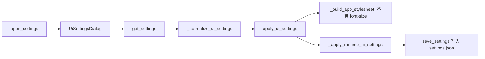

### 10.3 后续修改注意事项

1. 不要在 QSS 中重新加入 `font-size`。
2. 新增需要受界面设置控制的控件时，应在 `_apply_runtime_ui_settings()` 或对应行控件的 `apply_ui_settings()` 中用 `QFont.setPointSize()` 设置。
3. 需要改变控件间距或高度时，仍可修改紧凑程度相关计算；但字号不要混入 padding 或 px 字体设置。
4. 预览框边框隐藏保留在 QSS 与 `QFrame.NoFrame` 两层处理中，但字号只由 QFont 控制。

## 11. 本次补充优化：控件随字体自适应宽高与固定宽文本换行

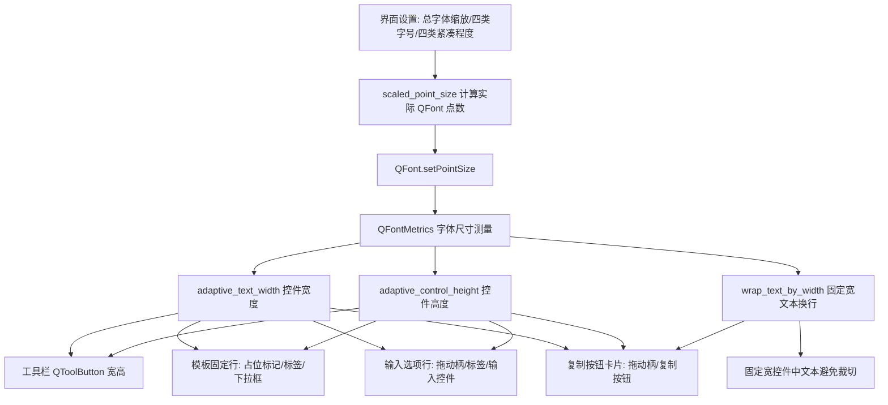

### 11.1 新增/调整的辅助函数

| 函数 | 作用 | 影响区域 |
|---|---|---|
| `font_metrics_for()` | 根据控件或字体返回 `QFontMetrics` | 所有自适应尺寸计算 |
| `text_width_for()` | 兼容不同 PyQt5 版本计算文本宽度 | 工具栏、标签、复制按钮 |
| `adaptive_control_height()` | 根据字体行高和紧凑程度计算控件高度 | 工具栏、输入控件、复制按钮、模板行 |
| `adaptive_text_width()` | 根据文本宽度、字体、紧凑程度计算控件宽度 | 工具栏按钮、模板标签、复制按钮 |
| `wrap_text_by_width()` | 对固定宽度文本插入换行 | 复制按钮文字，避免字号变大后被裁切 |

### 11.2 主界面自适应范围

- 工具栏按钮：在 `_apply_runtime_ui_settings()` 中根据按钮文字、工具栏字体和紧凑程度设置最小宽度、最小高度。
- 模板固定行：`TemplateSelectRow.update_adaptive_size()` 会调整左侧占位标记宽度、模板标签宽度、下拉框宽高。
- 输入选项行：`InputOptionRow.update_adaptive_size()` 会调整拖动柄宽度、标签固定宽度、输入框/下拉框高度；标签 `QLabel.setWordWrap(True)` 保留，用于长标签自动换行。
- 复制按钮卡片：`CopyButtonItem.update_adaptive_size()` 会根据字段名、字体和滚动区宽度计算按钮宽度和高度；字段名过长时用 `wrap_text_by_width()` 插入换行。
- 预览框：仍由预览框字体大小和紧凑程度控制字体与内边距，边框继续隐藏。

### 11.3 后续修改注意事项

1. 如果新增固定宽度按钮或标签，应优先使用 `adaptive_text_width()` 和 `adaptive_control_height()` 计算尺寸。
2. 如果固定宽度控件可能显示长中文或长字段名，应使用 `wrap_text_by_width()` 或 `QLabel.setWordWrap(True)`，避免字体放大后文字被裁切。
3. 不要为了适配字体重新在 QSS 中写 `font-size`；字号仍只通过 `QFont.setPointSize()` 控制。
4. 不是所有控件都需要固定宽度自适应。表格、预览框、输入框主体等可伸缩控件仍交给布局自动拉伸。

## 12. 本次补充优化：输入值持久化、子窗口字体控制与复制选项编辑菜单

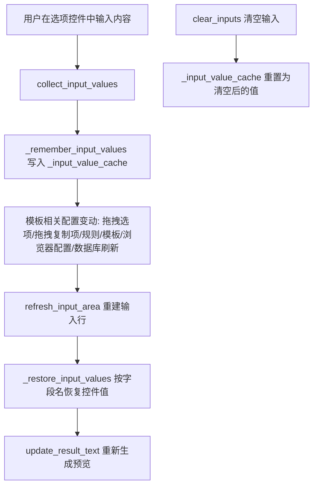

### 12.1 输入内容不被配置操作清空

- `_input_value_cache` 用于保存当前输入内容。
- `_remember_input_values()` 在配置类操作前保存当前输入。
- `_restore_input_values()` 在输入行被重建后按字段名恢复控件值。
- 选项拖动排序、复制按钮拖动排序、输入项配置、规则修改、模板编辑、浏览器配置、数据库刷新等流程都不应主动清空用户已输入内容。
- 只有 `clear_inputs()` 执行真正清空，并同步把 `_input_value_cache` 更新为清空后的状态。

### 12.2 输入控件字体与自动换行

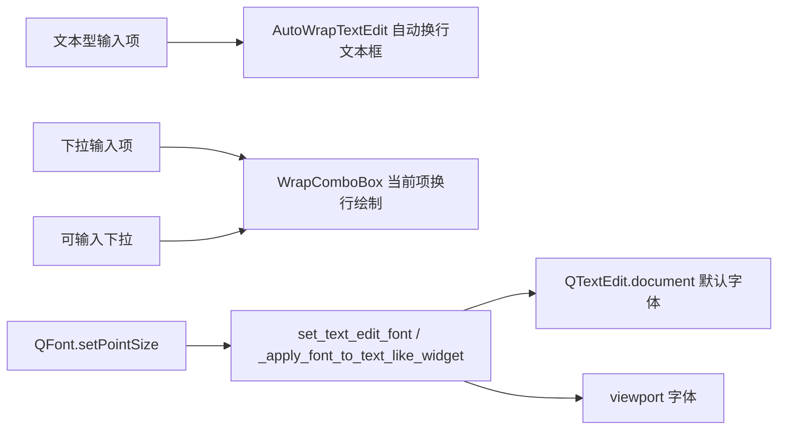

- 文本输入项由单行 `QLineEdit` 改为 `AutoWrapTextEdit`，解决字号变大后文字被裁切、不能换行的问题。
- 普通下拉框使用 `WrapComboBox` 重绘当前项文本，使长文本在控件高度允许时换行显示。
- `set_widget_point_size()` 和 `set_text_edit_font()` 同步设置 QTextEdit 的控件、document、viewport 字体，避免“产品型号”等输入框文字比其他字体小。

### 12.3 子窗口统一字体与自适应尺寸

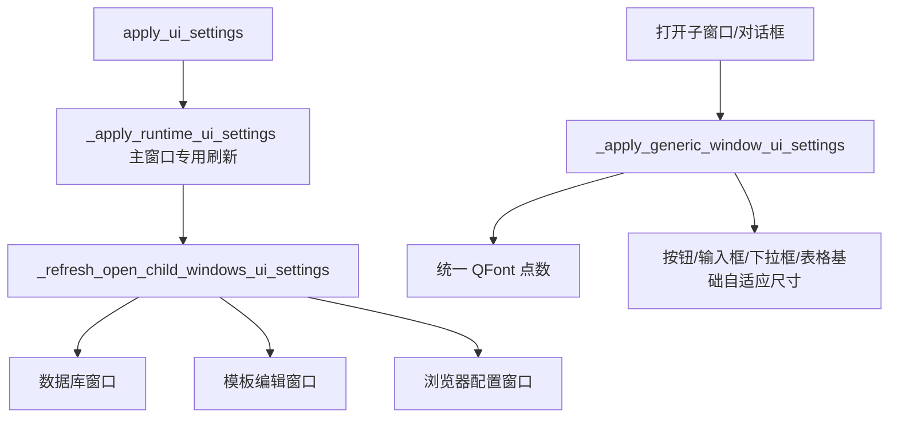

- 浏览器配置窗口、模板编辑窗口、规则窗口、数据库窗口、日志窗口、教程窗口、浏览器参数窗口均通过 `_apply_generic_window_ui_settings()` 应用统一字体缩放。
- 子窗口通用自适应只做基础最小高度、最小宽度和表格行高适配；主界面输入行和复制项仍使用各自专用的 `apply_ui_settings()` 与 `update_adaptive_size()`。

### 12.4 复制菜单调整

- 工具栏“复制”改为“复制选项编辑”。
- 复制选项编辑菜单删除“前移/后移”菜单项，排序仅保留拖动排序。
- 子菜单文字删除“按钮”二字：保留“添加工序”“删除选中”“多选复制”。
- `move_selected_copy_buttons()` 保留为兼容旧逻辑，但主界面入口不再提供左右移动菜单。

### 12.5 后续修改注意事项

1. 任何会重建输入行的函数，重建前应调用 `_remember_input_values()`，重建后应调用 `_restore_input_values()`。
2. 不要在配置窗口关闭、模板内容变化、规则变化、浏览器流程变化时清空输入控件。
3. 新增子窗口后，应在显示前调用 `_apply_generic_window_ui_settings(window)`。
4. 新增文本型输入控件优先使用 `AutoWrapTextEdit`；新增下拉显示长文本时优先使用 `WrapComboBox`。

## 13. 本次补充优化：输入框高度、手动宽度分配与浏览器配置滚动表单

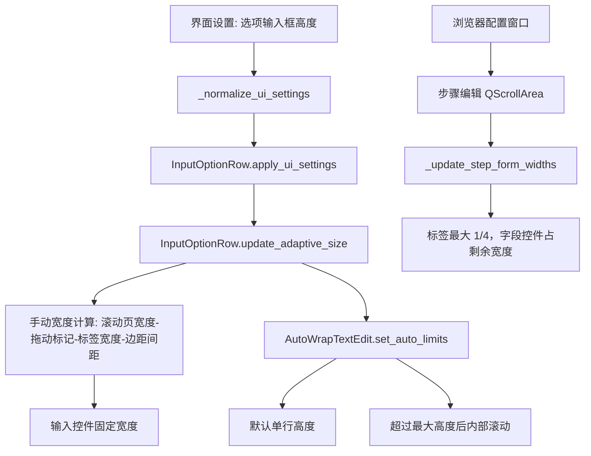

### 13.1 首页输入选项宽度策略

- `InputOptionRow._available_row_width()` 获取首页输入选项滚动页 viewport 宽度。
- `InputOptionRow.update_label_max_width()` 将标签最大宽度限制为滚动页宽度的四分之一；超过后由 `QLabel.setWordWrap(True)` 自动换行。
- `InputOptionRow.update_adaptive_size()` 按以下公式手动计算输入控件宽度：

```text
输入控件宽度 = 滚动页宽度 - 拖动标记宽度 - 标签宽度 - 行布局左右边距 - 两段间距
```

- 输入控件使用 `setFixedWidth()` 接收计算后的宽度，减少 PyQt 弹性布局在字号变化、拖拽刷新时产生的宽度抖动。

### 13.2 输入框高度策略

- 文本型输入项仍使用 `AutoWrapTextEdit`，但初始高度不再按内容默认拉大。
- `AutoWrapTextEdit.set_auto_limits(single_line_height, max_height)` 控制：
  - 默认高度 = 与下拉框一致的单行高度；
  - 内容换行后自动增高；
  - 超过“选项输入框高度”后启用内部滚动条。
- “选项输入框高度”在界面设置面板中配置，并随 `_ui_settings` 保存。

### 13.3 点击输入控件选中本行

- `InputOptionRow.eventFilter()` 同时监听输入控件本体、`QTextEdit.viewport()`、可输入下拉框内部 `lineEdit()`。
- 鼠标点击或获得焦点时调用 `select_option_row(row, toggle=False)`，使点击输入框、下拉框、文本编辑区域都能选中对应行。

### 13.4 浏览器配置窗口滚动步骤编辑区

- `webcontrol.BrowserFlowWindow.init_ui()` 中的“步骤编辑”区域已放入 `QScrollArea`。
- 当步骤编辑字段过多或字号放大时，编辑区纵向滚动浏览，不再把所有控件挤在同一高度内。
- `BrowserFlowWindow._update_step_form_widths()` 按“标签最大 1/4，字段控件占剩余宽度”的策略调整步骤表单宽度。

### 13.5 后续修改注意事项

1. 后续新增首页输入控件时，应放入 `InputOptionRow`，不要直接依赖 `QHBoxLayout.addWidget(widget, 1)` 的弹性宽度。
2. 后续修改选项标签宽度时，优先修改 `update_label_max_width()` 中的 `available_width // 4` 上限规则。
3. 后续调整文本输入框最大高度时，优先修改界面设置中的“选项输入框高度”，不要在 `AutoWrapTextEdit` 中写死高度。
4. 浏览器配置窗口步骤编辑区新增控件后，应确保控件被加入 `self.step_form`，从而自动受 `_update_step_form_widths()` 控制。

## 14. 本次补充优化：标签缩放、行高回缩与子窗口表单标签宽度

```mermaid
flowchart TB
    splitter_drag[拖动首页分割区域] --> viewport_resize[input_scroll viewport Resize]
    viewport_resize --> refresh_rows[_refresh_main_adaptive_rows]
    refresh_rows --> template_row[TemplateSelectRow.update_adaptive_size]
    refresh_rows --> option_row[InputOptionRow.update_adaptive_size]
    option_row --> row_width[行宽固定为滚动页可用宽度]
    option_row --> label_width[标签宽度重新按 1/4 上限计算]
    option_row --> editor_width[输入控件宽度重新计算]
    option_row --> row_height[行高 = max(标签换行高度, 输入控件高度, 拖动标记高度)]
    row_height --> row_max[最大行高 = max(选项输入框高度设置值, 标签换行高度)]

    child_form[子窗口 QFormLayout] --> form_rule[标签最大 1/4，短标签固定自然宽度]
    form_rule --> no_squeeze[避免标签被挤成两行]
```

### 14.1 首页输入行缩放规则

- `InputOptionRow._available_row_width()` 现在扣除了输入滚动页布局左右边距，避免行控件把 `QScrollArea` 内容区撑大。
- `InputOptionRow.update_adaptive_size()` 会将整行宽度固定为滚动页可用宽度，并重新计算拖动标记、标签和输入控件宽度。
- `PEditor.eventFilter()` 监听 `input_scroll.viewport()` 的 resize 事件，拖动分割区域后会调用 `_refresh_main_adaptive_rows()`，保证标签和输入框能随区域变大也能随区域变小。

### 14.2 行高与最大高度规则

- 输入项文本框仍保持单行初始高度。
- 选项行实际高度按 `max(标签换行高度, 输入控件高度, 拖动标记高度)` 计算，避免刚打开程序时背景高度大于输入框过多。
- 选项行最大高度按 `max(界面设置中的选项输入框高度, 标签文字换行后的高度)` 计算；标签换行较多时不会被裁切，输入框内容过多时仍进入内部滚动。

### 14.3 对齐规则

- 首页输入选项行中，拖动标记和标签均按左对齐显示。
- 模板固定行采用同样的左侧占位、标签、下拉框手动宽度计算策略。

### 14.4 子窗口类似问题处理

- `_apply_generic_window_ui_settings()` 中对子窗口 `QFormLayout` 改为 `DontWrapRows`，并为标签设置稳定的最小/最大宽度。
- 短标签按自然宽度显示，不再被压缩成两行；只有超过表单可用宽度四分之一的长标签才在标签内部自动换行。
- `webcontrol.BrowserFlowWindow._update_step_form_widths()` 同步采用相同策略，避免浏览器配置“步骤编辑”标签被挤压。

## 启动失败修复记录（本次）

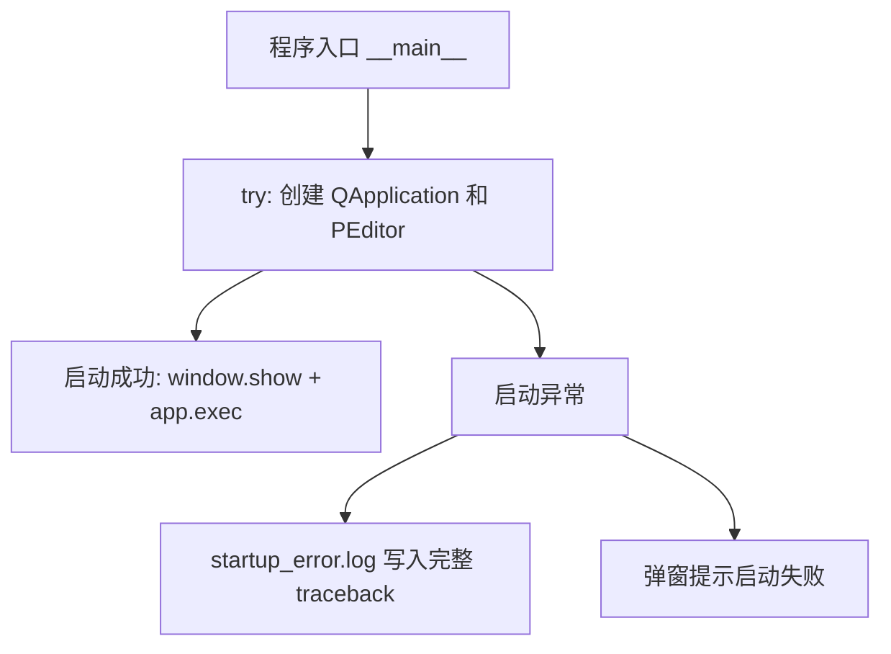

### 本次修复点

1. `AutoWrapTextEdit.update_auto_height()` 增加 `_height_updating` 防重入标记，避免 `resizeEvent -> setFixedHeight -> resizeEvent` 反复触发导致启动卡住或窗口打不开。
2. `InputOptionRow.update_adaptive_size()`、`TemplateSelectRow.update_adaptive_size()`、`CopyButtonItem.update_adaptive_size()` 增加 `_adaptive_updating` 防重入标记，并且只有宽高真正变化时才调用 `setFixedWidth/setFixedHeight`。
3. `BrowserFlowWindow._update_step_form_widths()` 增加 `_updating_step_form_widths` 防重入标记，窗口缩放时改为 `QTimer.singleShot(0, ...)` 延后刷新，避免布局刷新期间反复触发 resize。
4. `load_template_list()` 在程序启动选中默认模板时临时阻断 `template_combo` 信号，避免启动阶段重复执行 `on_template_changed()` 导致重复重建输入区。
5. 程序入口增加 `startup_error.log` 输出。若后续仍发生启动失败，可直接把 exe 同目录下的 `startup_error.log` 发回定位。

## 2026-05-14 输入行高度与缩放调试更新

### 更新目标

1. 输入项文本框默认高度与下拉菜单保持一致，默认在输入行中垂直居中。
2. 当文本内容高度小于当前输入框高度时，不额外撑大；当内容超过当前高度时自动增高，达到“选项输入框高度”设置值后改为内部滚动。
3. 拖动主界面分割区域时，模板行、输入选项行和复制项必须能随滚动区宽度变大，也能主动缩小。
4. 浏览器配置窗口的步骤编辑滚动区同步使用宽度刷新逻辑，避免子控件固定宽度只增不减。

### 关键函数关系

```mermaid
flowchart TB
    input_scroll_resize[首页输入滚动区尺寸变化] --> PEditor_eventFilter[PEditor.eventFilter]
    PEditor_eventFilter --> refresh_rows[_refresh_main_adaptive_rows]
    refresh_rows --> set_panel_width[input_scroll_panel.setFixedWidth(viewport_width)]
    refresh_rows --> template_update[TemplateSelectRow.update_adaptive_size]
    refresh_rows --> option_update[InputOptionRow.update_adaptive_size]

    option_update --> label_width[update_label_max_width: 标签最大为滚动页宽度1/4]
    option_update --> editor_width[输入控件宽度=滚动页宽度-拖动标记-标签-边距]
    option_update --> editor_height[update_editor_adaptive_size]
    editor_height --> auto_text[AutoWrapTextEdit.update_auto_height]
    auto_text --> one_line[内容未超过单行: 保持单行高度]
    auto_text --> grow[内容超过: 增高到设置上限]
    auto_text --> scroll[超过设置上限: 内部滚动]

    browser_step_scroll[浏览器配置步骤编辑滚动区尺寸变化] --> Browser_eventFilter[BrowserFlowWindow.eventFilter]
    Browser_eventFilter --> step_widths[_update_step_form_widths]
    step_widths --> step_panel_width[step_scroll_panel.setFixedWidth(viewport_width)]
    step_widths --> step_label_width[标签宽度最多1/4]
    step_widths --> step_field_width[字段控件固定为剩余宽度]
```

### 调试结论

- 首页输入行不能只依赖 PyQt 的弹性布局，否则子控件固定宽度会把滚动页最小宽度撑大，导致分割区域缩小时行控件不跟随缩小。
- 本次改为在滚动区 resize 时先固定 `input_scroll_panel` 为当前 viewport 宽度，再逐行重新计算控件宽度。
- 文本输入项使用 `AutoWrapTextEdit`，高度由 `single_line_height`、文档真实高度和 `option_input_height` 三者共同控制。
- 浏览器配置窗口中的步骤编辑区同样固定滚动页宽度，并重新计算表单标签和字段控件宽度，避免类似只变大不变小的问题。

## 2026-05-14 分隔栏拖动尺寸叠加修复

### 问题原因

拖动首页分隔栏时，输入行在 `resizeEvent`、滚动区 `eventFilter`、`setFixedWidth/setFixedHeight` 之间反复触发布局刷新。上一轮固定宽度、固定高度没有在下一轮计算前完全释放，部分计算又会读取当前控件尺寸作为备用值，容易出现“越拖越大、只能变大不能缩小”的现象。

### 新处理流程

```mermaid
flowchart TB
    resize[分隔栏/滚动区尺寸变化] --> schedule[_schedule_refresh_main_adaptive_rows 合并刷新]
    schedule --> refresh[_refresh_main_adaptive_rows]
    refresh --> reset[reset_adaptive_constraints 清空旧宽高限制]
    reset --> viewport[读取 input_scroll.viewport 当前宽度]
    viewport --> panel[input_scroll_panel 固定为当前可视宽度]
    panel --> row[InputOptionRow.update_adaptive_size]
    row --> base[只用 viewport 宽度作为本轮计算基准]
    base --> label[标签宽度 = min(自然宽度, viewport/4)]
    base --> editor[输入控件宽度 = viewport - 标记 - 标签 - 边距]
    base --> height[行高 = 标记/标签/输入控件高度最大值]
```

### 本次代码约束

1. `InputOptionRow.resizeEvent()` 和 `TemplateSelectRow.resizeEvent()` 不再主动调用自适应计算，避免自身 `setFixedWidth()` 再次触发布局循环。
2. 每次重算前先执行 `reset_adaptive_constraints()`，清空上一次 `setFixedWidth()` / `setFixedHeight()` 造成的最小最大尺寸约束。
3. `_refresh_main_adaptive_rows()` 增加 `_schedule_refresh_main_adaptive_rows()` 合并刷新，避免一次拖动产生多次排队重算。
4. `InputOptionRow._available_row_width()` 只以 `input_scroll.viewport().width()` 为核心基准，不再把上一轮行宽作为优先参考。
5. 浏览器配置窗口 `BrowserFlowWindow._update_step_form_widths()` 同步清理标签和字段控件旧宽度，再按当前滚动区宽度重新分配。

## 2026-05-14 长文本换行、数值容错与拖动抖动修复

### 1. 输入长文本异常换行修复

```mermaid
flowchart LR
    InputOptionRow[InputOptionRow.update_editor_adaptive_size] --> editor_width[本轮计算 editor_width]
    editor_width --> set_available_text_width[AutoWrapTextEdit.set_available_text_width]
    set_available_text_width --> doc_width[document.setTextWidth]
    doc_width --> update_auto_height[update_auto_height]
    update_auto_height --> row_height[输入行高度]
```

修复原则：文本框换行宽度只使用本轮由滚动区可视宽度计算出的 `editor_width`，不再使用上一轮 `viewport().width()` 或旧的文档宽度，避免长文本在固定旧宽度处异常换行。

### 2. 数量等字段输入非数字时的规则容错

```mermaid
flowchart LR
    formula[数学公式: round/roundup/int/float] --> safe_number[安全数值函数]
    safe_number --> numeric_ok{可转数字?}
    numeric_ok -->|是| result[正常计算]
    numeric_ok -->|否| fallback[返回原始文本/空文本]
```

`datamatch.py` 与 `webengine.py` 中的 `round()`、`roundup()`、`int()`、`float()` 已增加非数字容错。用户在“数量”等输入项输入长文本时，不再因为 `decimal.InvalidOperation` 造成公式错误或导出流程中断。

### 3. 拖动分隔栏时选项行抖动修复

```mermaid
flowchart TB
    resize[滚动区 Resize] --> schedule[延迟合并刷新]
    schedule --> viewport_width[读取当前 viewport 宽度]
    viewport_width --> reset[清除旧 fixed 宽高]
    reset --> recalc[重新计算标签/输入框/行高]
```

输入区滚动条改为稳定占位，避免内容高度变化导致滚动条显隐反复改变 viewport 宽度；浏览器配置窗口的步骤编辑滚动区也采用相同处理，并将尺寸刷新改为防抖调度。

## 15. 本次补充修复：长文本换行、单行高度、下拉菜单换行

```mermaid
flowchart TB
    InputOptionRow[InputOptionRow.update_adaptive_size] --> editor_width[本轮计算出的 editor_width]
    editor_width --> AutoWrapTextEdit[AutoWrapTextEdit.set_available_text_width]
    AutoWrapTextEdit --> no_doc_width[取消 QTextDocument 固定 textWidth]
    no_doc_width --> widget_width[显示换行交给 QTextEdit.WidgetWidth]
    editor_width --> metrics_height[QFontMetrics 按当前宽度计算文本高度]
    metrics_height --> auto_height[update_auto_height]
    auto_height --> single_height[文字高度未超过单行高度: 保持单行高度]
    auto_height --> grow_height[文字高度超过当前高度: 逐步增高]
    auto_height --> max_height[达到选项输入框高度: 内部滚动]

    QComboBox[QComboBox/WrapComboBox] --> configure_combo_word_wrap[configure_combo_word_wrap]
    configure_combo_word_wrap --> ComboWordWrapDelegate[ComboWordWrapDelegate]
    ComboWordWrapDelegate --> popup_wrap[下拉列表项按当前下拉宽度换行]
```

### 15.1 修复原因

- 原先 `AutoWrapTextEdit` 通过 `QTextDocument.setTextWidth()` 固定文档宽度，并在计算高度时调用 `document.adjustSize()`。
- 当分隔栏或窗口宽度变化后，上一轮文档宽度可能仍参与下一轮布局，导致长文本在旧位置异常换行。
- `adjustSize()` 还可能把文档的 ideal width 写回，造成单行文字也被算成更高高度。

### 15.2 新逻辑

1. 显示层：`QTextEdit` 继续使用 `WidgetWidth`，由控件当前实际宽度负责换行。
2. 高度层：不再用 `QTextDocument.adjustSize()` 推导高度，改用 `QFontMetrics.boundingRect()` 按本轮 `editor_width` 计算文本高度。
3. 单行逻辑：当计算出的文字高度没有超过单行高度时，不修改行高；只有真实需要多行显示时才增高。
4. 滚动逻辑：只有超过“选项输入框高度”设置值时才开启文本框内部滚动。
5. 下拉菜单：新增 `ComboWordWrapDelegate`，下拉列表项高度和绘制都允许换行，避免长选项被单行裁切。

### 15.3 后续修改注意事项

- 不要重新在 `AutoWrapTextEdit` 中长期固定 `QTextDocument.textWidth()`。
- 不要在自动高度计算中调用 `document.adjustSize()`。
- 输入行宽度仍应以 `input_scroll.viewport().width()` 为唯一基准。
- 若修改下拉框样式，应保留 `configure_combo_word_wrap()` 对 `ComboWordWrapDelegate` 的设置。

## 10. 2026-05-14 输入文本换行与下拉项换行修复

```mermaid
flowchart TB
    InputOptionRow[InputOptionRow.update_editor_adaptive_size] --> editor_width[本轮计算出的输入控件宽度]
    editor_width --> AutoWrapTextEdit[AutoWrapTextEdit.set_available_text_width]
    AutoWrapTextEdit --> doc_width[document.setTextWidth 当前真实文本宽度]
    doc_width --> height_calc[按当前宽度重新计算文本高度]
    height_calc --> single_baseline[单行基准高度]
    single_baseline --> row_height[只在内容高度超过单行基准时增高]
    row_height --> max_height[达到选项输入框高度后启用内部滚动]

    editor_width --> ComboWrap[configure_combo_word_wrap]
    ComboWrap --> ComboDelegate[ComboWordWrapDelegate]
    ComboDelegate --> popup_width[下拉列表按当前控件宽度绘制]
    popup_width --> popup_height[下拉项按换行后高度显示]
```

### 本次修复要点

1. `AutoWrapTextEdit` 不再把 `QTextDocument.textWidth` 固定为 `-1`。每次行宽变化时，都使用当前输入框真实文本宽度重新 `setTextWidth()`，避免全屏或宽区域下连续长文本不按控件宽度换行。
2. 输入框高度不再直接用旧文档布局或旧控件宽度判断。先计算单行基准高度，只有当前文本按真实宽度排版后的高度超过单行基准时才增高；达到“选项输入框高度”后才出现内部滚动条。
3. `ComboWordWrapDelegate` 的宽度来源改为当前下拉框/列表的 `_pe_wrap_width`，不使用上一轮 `sizeHint` 或内容自然宽度叠加，避免下拉项越撑越宽而看起来不换行。
4. `webcontrol.py` 的浏览器配置窗口下拉项同步使用换行代理，保证子窗口中的下拉菜单也按当前控件宽度换行。

## 本次补充优化：可输入下拉菜单换行、字体重排、表单标签宽度

```mermaid
flowchart TB
    EditableWrapComboBox[EditableWrapComboBox 可输入换行下拉框] --> AutoWrapTextEdit[内部 AutoWrapTextEdit 多行输入层]
    EditableWrapComboBox --> WrapComboBox[保留下拉列表能力]
    InputOptionRow[InputOptionRow.update_editor_adaptive_size] --> EditableWrapComboBox
    InputOptionRow --> current_width[本轮输入控件真实宽度]
    current_width --> set_auto_layout[set_auto_layout 同步文本宽度/单行高度/最大高度]
    set_auto_layout --> current_text_wrap[当前输入文字立即按范围换行]
    set_auto_layout --> popup_wrap[下拉列表按当前下拉框宽度换行]

    apply_ui_settings[apply_ui_settings 字体变化] --> row_update[逐行 update_adaptive_size]
    row_update --> recompute_width[按当前字体 QFontMetrics 重新计算宽度]
    recompute_width --> rewrap_text[重新换行显示]

    UiSettingsDialog[界面设置窗口] --> polish_form[_polish_settings_form]
    polish_form --> stable_labels[标签共享宽度，避免被挤成两行]
    child_windows[其他子窗口 QFormLayout] --> generic_form_width[_apply_generic_window_ui_settings]
    generic_form_width --> readable_layout[标签不拥挤，控件使用剩余宽度]
```

### 说明

1. 原生 `QComboBox` 的可输入区域是 `QLineEdit`，天然只能单行显示；本次新增 `EditableWrapComboBox`，在编辑区域覆盖 `AutoWrapTextEdit`，使“可输入下拉菜单”当前输入文字也能像普通输入文本框一样自动换行。
2. 字体变化后，所有输入行重新以当前 `QFontMetrics` 和当前控件宽度计算换行，不再沿用旧字体宽度。
3. 下拉列表弹出宽度固定为当前下拉框宽度附近，不再被最长选项撑大；超出部分由换行代理绘制。
4. 设置窗口和通用子窗口表单改为共享标签宽度，短标签不再被挤成两行，长标签才允许换行。

## 15. 本次补充修复：可输入下拉菜单选择、即时换行和拖拽卡死

```mermaid
flowchart TB
    EditableWrapComboBox[EditableWrapComboBox 可输入下拉菜单] --> inner_edit[AutoWrapTextEdit 覆盖编辑区]
    EditableWrapComboBox --> popup_view[下拉列表 view]
    popup_view --> _on_view_pressed[_on_view_pressed 点击下拉项]
    EditableWrapComboBox --> _on_popup_activated[_on_popup_activated 激活下拉项]
    _on_view_pressed --> _sync_inner_from_index[_sync_inner_from_index]
    _on_popup_activated --> _sync_inner_from_index
    _sync_inner_from_index --> inner_edit
    _sync_inner_from_index --> currentTextChanged[currentTextChanged 触发预览更新]

    inner_edit --> _on_inner_text_changed[_on_inner_text_changed 输入文本变化]
    _on_inner_text_changed --> update_inner_editor_geometry[update_inner_editor_geometry 立即按当前宽度重排]
    update_inner_editor_geometry --> _request_parent_layout[_request_parent_layout 通知 InputOptionRow 重算高度]
    _request_parent_layout --> InputOptionRow[InputOptionRow.update_adaptive_size]

    handle_mouse_move[拖动柄 mouseMove] --> buttons_check{左键是否仍按下}
    buttons_check -->|否| clear_drag_state[清空 drag_start 和 mouse_dragging]
    buttons_check -->|是| move_row[执行拖拽排序]
```

### 15.1 修复点

1. `EditableWrapComboBox` 增加 `activated` 和 `view().pressed` 双重同步，避免覆盖的多行编辑区导致下拉项点击后没有写回当前值。
2. 输入长文本时，`AutoWrapTextEdit` 内容变化后会立即调用 `update_inner_editor_geometry()` 并通知父级 `InputOptionRow.update_adaptive_size()`，不再等拖动窗口后才换行。
3. 输入选项拖动柄和复制项拖动柄在 `mouseMove` 中检查左键是否仍按下。如果用户拖动分隔栏时鼠标经过拖动柄，不会误进入排序流程，降低卡死风险。
4. 主界面分隔栏 resize 刷新从 20 ms 合并为 60 ms，并缓存本轮可视宽度，减少拖动过程中的重复布局计算。

### 15.2 后续注意

- 可输入下拉菜单的显示值以 `EditableWrapComboBox.inner_text_edit()` 为准，采集输入值时仍通过 `currentText()` 获取。
- 修改下拉菜单显示逻辑时，必须同时检查 `_sync_inner_from_index()`、`_on_inner_text_changed()`、`configure_combo_word_wrap()` 三处，避免选择项、手动输入和下拉列表显示不同步。

## 12. 本次补充优化：最小稳定布局宽度与工具栏菜单稳定

```mermaid
flowchart TB
    viewport_width[input_scroll.viewport 当前宽度] --> effective_width[effective_width=max(viewport_width, option_row_min_layout_width)]
    effective_width --> input_scroll_panel[input_scroll_panel 固定为有效宽度]
    input_scroll_panel --> TemplateSelectRow[模板固定行按有效宽度布局]
    input_scroll_panel --> InputOptionRow[输入选项行按有效宽度布局]
    InputOptionRow --> label_width[标签最大宽度=有效宽度/4]
    InputOptionRow --> editor_width[输入控件宽度=有效宽度-拖动标记-标签-边距]
    editor_width --> text_wrap[文本按稳定宽度换行]

    viewport_width --> narrow{视口是否小于最小稳定宽度}
    narrow -->|是| min_layout[行内控件保持最小稳定宽度，不再继续压缩]
    narrow -->|否| normal_layout[随视口正常变宽/变窄]

    toolbar_menu[工具栏菜单按钮] --> fixed_width[固定菜单按钮宽度]
    fixed_width --> stable_arrow[菜单三角指示位置稳定]
```

### 12.1 输入区最小稳定宽度

- 新增 `input_option_min_layout_width`，作为主界面输入区最小稳定布局宽度。
- `PEditor.option_row_min_layout_width()` 会结合当前选项字体大小计算最终最小宽度。
- 当左侧分割区域小于该宽度时，`input_scroll_panel` 使用最小稳定宽度，并通过水平滚动查看内容。
- `InputOptionRow` 和 `TemplateSelectRow` 均使用 `effective_width=max(视口宽度, 最小稳定宽度)` 作为唯一布局基准。
- 这样可避免长文本在极窄宽度下反复换行、反复改行高，造成拖动分隔栏卡死。

### 12.2 浏览器配置窗口同步策略

- `webcontrol.py` 新增 `step_editor_min_layout_width`。
- 浏览器配置窗口的步骤编辑滚动区小于该宽度时，不再继续压缩表单标签和控件，而是使用水平滚动查看。
- 防止子窗口中长输入模板、备注、下拉框在窄宽度下反复重排。

### 12.3 工具栏菜单三角位置稳定

- 工具栏 `QToolButton` 改为按字体计算后固定宽度。
- QSS 中显式设置 `QToolButton::menu-indicator` 位于按钮右侧。
- 拖动复制项或输入选项后，即使模板保存和布局刷新，也不再改变菜单按钮宽度，从而减少三角图标位置跳动。

## 10. 本次 B + A 分支修复记录（2026-05）

### 10.1 可输入下拉菜单：选择 B，自定义控件实现

```mermaid
flowchart LR
    EditableWrapComboBox[EditableWrapComboBox 自定义可输入下拉控件] --> inner[AutoWrapTextEdit 多行输入区]
    EditableWrapComboBox --> drop[QToolButton 下拉按钮]
    EditableWrapComboBox --> popup[Qt.Popup 弹出层]
    popup --> list[QListWidget 下拉列表]
    list --> choose[_on_popup_item_clicked]
    choose --> setindex[setCurrentIndex]
    setindex --> text[currentTextChanged]
    text --> main[PEditor.on_input_widget_changed]
    main --> result[update_result_text]
```

改动原因：原生 `QComboBox` 的可输入区由单行 `QLineEdit` 实现，长文本换行、空白项选择、覆盖式多行编辑区同步容易产生事件冲突。本次改为 `QWidget + AutoWrapTextEdit + QToolButton + QListWidget(Qt.Popup)`，保留 `addItem/addItems/clear/count/itemText/findText/currentText/setCurrentText/setCurrentIndex/currentIndex/isEditable` 等兼容接口。

影响函数：

- `_create_widget()`：`editable_combo` 生成 `EditableWrapComboBox`。
- `_set_widget_value()`：新增对 `EditableWrapComboBox` 的恢复逻辑。
- `setup_input_change_tracking()`：连接 `EditableWrapComboBox.currentTextChanged`。
- `refresh_dynamic_combo_options()`：动态刷新支持 `QComboBox` 和 `EditableWrapComboBox`。
- `collect_input_values()` / `clear_inputs()`：新增对自定义下拉控件的采集和清空。
- `InputOptionRow.update_editor_adaptive_size()`：对自定义下拉控件调用 `set_auto_layout()`。

### 10.2 工具栏：选择 A，恢复原生菜单三角形

```mermaid
flowchart LR
    create_toolbar[create_toolbar] --> QToolBar[QToolBar mainToolbar]
    QToolBar --> ToolButton[QToolButton 原生 InstantPopup]
    ToolButton --> QMenu[QMenu]
    apply[_apply_runtime_ui_settings] --> font[仅设置 QFont 和 minHeight/minWidth]
    font --> nofixed[不再 setFixedWidth]
    nofixed --> native[保留 PyQt 原生菜单指示器]
```

改动原因：上一版为了固定三角形位置，使用了 `QToolButton::menu-indicator` 自定义样式和 `setFixedWidth()`。在模板保存、选项/复制项拖动排序后，工具栏会重新参与布局计算，导致文字和菜单箭头一起轻微位移。本次恢复原生菜单指示器，删除自定义 `menu-indicator` QSS，不再对工具栏菜单按钮设置固定宽度，只设置稳定的最小宽度和高度。

影响函数：

- `_build_app_stylesheet()`：删除 `QToolButton::menu-indicator` 自定义样式，工具栏按钮只保留 padding/min-height。
- `_apply_runtime_ui_settings()`：工具栏按钮不再 `setFixedWidth()`，改为 `setMinimumWidth()` + 放开最大宽度。
- `create_toolbar()` / `_add_toolbar_menu()`：工具栏和菜单按钮设置为原生 `QToolButton.InstantPopup`，并保持 `QSizePolicy.Minimum, QSizePolicy.Fixed`。

### 10.3 隐性 bug 防护点

1. 下拉项选择空白行时不再依赖原生 QComboBox 的内部 `QLineEdit`，避免空白项、覆盖式多行文本框和 currentIndex 信号之间互相抢状态。
2. 可输入下拉菜单输入长文本后立即由 `AutoWrapTextEdit` 按当前宽度重排，不需要拖动边界后才更新。
3. 工具栏不再用固定宽度和自定义三角形样式抵消布局，这类强制修正容易在字体、菜单弹出、模板保存后产生二次位移。
4. 动态下拉项刷新时继续保留当前用户输入文本，不因临时不在候选项中而清空。

## 13. 深度研究报告后续修复记录（报告问题全量跟进）

本节对应“PEditor v3.0 PyQt5 GUI 剩余问题深度研究报告”中除 B+A 分支外的其余整改内容。后续继续修改前，应优先检查本节涉及的工具栏、下拉控件、信号阻断、滚动条和自适应缓存逻辑。

### 13.1 工具栏稳定性修复

```mermaid
flowchart TB
    create_toolbar[create_toolbar] --> ToolbarMenuButton[ToolbarMenuButton 原生菜单三角]
    ToolbarMenuButton --> stable_size_hint[stable_size_hint: 基于 Qt sizeHint]
    apply_ui_settings[apply_ui_settings] --> toolbar_sig[_toolbar_metrics_sig]
    toolbar_sig -->|字体/紧凑度/文字变化| refresh_toolbar_width[重新计算工具栏按钮宽度]
    toolbar_sig -->|无变化| keep_toolbar_width[保持现有宽度]
    refresh_toolbar_width --> no_shift[避免排序/保存模板后工具栏文字和三角轻微位移]
```

整改点：

1. 删除 `QToolButton::menu-indicator` 自定义样式覆盖，恢复 PyQt 原生菜单三角。
2. 工具栏按钮改为 `ToolbarMenuButton`，宽度使用 Qt 原生 `sizeHint()/minimumSizeHint()`，不再用 `adaptive_text_width()` 手写估算。
3. 工具栏宽度只在工具栏相关签名变化时刷新，拖动输入选项、拖动复制项、刷新输入区时不再反复重算工具栏宽度。

### 13.2 可输入下拉与信号连接修复

```mermaid
flowchart LR
    refresh_input_area[refresh_input_area] --> setup_input_change_tracking[setup_input_change_tracking]
    setup_input_change_tracking --> no_disconnect[不再 widget.disconnect]
    no_disconnect --> keep_internal_signals[保留自定义下拉内部信号]
    EditableWrapComboBox[EditableWrapComboBox] --> popup_list[弹出 QListWidget]
    popup_list --> item_clicked[_on_popup_item_clicked]
    item_clicked --> setCurrentIndex[先 setCurrentIndex]
    setCurrentIndex --> activated_emit[再发出 activated]
    activated_emit --> hidePopup[最后延后 hidePopup]
```

整改点：

1. `setup_input_change_tracking()` 去掉 blanket `widget.disconnect()`，避免误断控件内部信号。
2. 自定义可输入下拉选择空白项时，按“设置当前值 → 发出激活信号 → 延后关闭弹窗”的顺序执行，降低空项重选造成假死的风险。
3. 动态下拉项刷新时使用异常安全的 `signal_blocked()`，不再手写 `blockSignals(True/False)`。

### 13.3 通用 GUI 辅助逻辑抽取

```mermaid
flowchart TB
    gui_helpers[gui_helpers.py] --> signal_blocked[signal_blocked: QSignalBlocker封装]
    gui_helpers --> ComboWordWrapDelegate[ComboWordWrapDelegate 下拉项换行代理]
    gui_helpers --> configure_combo_word_wrap[configure_combo_word_wrap]
    PEditor[PEditor.py] --> gui_helpers
    webcontrol[webcontrol.py] --> gui_helpers
    datamanager[datamanager.py] --> signal_blocked
    template_editor[template_editor.py] --> signal_blocked
```

整改点：

1. 保留 `gui_helpers.py`，仅保存异常安全信号阻断工具和文本框换行高度计算标志。
2. `PEditor.py` 和 `webcontrol.py` 已删除下拉换行代理调用，下拉菜单恢复原生样式，避免自定义绘制与选择逻辑冲突。
3. `datamanager.py`、`template_editor.py` 中的手写 `blockSignals` 同步改为 `signal_blocked()`。

### 13.4 主界面自适应缓存修复

```mermaid
flowchart TB
    resize_or_setting[窗口缩放或字体设置变化] --> adaptive_signature[自适应刷新签名]
    adaptive_signature --> width[输入区宽度]
    adaptive_signature --> option_font[选项字号]
    adaptive_signature --> option_compact[选项紧凑度]
    adaptive_signature --> option_height[选项输入框高度]
    adaptive_signature --> copy_font[复制按钮字号]
    adaptive_signature --> copy_compact[复制按钮紧凑度]
    adaptive_signature --> refresh_rows[_refresh_main_adaptive_rows]
```

整改点：

1. `_refresh_main_adaptive_rows()` 的缓存签名不再只看宽度，同时纳入字号、紧凑度、选项输入框高度、复制按钮字号等参数。
2. `apply_ui_settings()` 会强制下一次自适应刷新并清空工具栏宽度缓存。
3. 同一窗口宽度下修改字体大小，也会重新计算行宽、行高和下拉换行宽度。

### 13.5 复制按钮区滚动与 resize 防抖

```mermaid
flowchart LR
    copy_scroll[copy_scroll] --> vertical_always_on[纵向滚动条 AlwaysOn]
    vertical_always_on --> stable_viewport[viewport宽度稳定]
    CopyButtonItem[CopyButtonItem.resizeEvent] --> resize_sig[_last_resize_sig]
    resize_sig -->|变化| singleShot[QTimer.singleShot合并刷新]
    resize_sig -->|未变化| skip[跳过重复刷新]
```

整改点：

1. 复制按钮区纵向滚动条改为固定占位，避免滚动条显隐造成 viewport 宽度抖动。
2. `CopyButtonItem.resizeEvent()` 增加签名比对和延后刷新，避免 resize 时立即写回固定尺寸导致高频重排。

### 13.6 后续检查重点

- 修改输入行宽度逻辑时，不要把上一次 `fixedWidth/fixedHeight` 当作下一次计算基准。
- 修改下拉控件时，保持 PyQt5 原生 `QComboBox` 行为，不再恢复自定义换行代理。
- 修改信号阻断时，优先使用 `with signal_blocked(widget):`。
- 修改工具栏时，不要重新添加 `QToolButton::menu-indicator` 自定义样式，不要用纯文字宽度估算工具栏按钮宽度。

## 12. 本次删除后定时回调修复

```mermaid
flowchart LR
    resize_or_text_change[resizeEvent / 文本变化 / 子窗口尺寸变化] --> qt_safe_single_shot[qt_safe_single_shot 延后执行]
    qt_safe_single_shot --> callback[布局刷新回调]
    callback --> alive{Qt C++ 对象仍存在?}
    alive -->|是| update_layout[执行 set_auto_layout / update_auto_height / update_adaptive_size]
    alive -->|否或已删除| ignore[捕获 RuntimeError 并忽略]
```

### 修复说明

- 报错位置为 `EditableWrapComboBox.resizeEvent()` 中的 `QTimer.singleShot(0, lambda: self.set_auto_layout(...))`。
- 输入行刷新、模板切换、选项重建或窗口关闭时，原控件可能已经被 Qt 删除，但延后执行的 lambda 仍会访问该对象，导致 `RuntimeError: wrapped C/C++ object ... has been deleted`。
- 本次新增 `qt_safe_single_shot()`，所有主界面相关延后布局刷新统一通过该函数调度。
- `PEditor.py` 中的输入框自适应高度、可输入下拉布局、输入行尺寸、复制项尺寸、主界面自适应刷新均已改为删除安全回调。
- `webcontrol.py` 中浏览器配置窗口步骤编辑区的延后宽度刷新也已同步改为删除安全回调。

### 变量/函数影响

| 函数 | 影响范围 | 说明 |
|---|---|---|
| `qt_safe_single_shot()` | 主界面与浏览器配置窗口 | 捕获延后回调中访问已删除 Qt 对象产生的 `RuntimeError` |
| `EditableWrapComboBox.resizeEvent()` | 自定义可输入下拉菜单 | 不再直接用 lambda 延后访问自身 |
| `AutoWrapTextEdit.resizeEvent()` | 自动换行输入框 | 延后高度计算删除安全 |
| `InputOptionRow` 文档变化监听 | 首页输入选项行 | 文本变化后延后刷新行尺寸删除安全 |
| `CopyButtonItem.resizeEvent()` | 复制选项卡片 | 延后刷新尺寸删除安全 |
| `BrowserFlowWindow._schedule_step_form_width_update()` | 浏览器配置窗口 | 子窗口关闭/切换时不再因延后刷新访问已删除对象 |

## 14. 下拉菜单回退为原生控件

> 本次根据反馈，将“下拉菜单”和“可输入下拉菜单”全部回退为 PyQt5 原生 `QComboBox`。不再要求下拉项换行，也不再使用自定义可输入下拉控件。

```mermaid
flowchart TB
    option_config[主模板 options] --> _create_widget[_create_widget]
    _create_widget -->|type=combo| native_combo[QComboBox 原生下拉菜单]
    _create_widget -->|type=editable_combo| native_editable_combo[QComboBox + setEditable(True)]
    native_combo --> setup_input_change_tracking[setup_input_change_tracking]
    native_editable_combo --> setup_input_change_tracking
    setup_input_change_tracking --> currentTextChanged[currentTextChanged]
    currentTextChanged --> on_input_widget_changed[on_input_widget_changed]
    on_input_widget_changed --> update_result_text[刷新预览]
```

### 本次删除/回退内容

1. 删除 `EditableWrapComboBox` 自定义控件，避免自定义弹窗、延后回调和原生下拉行为冲突。
2. 删除 `WrapComboBox` 自定义绘制控件，普通下拉菜单恢复原生 `QComboBox` 显示。
3. 删除 `ComboWordWrapDelegate` 和 `configure_combo_word_wrap()` 下拉换行代理逻辑。
4. `gui_helpers.py` 仅保留通用的 `signal_blocked()` 和文本框高度计算用的 `wrap_text_flags()`。
5. `webcontrol.py` 同步删除下拉换行代理调用，浏览器配置窗口下拉框恢复原生样式。

### 当前保留逻辑

| 内容 | 是否保留 | 说明 |
|---|---|---|
| 文本输入框自动换行 | 保留 | 仅影响普通文本输入项，不影响下拉菜单 |
| 可输入下拉菜单输入 | 保留 | 使用原生 `QComboBox.setEditable(True)` |
| 下拉项自动换行 | 删除 | 下拉菜单恢复原生单行行为 |
| 下拉项自定义绘制代理 | 删除 | 避免选择空白项、弹窗关闭、信号链冲突 |
| `signal_blocked()` | 保留 | 用于模板切换、下拉项刷新时安全阻断信号 |

### 后续修改注意

- 后续不要再给 `QComboBox` 添加自定义弹出列表或 `pressed + hidePopup` 逻辑。
- 可输入下拉菜单以原生 `QComboBox.setEditable(True)` 为准，不再强制换行。
- 下拉菜单动态刷新时仍需保留当前输入值，不允许因选项列表刷新而清空用户输入。

## 12. 本次修复：原生可输入下拉菜单光标跳位

```mermaid
flowchart TB
    user_typing[用户在可输入下拉菜单中输入文本] --> currentTextChanged[currentTextChanged]
    currentTextChanged --> on_input_widget_changed[on_input_widget_changed 记录 source_widget]
    on_input_widget_changed --> refresh_dynamic_combo_options[refresh_dynamic_combo_options(source_widget)]
    refresh_dynamic_combo_options --> is_current_editable{当前控件是否为正在输入的 editable combo}
    is_current_editable -->|是| skip_self[跳过刷新自身候选项]
    is_current_editable -->|否| update_others[刷新其他下拉控件]
    skip_self --> keep_cursor[保留原生 QLineEdit 光标位置]
    update_others --> preserve_text[_update_combo_items_preserve_text 保留文本/光标]
```

### 12.1 修复原因

原生 `QComboBox.setEditable(True)` 的输入区是内部 `QLineEdit`。之前每次输入字符都会触发 `refresh_dynamic_combo_options()`，并在候选项变化时执行 `clear()`、`addItems()`、`setCurrentText()`。当用户把光标放在文本中间连续输入时，第一次输入后内部 `QLineEdit` 光标会被重置到末尾，因此出现 `abc` 中在 `a` 和 `b` 之间输入 `111111` 后变成 `a1bc11111` 的问题。

### 12.2 当前规则

1. 用户正在某个可输入下拉菜单中打字时，不刷新该控件自己的候选列表。
2. 可输入下拉菜单允许列表外文本，因此不再把当前输入文本临时追加到候选项列表中。
3. 其他下拉控件仍可随当前输入值动态刷新。
4. 必须刷新候选项时，通过 `_update_combo_items_preserve_text()` 保留当前文本、光标位置和选区。

## 14. PEditor 3.1 更新：复制按钮自动换行与浏览器点击兜底

> 本节记录 3.1 版本中与本次需求直接相关的变量、函数和流程。后续继续修改复制按钮区或浏览器点击执行前，需要先参考本节，避免重新引入横向滚动或单一点击方式。

### 14.1 复制按钮区自动换行流程

```mermaid
flowchart TB
    copy_buttons[copy_buttons: 按保存顺序记录 CopyButtonItem 和字段名] --> _relayout[_relayout_copy_buttons]
    copy_scroll_width[copy_scroll.viewport().width 当前显示宽度] --> _relayout
    CopyButtonItemSize[CopyButtonItem.update_adaptive_size 计算单个按钮宽度和高度] --> _relayout
    _relayout --> row_calc{本行累计宽度 + 下个按钮宽度 > 可显示宽度?}
    row_calc -->|否| same_row[继续放在当前行]
    row_calc -->|是| new_row[换到下一行]
    same_row --> row_layout[当前行 QHBoxLayout]
    new_row --> new_row_widget[新增独立行 QWidget + QHBoxLayout]
    row_layout --> rows[copy_buttons_layout: QVBoxLayout 行容器]
    new_row_widget --> rows
    rows --> vertical_scroll[copy_scroll 只保留纵向滚动]
```

#### 关键变量与函数影响

| 变量/函数 | 本次改动 | 影响流程 |
|---|---|---|
| `copy_scroll` | `setWidgetResizable(True)`；横向滚动改为 `Qt.ScrollBarAlwaysOff`；纵向滚动改为按需显示 | 复制按钮不再横向拖动浏览，按钮超出宽度后自动换到下一行，区域高度不够时纵向滚动 |
| `copy_buttons_layout` | 从网格布局改为 `QVBoxLayout` 行容器 | 每一行内部由独立 `QHBoxLayout` 排列，换行后不再按列宽对齐 |
| `copy_buttons` | 继续作为真实顺序来源 | 拖拽排序、保存 `copy_buttons` 配置、删除/新增复制项都以该列表为准 |
| `_relayout_copy_buttons()` | 新增；按当前视口宽度重新计算行列 | 在刷新、窗口尺寸变化、按钮显示/隐藏、拖拽排序后调用 |
| `move_copy_item_by_mouse()` | 改为直接调整 `copy_buttons` 列表顺序，再调用 `_relayout_copy_buttons()` | 适配多行布局后仍可拖动排序 |
| `sync_copy_order_from_items()` | 不再从布局读取顺序，改为保存当前 `copy_buttons` 顺序 | 避免多行行容器位置影响真实保存顺序 |
| `CopyButtonItem.handle` | 从较高的 `☰` 改为很矮的 `•••` | 拖动标记高度减小，不再明显挤占复制按钮显示空间 |

### 14.2 复制按钮拖拽排序流程

```mermaid
flowchart LR
    drag[拖动 CopyButtonItem.handle] --> find_target[find_copy_item_at_pos 找到鼠标下的目标按钮]
    find_target --> move[move_copy_item_by_mouse]
    move --> index_calc[从 copy_buttons 计算原索引和目标索引]
    index_calc --> list_reorder[调整 copy_buttons 列表顺序]
    list_reorder --> relayout[_relayout_copy_buttons 按新顺序重新排成多行]
    relayout --> sync[sync_copy_order_from_items]
    sync --> save[_save_current_template 保存主模板 copy_buttons]
```

### 14.3 浏览器点击失败原因分析与兜底流程

本次问题表现为：定位 XPath 能找到 `<a>`，但自动点击确认按钮大概率无效，手动点过后才偶尔成功。结合当前执行链路，可能原因主要有以下几类：

1. 小弹窗刚出现时仍处在动画或布局变化中，元素已能定位，但点击点未稳定。
2. XPath 匹配到多个 `<a>` 时，Selenium 可能先取到隐藏或非当前弹窗中的元素。
3. 元素中心点被遮罩层、浮层或其他元素短暂覆盖，普通 `element.click()` 会失败或被吞掉。
4. 自定义弹窗按钮可能依赖 `mousedown`、`mouseup`、`click` 等完整鼠标事件链，仅调用普通 click 不稳定。
5. 弹窗/浏览器焦点状态不同，导致第一次自动点击不像人工点击那样触发完整交互。

```mermaid
flowchart TB
    click_step[execute_flow: 点击元素步骤] --> _click[_click_element]
    _click --> candidate[_wait_for_click_candidate 从全部匹配元素中选择可见可用项]
    candidate --> scroll[_scroll_into_view 滚动到视图中心]
    scroll --> stable[_wait_for_element_stable 等待位置尺寸稳定]
    stable --> covered{中心点是否被覆盖?}
    covered -->|否| action_click[ActionChains.move_to_element.click 模拟人工鼠标点击]
    action_click --> success[点击成功]
    covered -->|是/异常| retry[重试]
    retry --> js[_js_click_element: mouseover/mousemove/mousedown/mouseup/click]
    js --> success
```

#### 点击链路变量与函数影响

| 变量/函数 | 本次改动 | 影响流程 |
|---|---|---|
| `_wait_for_click_candidate()` | 新增；从全部匹配元素中选择可见且可用的元素 | 避免 XPath 为 `<a>` 或宽泛路径时选到隐藏链接 |
| `_wait_for_element_stable()` | 新增；短暂等待元素矩形稳定 | 减少弹窗动画、布局变化导致的点击失败 |
| `_element_center_is_covered()` | 新增；检测元素中心点上方是否有遮挡元素 | 避免点击被遮罩/浮层拦截 |
| `_js_click_element()` | 新增；触发完整鼠标事件链和 JS click | 作为自定义弹窗确认按钮的兜底点击方式 |
| `_click_element()` | 从单一 `element.click()` 改为多策略点击 | 所有“点击元素”、下拉第二段点击、右键菜单项点击等调用该函数的动作都会受益 |

### 14.4 本次改动边界

- 未修改模板数据结构，`copy_buttons` 仍保存在主模板配置中。
- 未把复制按钮重新绑定到可用字段池；删除后的复制按钮仍不会因字段存在而自动恢复。
- 未新增新的浏览器动作类型，只增强现有“点击元素”底层执行稳定性。
- 未改变规则引擎、字段模板、数据库管理等与本次需求无关的代码。


## 15. PEditor 3.1 追加调整：复制按钮无闪窗、文字不换行、独立行排列

> 本节记录在 3.1 基础上继续修正复制按钮区后的变量、函数和流程影响。后续修改复制按钮新增、删除、刷新和布局时，应优先参考本节。

### 15.1 添加复制按钮闪出小窗口的原因与修复

```mermaid
flowchart TB
    add_copy[add_copy_button_by_field 添加复制按钮] --> rebuild[_rebuild_copy_button_widgets]
    rebuild --> clear_old[_clear_copy_button_widgets]
    clear_old --> clear_rows[_clear_copy_row_widgets]
    clear_rows --> detach[_detach_copy_items_for_relayout]
    detach --> hide_first[先 hide 复制项]
    hide_first --> reparent[临时设回 copy_scroll_widget]
    reparent --> delete_row[删除旧行容器]
    clear_old --> delete_item[旧 CopyButtonItem hide 后 deleteLater]
    delete_item --> no_popup[不再 setParent(None)，避免短暂变成顶层小窗口]
```

#### 关键变量与函数影响

| 变量/函数 | 本次改动 | 影响流程 |
|---|---|---|
| `_clear_copy_button_widgets()` | 删除旧复制项前先隐藏，不再对可见控件调用 `setParent(None)` | 避免添加复制按钮时旧按钮短暂变成多个顶层小窗口 |
| `_clear_copy_row_widgets()` | 新增；只负责清理自动换行产生的行容器 | 刷新布局时不销毁真实按钮对象，减少闪烁 |
| `_detach_copy_items_for_relayout()` | 新增；重排前把按钮隐藏并临时挂回滚动面板 | 行容器销毁时不会误删仍需保留的复制按钮 |

### 15.2 复制按钮文字宽度与独立行布局

```mermaid
flowchart TB
    field_name[字段名 field_name] --> text_width[text_width_for 计算完整文字宽度]
    text_width --> button_width[button_width = 文字宽度 + 内边距]
    button_width --> no_wrap[按钮文字保持单行，不调用 wrap_text_by_width]
    no_wrap --> copy_item[CopyButtonItem 固定宽度]

    copy_item --> relayout[_relayout_copy_buttons]
    relayout --> row_limit{当前行剩余宽度是否足够?}
    row_limit -->|足够| same_row[加入当前行 QHBoxLayout]
    row_limit -->|不足| new_row[新建下一行 QWidget + QHBoxLayout]
    same_row --> independent[每行独立横向排列]
    new_row --> independent
```

#### 关键变量与函数影响

| 变量/函数 | 本次改动 | 影响流程 |
|---|---|---|
| `CopyButtonItem.update_adaptive_size()` | 按完整文字宽度计算按钮宽度，按钮文字不再插入换行 | 复制按钮显示保持单行，宽度随字段名变化 |
| `copy_buttons_layout` | 外层改为 `QVBoxLayout`，内部每行动态创建独立 `QHBoxLayout` | 多行按钮不再按网格列宽对齐，每行都从左侧独立紧凑排列 |
| `_relayout_copy_buttons()` | 按当前行累计宽度决定是否新建行容器 | 仍保留自动换行和纵向滚动，不恢复横向滚动 |
| `_hidden_by_filter` | `CopyButtonItem` 新增过滤隐藏标记 | 重排时区分“条件隐藏”和“临时隐藏”，避免按钮被误判为不可显示 |

### 15.3 本次改动边界

- 未修改模板保存结构，复制按钮顺序仍来自主模板配置 `copy_buttons`。
- 未修改复制按钮新增来源，仍从字段模板中的字段选择。
- 未改变复制按钮点击复制、多选复制、拖拽排序和删除逻辑。
- 未改动浏览器点击兜底逻辑和其他与本次问题无关的模块。

## 16. PEditor 3.1 追加调整：选项拖动图标恢复为三个横杠

> 本节记录本次只针对拖动标记外观的微调。复制按钮区保持上一版点状拖动标记不变，只恢复左侧输入选项行的拖动标记。

```mermaid
flowchart LR
    InputOptionRow[InputOptionRow 输入选项行] --> option_handle[handle = QLabel('☰')]
    option_handle --> option_drag[handle_mouse_press / handle_mouse_move / handle_mouse_release]
    option_drag --> move_option[move_option_row_by_mouse]
    move_option --> sync_option[sync_option_order_from_rows]

    CopyButtonItem[CopyButtonItem 复制按钮项] --> copy_handle[handle = QLabel('•••')]
    copy_handle --> copy_drag[复制按钮拖拽排序保持不变]
```

### 16.1 关键变量与函数影响

| 变量/函数 | 本次改动 | 影响流程 |
|---|---|---|
| `InputOptionRow.handle` | 从点状 `•••` 恢复为三个横杠 `☰` | 只影响左侧输入选项行的拖动标记显示 |
| `CopyButtonItem.handle` | 保持点状 `•••` 不变 | 下方复制按钮区仍使用低高度拖动标记 |
| `handle_mouse_press()` / `handle_mouse_move()` / `handle_mouse_release()` | 未改动 | 拖拽排序逻辑不变 |
| `update_adaptive_size()` | 未改动 | 选项行宽高自适应逻辑不变 |

### 16.2 本次改动边界

- 未修改复制按钮布局、复制按钮换行、删除、新增和排序逻辑。
- 未修改浏览器自动点击逻辑。
- 未修改模板、规则、数据库和导出流程。


## 16. 本次补充优化：可输入下拉菜单输入框避让下拉按钮

```mermaid
flowchart TB
    create_widget[_create_widget 创建输入控件] --> editable{是否可输入下拉菜单}
    editable -->|是| SafeEditableComboBox[SafeEditableComboBox 专用可输入下拉框]
    editable -->|否| normal_combo[普通 QComboBox]

    SafeEditableComboBox --> line_edit[内部 QLineEdit 输入框]
    SafeEditableComboBox --> sync_area[sync_line_edit_area]
    sync_area --> reserve_arrow[右侧预留下拉按钮宽度]
    reserve_arrow --> set_geometry[重新限制 lineEdit 几何区域]
    set_geometry --> avoid_cover[输入框不再覆盖下拉箭头]

    InputOptionRow[InputOptionRow.update_editor_adaptive_size] --> sync_area
    apply_font[_apply_font_to_text_like_widget] --> sync_area
    resize_show[resizeEvent/showEvent] --> sync_area
```

### 16.1 修改原因

- 可输入下拉菜单由 `QComboBox` 和其内部 `QLineEdit` 组合而成。
- 主界面输入区统一样式原先会同时影响 `QComboBox` 和内部 `QLineEdit`，在字体、紧凑程度或宽度刷新后，内部输入框有概率覆盖右侧下拉按钮区域。
- 本次只针对主界面的可输入下拉菜单新增专用类，不改普通下拉菜单、文本框和复制按钮逻辑。

### 16.2 关键变量与函数影响

| 名称 | 类型 | 影响 |
|---|---|---|
| `SafeEditableComboBox` | 新增类 | 仅用于 `editable_combo` 类型输入项 |
| `sync_line_edit_area()` | 新增方法 | 给内部 `QLineEdit` 重新设置宽度，右侧预留下拉按钮区域 |
| `_create_widget()` | 修改函数 | `editable_combo` 改为创建 `SafeEditableComboBox`，普通 `combo` 仍为 `QComboBox` |
| `InputOptionRow.update_editor_adaptive_size()` | 修改函数 | 下拉框宽高刷新后同步调用 `sync_line_edit_area()` |
| `_apply_font_to_text_like_widget()` | 修改函数 | 字体刷新后同步修正可输入下拉框内部输入区 |
| `_build_app_stylesheet()` | 修改函数 | 输入区统一样式不再直接匹配 `QLineEdit`，避免影响 `QComboBox` 内部输入框 |

### 16.3 后续修改注意事项

1. 不要把 `QWidget#inputOptionRow QLineEdit` 重新加回主界面输入区统一样式，否则可能再次影响可输入下拉菜单内部输入框。
2. 如果后续新增需要样式控制的独立 `QLineEdit` 输入项，应单独设置 `objectName` 后精确匹配，不要泛匹配所有 `QLineEdit`。
3. 可输入下拉菜单宽度、高度或字体变化后，应继续调用 `sync_line_edit_area()` 保证下拉按钮可点击。

## 17. 本次补充优化：可输入下拉菜单下拉按钮实际点击热区修复

> 本次针对上一版“只改善显示但按钮左侧部分区域仍无法触发”的问题继续微调。改动范围仍仅限主界面的可输入下拉菜单，不影响普通下拉菜单、文本框、复制按钮和其他流程。

```mermaid
flowchart TB
    SafeEditableComboBox[SafeEditableComboBox 可输入下拉框] --> line_edit[内部 QLineEdit]
    SafeEditableComboBox --> hot_width[_reserved_button_width 扩大右侧热区]
    hot_width --> style_arrow[_style_arrow_width 读取当前样式箭头宽度]
    style_arrow --> reserve[预留箭头宽度 + 边缘缓冲]
    reserve --> sync_area[sync_line_edit_area 缩短内部输入框]
    sync_area --> line_edit_area[QLineEdit 不覆盖按钮热区]

    click_combo[点击 QComboBox 右侧热区] --> mousePressEvent[mousePressEvent]
    click_line[点击内部 QLineEdit 右侧热区] --> eventFilter[eventFilter 拦截]
    mousePressEvent --> show_popup[_show_popup_from_hot_zone]
    eventFilter --> show_popup
    show_popup --> popup[showPopup 打开下拉菜单]
```

### 17.1 修改原因

- `QComboBox` 的可输入模式内部包含一个 `QLineEdit`。
- 上一版虽然调整了显示区域，但在部分 Qt 样式或缩放条件下，内部 `QLineEdit` 仍可能吃掉下拉按钮左侧边缘区域的鼠标事件。
- 本次不只调整显示，还增加点击事件拦截：只要鼠标落在右侧下拉按钮热区，即使事件先进入内部输入框，也会主动调用 `showPopup()` 打开下拉列表。

### 17.2 关键变量与函数影响

| 名称 | 类型 | 影响 |
|---|---|---|
| `_style_arrow_width()` | 新增方法 | 读取当前 Qt 样式中的真实下拉箭头区域宽度 |
| `_reserved_button_width()` | 修改方法 | 按控件高度和样式箭头宽度取较大值，并增加边缘缓冲 |
| `_point_in_popup_zone()` | 新增方法 | 判断鼠标是否处于右侧下拉按钮热区 |
| `_show_popup_from_hot_zone()` | 新增方法 | 热区点击时主动聚焦并打开下拉菜单 |
| `eventFilter()` | 新增/扩展方法 | 拦截内部 `QLineEdit` 上的右侧热区鼠标事件，避免事件被输入框吃掉 |
| `mousePressEvent()` / `mouseReleaseEvent()` | 新增/扩展方法 | 拦截 `QComboBox` 本体右侧热区点击，确保直接打开下拉菜单 |
| `sync_line_edit_area()` | 修改方法 | 根据扩大后的热区进一步缩短内部输入框宽度 |

### 17.3 本次改动边界

- 未修改普通 `QComboBox` 下拉菜单。
- 未修改文本框、复选框、复制按钮、输入项拖拽、模板保存和浏览器导出逻辑。
- 未改变可输入下拉菜单的候选项刷新、当前文本保留和规则计算流程。

## 16. 2026-05-19 本次补充优化：界面主题与控件颜色设置

```mermaid
flowchart TB
    open_settings[open_settings 打开界面设置] --> UiSettingsDialog[UiSettingsDialog]
    UiSettingsDialog --> splitter[QSplitter 左右可拖动分割]
    splitter --> left_form[左侧: 字号/紧凑程度/输入框高度]
    splitter --> right_form[右侧: 主题预设/控件颜色]

    right_form --> theme_combo[theme_combo 主题预设: 浅色/深色/护眼/自定义]
    theme_combo --> theme_presets[theme_presets 预设颜色]
    right_form --> color_edits[color_edits 十六进制颜色输入]
    color_edits --> QColorDialog[QColorDialog 选择颜色]

    UiSettingsDialog --> get_settings[get_settings]
    get_settings --> _normalize_ui_settings[_normalize_ui_settings 校验颜色与主题名]
    _normalize_ui_settings --> resolve_theme_colors[resolve_theme_colors 得到实际颜色]
    resolve_theme_colors --> apply_ui_settings[apply_ui_settings]
    apply_ui_settings --> _build_theme_palette[QPalette 基础调色板]
    apply_ui_settings --> _build_app_stylesheet[主窗口 QSS]
    apply_ui_settings --> _apply_runtime_ui_settings[刷新已有控件样式]

    _apply_runtime_ui_settings --> TemplateSelectRow[TemplateSelectRow.apply_ui_settings]
    _apply_runtime_ui_settings --> InputOptionRow[InputOptionRow.set_selected]
    _apply_runtime_ui_settings --> CopyButtonItem[CopyButtonItem.set_selected]
    _apply_runtime_ui_settings --> result_text[预览框颜色/字体]
    _apply_runtime_ui_settings --> child_windows[_apply_generic_window_ui_settings 子窗口基础颜色]
```

### 16.1 新增设置变量

| 变量 | 作用 | 影响流程 |
|---|---|---|
| `theme_name` | 当前主题名称，支持浅色、深色、护眼、自定义 | 影响预设颜色填充和保存 |
| `color_window` | 主窗口/子窗口背景色 | 影响 `QMainWindow`、`QDialog` 背景 |
| `color_panel` | 面板、卡片、普通行背景色 | 影响左侧面板、下方面板、输入行、复制项 |
| `color_text` | 普通文字颜色 | 影响标签、输入框文字、预览文字 |
| `color_input_bg` | 输入类控件背景色 | 影响 `QLineEdit/QTextEdit/QComboBox/QTableWidget` 等 |
| `color_button_bg` | 按钮背景色 | 影响 `QPushButton/QToolButton` |
| `color_button_text` | 按钮文字颜色 | 影响按钮文字 |
| `color_border` | 普通边框颜色 | 影响面板、输入控件、未选中行边框 |
| `color_primary` | 选中主色 | 影响选中行边框、按钮 hover 边框 |
| `color_selected_bg` | 选中背景色 | 影响选中的输入行和复制按钮项 |
| `color_handle_bg` | 拖动柄默认背景色 | 影响选项行与复制按钮拖动柄 |
| `color_handle_selected_bg` | 拖动柄选中背景色 | 影响选中状态下的拖动柄 |
| `color_preview_bg` | 预览框背景色 | 影响右侧工艺预览框 |

### 16.2 修改原则

1. 字号仍只通过 `QFont.setPointSize()` 控制，不在 QSS 中写 `font-size`。
2. 颜色统一从 `resolve_theme_colors()` 获取，避免继续散落硬编码颜色。
3. `_make_panel()` 不再写固定白色或灰色边框，面板颜色由 `_build_app_stylesheet()` 统一控制。
4. `InputOptionRow.set_selected()` 与 `CopyButtonItem.set_selected()` 改为读取主题色，因此切换主题后选中状态颜色会同步更新。
5. 界面设置窗口使用左右 `QSplitter`，左侧设置字号和尺寸，右侧设置主题和颜色；两个表单的标签均允许自动换行，避免字号放大后挤压输入框。
6. 子窗口通过 `_apply_generic_window_ui_settings()` 应用基础调色板和通用控件颜色，但不改变各子窗口已有业务逻辑。

## 17. 2026-05-19 本次补充优化：复制按钮快速点击稳定与界面设置窗口自适应

```mermaid
flowchart TB
    click_copy[点击复制按钮] --> on_copy_button_clicked[on_copy_button_clicked]
    on_copy_button_clicked --> checked_state[_apply_copy_button_checked_state 立即更新选中状态]
    checked_state --> delayed_copy[qt_safe_single_shot 延后执行复制]
    delayed_copy --> copy_field_content[copy_field_content]
    copy_field_content --> cache_ok{输入值与缓存一致且字段已渲染?}
    cache_ok -->|是| use_cache[直接读取 _last_final_fields]
    cache_ok -->|否| render_single[只渲染当前复制字段]
    use_cache --> clipboard[写入剪贴板]
    render_single --> clipboard

    update_result_text[update_result_text] --> refresh_visibility[refresh_copy_button_visibility]
    refresh_visibility --> changed{按钮隐藏状态是否变化?}
    changed -->|是| relayout[_relayout_copy_buttons]
    changed -->|否| skip[不重排复制按钮区]
```

### 17.1 复制按钮快速点击问题处理

- `copy_field_content()` 不再每次调用 `update_result_text(force=True)`。
- 当当前输入值与 `_last_input_values` 一致且 `_last_final_fields` 中已有目标字段时，直接复制缓存内容。
- 当缓存不存在或输入值已变化时，只用当前字段临时覆盖 `selected_fields` 做单字段渲染，不刷新主预览框，不触发复制按钮区重排。
- `on_copy_button_clicked()` 先立即刷新选中状态，再用 `qt_safe_single_shot(0, ...)` 延后执行复制，减少鼠标连点时 UI 状态与复制动作互相打断。
- `refresh_copy_button_visibility()` 只有在 `_hidden_by_filter` 状态实际变化时才调用 `_relayout_copy_buttons()`，避免普通复制点击导致按钮临时隐藏、换父容器和重新显示。

## 18. 界面设置窗口内部表单自适应调整

```mermaid
flowchart TB
    UiSettingsDialog[UiSettingsDialog] --> splitter[左右 QSplitter]
    splitter --> left_scroll[左侧字号尺寸设置]
    splitter --> right_scroll[右侧主题颜色设置]
    left_scroll --> size_form[size_form]
    right_scroll --> theme_form[theme_form]
    resize[窗口缩放/分割条拖动] --> update_settings_form_widths[update_settings_form_widths]
    update_settings_form_widths --> polish[_polish_settings_form]
    polish --> label_width[标签宽度 = min(自然宽度, 分割区域宽度 1/4)]
    polish --> label_wrap[标签自动换行]
    polish --> fit_field[_fit_settings_field_widget]
    fit_field --> spin[数字输入框按数值宽度收缩]
    fit_field --> color_row[颜色输入框固定短宽 + 选择按钮固定显示]
    fit_field --> combo[主题下拉按内容短宽显示]
```

### 18.1 影响范围

- 本次表单宽度优化仅限 `UiSettingsDialog`。
- 左侧字号、紧凑程度、输入框高度等数字输入框按内容宽度显示，不再横向拉满。
- 左侧标签和右侧主题颜色标签均按当前分割区域宽度重新计算，最大不超过该区域宽度的四分之一，并允许自动换行。
- 主题颜色行中，`#RRGGBB` 输入框为短宽度，右侧“选择”按钮固定可见，避免被输入框顶出窗口外。
- 主界面输入项、复制按钮、浏览器配置窗口、数据库窗口等不受本次界面设置窗口表单宽度逻辑影响。

### 18.2 后续修改注意事项

1. 后续如继续增加界面设置项，应加入 `size_form` 或 `theme_form` 后复用 `_fit_settings_field_widget()`，不要手动设置过长固定宽度。
2. 仅界面设置窗口使用 `update_settings_form_widths()`；不要把这套宽度计算扩展到主界面输入选项行，主界面已有独立自适应逻辑。
3. 复制按钮点击流程不应再在普通复制时强制调用 `update_result_text(force=True)`，否则会重新引入快速点击丢失的问题。

## 18. 本次补充优化：复制按钮取消选中时也复制内容

```mermaid
flowchart LR
    click_copy[点击复制按钮] --> on_click[on_copy_button_clicked]
    on_click --> checked_state{按钮当前状态}
    checked_state -->|选中| select_state[更新 _copy_selected_fields / _copy_last_selected_field]
    checked_state -->|取消选中| unselect_state[移除选中状态或清空单选状态]
    select_state --> apply_state[_apply_copy_button_checked_state 刷新高亮]
    unselect_state --> apply_state
    apply_state --> delayed_copy[qt_safe_single_shot 延后执行复制]
    delayed_copy --> copy_field_content[copy_field_content]
    copy_field_content --> clipboard[写入系统剪贴板]
```

### 18.1 修改说明

- `on_copy_button_clicked()` 中，原逻辑只在 `checked == True` 时调用 `copy_field_content()`。
- 本次改为：无论按钮是选中还是取消选中，都会在刷新高亮状态后通过 `qt_safe_single_shot(0, ...)` 复制当前按钮对应字段内容。
- 单选模式下，取消当前按钮选中会清空 `_copy_selected_fields`，但仍复制被点击按钮的字段内容。
- 多选模式下，取消某个按钮的选中会从 `_copy_selected_fields` 中移除该字段，但仍复制该字段内容。

### 18.2 后续修改注意事项

1. 不要把复制动作重新限制为只在 `checked == True` 时执行。
2. 复制动作继续保持延后执行，避免按钮高亮刷新与剪贴板操作互相影响。
3. 本次不改变复制按钮布局、不改变复制区自动换行、不触发额外重排。

## 18. 本次补充优化：界面设置窗口标签和右侧控件宽度策略

```mermaid
flowchart TB
    settings_dialog[UiSettingsDialog 界面设置窗口] --> left_form[size_form 字号与尺寸表单]
    settings_dialog --> right_form[theme_form 主题颜色表单]
    left_form --> polish[_polish_settings_form]
    right_form --> polish
    polish --> fit_field[_fit_settings_field_widget]
    fit_field --> spin[QSpinBox/QDoubleSpinBox 按数字范围计算固定宽度]
    fit_field --> line[QLineEdit 按当前文字或占位文字计算固定宽度]
    fit_field --> combo[QComboBox 按最长选项计算固定宽度]
    fit_field --> button[QPushButton 按按钮文字计算固定宽度]
    polish --> label_width[标签宽度不再限制为分割区四分之一]
    label_width --> label_wrap[空间不足时 QLabel 自动换行]
    polish --> reserve[优先为右侧输入框/按钮/下拉框预留显示宽度]
```

### 18.1 修改原因

- 取消“标签最多占分割区四分之一”的限制，避免标签区域过窄导致过度换行。
- 标签宽度改为按标签自然文字宽度与当前分割区剩余空间共同决定。
- 当分割区变窄时，先为右侧控件保留必要宽度，再压缩标签并依靠 `QLabel.setWordWrap(True)` 自动换行。
- 输入框、数字框、下拉框和按钮继续按内容宽度自适应，不再无意义拉长。

### 18.2 影响范围

- 仅影响 `UiSettingsDialog` 内部的 `size_form` 和 `theme_form`。
- 不影响主界面输入选项行、复制按钮区、浏览器配置窗口和其他子窗口。
- `QLineEdit`、`QComboBox`、`QPushButton`、`QAbstractSpinBox` 的宽度仍由 `_fit_settings_field_widget()` 统一计算，确保输入框右侧按钮和下拉菜单始终可见。

### 18.3 后续修改注意事项

1. 不要在界面设置窗口中重新加入“标签最大占四分之一”的硬性限制。
2. 如果新增颜色项或设置项，应继续放入 `QFormLayout`，由 `_polish_settings_form()` 统一处理标签换行和字段宽度。
3. 复合字段控件（例如颜色输入框 + 选择按钮）应保持内部子控件固定宽度，避免输入框挤掉右侧按钮。

## 19. 本次补充优化：v3.2 ExtJS 组件按钮点击兜底

```mermaid
flowchart TB
    click_step[浏览器流程: 点击元素/添加表格/下拉入口点击] --> click_element[_click_element]
    click_element --> find_target[_wait_for_click_candidate / _retry_find_element]
    find_target --> stable[_wait_for_element_stable 等待弹窗布局稳定]
    stable --> extjs[_try_extjs_click]
    extjs --> ext_detect{页面存在 Ext.getCmp 且元素/父级有 componentid 或 id?}
    ext_detect -->|是| cmp[Ext.getCmp(id) 获取组件]
    cmp --> fire[优先 cmp.fireHandler]
    fire -->|成功| done[返回 True]
    cmp --> handler[fireHandler 不可用时尝试 cmp.handler / cmp.fireEvent]
    handler -->|成功| done
    ext_detect -->|否或失败| normal[ActionChains 人工点击]
    normal --> js_fallback[JS click / 鼠标事件兜底]
```

### 19.1 修改原因

- 用户在内网页面中发现“确定”按钮定位正确，但普通自动点击大概率不生效。
- 通过浏览器控制台排查后确认：该按钮具有 `x-btn`、`componentid`、`button-数字` 等 ExtJS 组件特征。
- 该按钮 DOM 上主要绑定 `mouseenter`、`mouseleave`，真正确定逻辑不在普通 DOM click 上，而在 ExtJS 组件对象中。
- 手动测试 `Ext.getCmp($0.id).fireHandler()` 能成功触发按钮逻辑，因此 v3.2 增加 ExtJS 专用兜底。

### 19.2 影响范围

| 函数/流程 | 影响 |
|---|---|
| `BrowserEngine._try_extjs_click()` | 新增函数；读取元素或父级的 `componentid` / `data-componentid` / `id`，通过 `Ext.getCmp(id)` 获取组件并触发 handler |
| `BrowserEngine._click_element()` | 在普通人工点击和 JS click 前，先尝试 ExtJS 组件点击；成功则直接返回 |
| `BrowserEngine._add_table()` | 仍调用 `_click_element()`，因此添加表格按钮如果是 ExtJS 组件也可受益 |
| `BrowserEngine._dropdown_two_stage()` | 下拉入口和目标选项仍调用 `_click_element()`，如果前端组件属于 ExtJS 按钮可受益 |
| 普通网页按钮 | ExtJS 检测失败会自动回到原有普通点击流程，理论上不影响普通网页 |

### 19.3 后续修改注意事项

1. 不要写死 `button-1291` 这类动态 id；程序应运行时从元素属性读取 `componentid` 或 `id`。
2. ExtJS 点击只作为专用兜底，不要删除原有可见元素筛选、滚动到中间、ActionChains 人工点击和 JS click 兜底。
3. 如果后续继续出现其他前端框架按钮点击问题，应优先新增框架专用检测函数，不要把强行点击父元素、`elementFromPoint` 等激进逻辑放到默认点击流程前面。
4. 该修改只影响浏览器执行引擎，不影响主界面、模板、规则、复制按钮、数据库管理等功能。

## 20. v3.2 文档与版本号同步

```mermaid
flowchart LR
    version[PEditor.py __version__] --> v32[3.2]
    v32 --> title[主窗口标题 PEditor_v3.2]
    v32 --> tutorial[PEditor_教程.txt 增加 v3.2 更新说明]
    v32 --> background[项目背景.txt 同步 ExtJS 兼容说明]
```

### 20.1 修改说明

- `PEditor.py` 中 `__version__` 由 `3.1` 更新为 `3.2`。
- `PEditor_教程.txt` 新增 v3.2 更新条目，并说明本次“确定按钮定位正确但点击不生效”属于 ExtJS 组件按钮机制导致。
- `项目背景.txt` 更新为对应 PEditor v3.2，补充 ExtJS 内网页面按钮点击兼容处理说明。

## 2026-05-25 v3.3 浏览器点击顺序与失败等待优化

```mermaid
flowchart TB
    click_step[浏览器流程: 点击元素] --> _click_element[_click_element]
    _click_element --> normal_click[普通点击流程: 可见候选元素/滚动/稳定等待/ActionChains 或 JS click]
    normal_click --> normal_ok{普通点击成功?}
    normal_ok -->|是| done[返回 True]
    normal_ok -->|否| extjs_fallback[_try_extjs_click]
    extjs_fallback --> extjs_cmp[读取当前元素 componentid 或 id]
    extjs_cmp --> fire_handler[Ext.getCmp(id).fireHandler / handler]
    fire_handler --> extjs_ok{ExtJS 成功?}
    extjs_ok -->|是| done
    extjs_ok -->|否| js_fallback[保留一次 JS click 兜底]
    js_fallback --> fail[仍失败则抛出原错误]
```

### v3.3 修改说明

- ExtJS 点击不再提前抢占普通点击。
- `_try_extjs_click()` 不再通过 `class`、`x-btn` 等特征判断，也不再向父级组件扩大查找范围。
- 普通点击失败后，才读取当前元素自身的 `componentid` 或 `id`，并尝试 `Ext.getCmp(id).fireHandler()`。
- 删除/后移 v3.2 中可能误判成功的激进逻辑，例如父级组件查找和 `cmp.fireEvent('click', cmp)` 成功判定。
- 普通点击、输入、右键、多选、拖拽、自动填单元格等非专门等待类动作使用 `_quick_action_timeout()` 控制失败等待上限。
- `execute_flow()` 中将隐式等待控制在 0.5 秒以内，避免 Selenium 隐式等待与显式等待叠加造成失败步骤长时间卡住。

### 影响范围

| 变量/函数 | 影响 |
|---|---|
| `__version__` | 更新为 `3.3` |
| `_click_element()` | 点击顺序调整为普通点击优先，失败后再 ExtJS，再 JS 兜底 |
| `_try_extjs_click()` | 收窄为当前元素自身 `componentid/id` 的 ExtJS 组件兜底 |
| `_quick_action_timeout()` | 控制普通动作失败等待上限，避免多轮完整 timeout |
| `_set_implicit_wait()` | 统一设置并记录当前 Selenium 隐式等待 |
| `execute_flow()` | 流程执行时隐式等待最大 0.5 秒 |
| `webcontrol.py` 的 `implicit_wait` 默认值 | 默认由 2 秒调整为 0.5 秒 |

### 后续注意事项

1. 如果某一步确实需要等待页面加载，应先添加“等待元素”或“等待元素消失”步骤，不建议依赖点击/输入动作自身长时间等待。
2. ExtJS 兜底仅用于普通点击失败后的补救，不应再放到普通点击前面。
3. 不要再恢复父级组件自动查找或无条件 `fireEvent('click')`，否则可能再次影响原本能正常点击的普通元素。
4. 本次不更新 `PEditor_教程.txt` 和 `项目背景.txt`，按照约定等稳定版时再单独更新说明文件。

## 16. v3.3 补充：自定义 JavaScript 浏览器步骤

```mermaid
flowchart TB
    webcontrol_actions[webcontrol.py STEP_ACTIONS] --> custom_js_action[执行JavaScript命令]
    custom_js_action --> value_template[value_template 输入/参数模板]
    custom_js_action --> optional_locator[可选定位方式/定位值]

    execute_flow[BrowserEngine.execute_flow] --> action_check{动作类型}
    action_check -->|执行JavaScript命令| execute_js[_execute_custom_javascript]
    execute_js --> render_template[render_value_template 渲染字段/公式]
    execute_js --> has_locator{是否填写定位值}
    has_locator -->|是| find_element[_retry_find_element 快速定位元素]
    find_element --> pass_element[arguments[0] = 定位元素]
    pass_element --> js_with_element[execute_script(script, element, payload)]
    has_locator -->|否| js_without_element[execute_script(script, payload)]
```

### 16.1 本次变量和函数影响

| 文件 | 改动 | 影响范围 |
|---|---|---|
| `webcontrol.py` | 新增 `ACTION_CUSTOM_JS = '执行JavaScript命令'`，加入 `STEP_ACTIONS` | 浏览器配置窗口动作下拉框出现新动作 |
| `webcontrol.py` | `update_action_visibility()` 将该动作加入定位字段和输入/参数模板显示范围 | 该动作可填写定位方式、定位值和 JavaScript 命令 |
| `webengine.py` | 新增 `_execute_custom_javascript(step, payload, timeout)` | 执行自定义 JavaScript，支持有定位元素和无定位元素两种模式 |
| `webengine.py` | `execute_flow()` 新增 `执行JavaScript命令` 分支 | 浏览器流程运行时可执行该新动作 |
| `PEditor.py` | 版本号保持 `3.3` | 本次未单独提高版本号 |

### 16.2 使用约定

- 如果步骤填写了定位值，程序先定位元素，并把该元素作为 JavaScript 中的 `arguments[0]` 传入，`payload` 作为 `arguments[1]` 传入。
- 如果步骤没有填写定位值，程序直接在当前页面执行 JavaScript，`payload` 作为 `arguments[0]` 传入。
- Chrome 开发者工具中的 `$0` 只在 F12 控制台中有效，不能直接写入程序步骤。需要将类似 `Ext.getCmp($0.id).fireHandler()` 改为 `Ext.getCmp(arguments[0].id).fireHandler()`，并填写该按钮的定位方式和定位值。

### 16.3 后续修改注意事项

1. 自定义 JavaScript 权限较高，后续不要自动生成或隐式修改用户填写的脚本内容。
2. 不要把该动作和普通点击逻辑混在一起；普通点击、ExtJS 点击兜底仍保留在 `_click_element()` 中，自定义 JavaScript 是独立动作。
3. 如果后续需要返回值参与分支判断，应另行设计结果保存字段；当前版本只在结果非空时写入日志。

## 17. 2026-05-26 本次补充优化：执行JavaScript命令专用占位符与鼠标连击动作（v3.4）

```mermaid
flowchart TB
    BrowserFlowWindow[BrowserFlowWindow 浏览器流程配置窗口] --> STEP_ACTIONS[STEP_ACTIONS 动作列表]
    STEP_ACTIONS --> ACTION_CUSTOM_JS[执行JavaScript命令]
    STEP_ACTIONS --> ACTION_MOUSE_MULTI_CLICK[鼠标连击]

    ACTION_CUSTOM_JS --> value_template_edit[输入/参数模板: JS代码]
    value_template_edit --> render_javascript_template[BrowserEngine.render_javascript_template]
    render_javascript_template --> js_placeholder[[仅替换 [[字段名]] / [[__RESULT__]]]]
    js_placeholder --> execute_script[driver.execute_script]
    execute_script --> arguments0[有定位值: arguments[0] 为定位元素]
    execute_script --> arguments_payload[无定位值: arguments[0] 为 payload]

    ACTION_MOUSE_MULTI_CLICK --> mouse_click_widget[连击设置]
    mouse_click_widget --> mouse_click_button[mouse_click_button: 左键连击/右键连击]
    mouse_click_widget --> mouse_click_count[mouse_click_count: 1-20]
    mouse_click_button --> _mouse_multi_click[BrowserEngine._mouse_multi_click]
    mouse_click_count --> _mouse_multi_click
    _mouse_multi_click --> actionchains[ActionChains: double_click/click/context_click]
```

### 17.1 执行JavaScript命令占位符规则

- `执行JavaScript命令` 不再调用普通 `render_value_template()`，避免把 JS 对象字面量如 `{bubbles:true}` 误当作 `{字段名}` 处理。
- JS 命令只支持专用占位符：`[[字段名]]`、`[[__RESULT__]]`。
- 其它浏览器动作仍保持原有 `{字段名}`、`{__RESULT__}`、`#表达式#` 替换规则，不受本次修改影响。
- `插入字段` 与 `插入结果` 按当前动作自动切换：普通动作插入 `{字段名}`，JS 动作插入 `[[字段名]]`。

### 17.2 鼠标连击动作

- 新增动作常量 `ACTION_MOUSE_MULTI_CLICK = '鼠标连击'`。
- 步骤配置新增：
  - `mouse_click_button`：`左键连击` 或 `右键连击`。
  - `mouse_click_count`：连击次数，限制为 1 到 20。
- 左键 2 次优先使用 Selenium 原生 `double_click()`。
- 其它左键次数使用循环 `click()`；右键连击使用循环 `context_click()`。
- 查找元素时沿用 v3.3 的快速失败机制，避免普通动作失败时等待过久。

### 17.3 后续修改注意事项

1. 不要把 `执行JavaScript命令` 改回普通 `{字段名}` 替换，否则会再次破坏 JS 对象字面量。
2. 如果未来需要在 JS 中安全传递含引号/换行的字段值，建议新增 JSON 参数传递方式，不要直接扩展 `{字段名}`。
3. 鼠标连击动作只负责定位元素并执行连击，不应复用 `输入/参数模板` 存储次数，避免与 JS/输入文本配置混淆。
4. 新增浏览器动作时，需要同时更新 `STEP_ACTIONS`、`update_action_visibility()`、`_new_step()`、`current_step_dict()` 和 `BrowserEngine.execute_flow()`。

## 18. 2026-05-27 本次补充优化：浏览器步骤循环、自动保存与配置窗口布局（v3.6）

```mermaid
flowchart TB
    BrowserFlowWindow[BrowserFlowWindow 浏览器流程配置窗口] --> compact_browser[浏览器连接区紧凑化]
    BrowserFlowWindow --> record_panel[自动录制结果区]
    compact_browser --> top_splitter[顶部左右 QSplitter]
    record_panel --> top_splitter

    BrowserFlowWindow --> step_editor[步骤编辑区]
    BrowserFlowWindow --> log_panel[运行日志]
    step_editor --> editor_splitter[上下 QSplitter]
    log_panel --> editor_splitter

    step_editor --> locator_value_edit[定位值 QPlainTextEdit]
    locator_value_edit --> wrap_scroll[自动换行/滚动/高度限制]

    step_editor --> auto_save[_save_current_editor_to_flow]
    auto_save --> flow_config[flow_config.steps 当前步骤]
    auto_save --> _save_flow_config_silent[静默保存到 template_db.browser_flows]

    step_editor --> loop_widget[循环设置]
    loop_widget --> loop_enabled[loop_enabled]
    loop_widget --> loop_range[loop_start / loop_end]
    loop_widget --> loop_marker[loop_marker 默认 [[i]]]
    step_editor --> loop_value_table[循环内容表 loop_values]

    BrowserEngine[BrowserEngine.execute_flow] --> expand_loop[_expand_loop_step]
    expand_loop --> replace_locator[_replace_loop_index 替换 [[i]] 或 XPath第一个纯数字下标]
    expand_loop --> loop_payload[_loop_payload 添加 __INDEX__/__LOOP_INDEX__]
    expand_loop --> supported_actions{支持循环的动作}
    supported_actions --> click[点击元素]
    supported_actions --> input[输入文本]
    supported_actions --> js[执行JavaScript命令]
    supported_actions --> multi_click[鼠标连击]
```

### 18.1 本次变量和函数影响

| 文件 | 改动 | 影响范围 |
|---|---|---|
| `PEditor.py` | `__version__` 更新为 `3.6` | 主窗口标题与版本标记 |
| `webcontrol.py` | 浏览器连接区与自动录制结果区放入顶部左右 `QSplitter` | 浏览器配置窗口布局，连接区更紧凑，录制结果固定在右侧显示 |
| `webcontrol.py` | 步骤编辑区与运行日志放入上下 `QSplitter` | 可拖动调整步骤编辑和日志高度 |
| `webcontrol.py` | 删除“应用当前步骤修改”按钮，新增 `_save_current_editor_to_flow()` 和 `_save_flow_config_silent()` | 步骤字段变更后自动保存到当前模板浏览器流程 |
| `webcontrol.py` | 删除自动录制结果区的填入/新建步骤按钮 | 自动录制只显示定位信息，不再修改当前流程 |
| `webcontrol.py` | `locator_value_edit` 改为 `QPlainTextEdit` | 长 XPath 支持自动换行、滚动浏览和高度限制 |
| `webcontrol.py` | 新增 `loop_widget`、`loop_value_table` 与循环字段 | 点击、输入、JS、鼠标连击动作可配置循环 |
| `webengine.py` | 新增 `_expand_loop_step()`、`_replace_loop_index()`、`_loop_payload()` | 执行流程时按循环序号展开步骤 |
| `webengine.py` | `execute_flow()` 中点击、输入、JS、鼠标连击分支支持循环 | 批量点击、批量输入、批量执行 JS、批量双击/连击 |

### 18.2 循环规则

- 启用循环后，`loop_start` 到 `loop_end` 会逐个生成循环序号。
- 定位值中优先替换 `loop_marker`，默认是 `[[i]]`。
- 如果定位值没有 `[[i]]`，会兼容替换 XPath 中第一个纯数字下标，例如 `//a[1]` 会随循环替换为 `//a[2]`、`//a[3]`。
- `loop_values` 对应循环内容表：对应行非空时覆盖本轮 `value_template`；为空时使用统一输入/参数模板。
- 循环执行时 payload 会增加 `__INDEX__` 和 `__LOOP_INDEX__`，普通动作可用 `{__INDEX__}`，JS 动作可用 `[[__INDEX__]]`。

### 18.3 后续修改注意事项

1. 后续新增需要循环的动作时，优先复用 `_expand_loop_step()`，不要为每个动作单独写一套循环逻辑。
2. 循环范围目前限制为最多 200 次，避免误填范围导致浏览器流程长时间运行。
3. 自动保存会直接写入 `template_db.browser_flows`，修改步骤控件时不要再恢复“应用当前步骤修改”按钮。
4. 自动录制后续只作为定位信息查看功能，不再自动填充当前步骤或新增步骤。
5. 如果继续调整浏览器配置窗口布局，要保持顶部连接区/录制区和中部步骤区/日志区均可拖动。


## 19. 2026-05-27 本次补充优化：复制步骤、键盘动作与跳转步骤（v3.6）

```mermaid
flowchart TB
    step_list[流程步骤列表] --> copy_step_btn[复制步骤按钮]
    copy_step_btn --> copy_step[copy_step 深拷贝当前步骤]
    copy_step --> insert_after[插入到当前步骤后方]
    insert_after --> refresh_step_list[refresh_step_list 选中新复制步骤]
    refresh_step_list --> silent_save[_save_flow_config_silent 自动保存]

    action_combo[动作类型] --> select_all[全选操作]
    action_combo --> key_press[键盘按键]
    action_combo --> jump_step[跳转至步骤]

    select_all --> _send_select_all[BrowserEngine._send_select_all]
    key_press --> keyboard_settings[keyboard_press_mode / keyboard_hold_seconds]
    keyboard_settings --> _send_key_action[BrowserEngine._send_key_action]
    jump_step --> jump_step_spin[jump_step]
    jump_step_spin --> resolve_step[_resolve_step_index]
    resolve_step --> execute_flow[execute_flow 修改 next_index]
```

### 19.1 本次变量和函数影响

| 文件 | 改动 | 影响范围 |
|---|---|---|
| `webcontrol.py` | 新增 `ACTION_SELECT_ALL`、`ACTION_KEY_PRESS`、`ACTION_JUMP_STEP` | 浏览器步骤动作类型列表；旧 `ACTION_KEY_COMBO` 仅保留兼容 |
| `webcontrol.py` | 新增 `copy_step()` 和“复制步骤”按钮 | 复制当前步骤并插入到当前步骤后方，自动选中新步骤并保存 |
| `webcontrol.py` | 新增 `keyboard_action_widget`、`keyboard_press_mode`、`keyboard_hold_seconds` | 键盘按键支持点按和长按 |
| `webcontrol.py` | 新增 `jump_step_widget`、`jump_step` | 跳转至步骤动作的目标步骤编号 |
| `webcontrol.py` | 浏览器连接区输入框改为 `QSizePolicy.Expanding` 并占用行内剩余宽度 | 输入框紧贴标签，右侧贴近连接区边界 |
| `webengine.py` | 新增 `_send_select_all()` | 专门执行 CTRL+A，可选先定位并点击元素 |
| `webengine.py` | 新增 `_send_key_action()` | 点按/长按常见按键或简单组合键 |
| `webengine.py` | `execute_flow()` 新增“跳转至步骤”分支 | 通过修改 `next_index` 实现无条件跳转 |

### 19.2 后续修改注意事项

1. 新建步骤优先使用“全选操作”和“键盘按键”，不要再把旧“键盘组合键”作为主入口；旧动作只用于兼容历史流程。
2. “跳转至步骤”会直接改变 `execute_flow()` 的 `next_index`，配置时要避免无限循环。
3. 复制步骤使用 `copy.deepcopy()`，不要复用原步骤字典引用，否则编辑复制步骤会影响原步骤。
4. 浏览器连接区如果继续调整布局，应保留“标签自适应、输入框紧贴标签并动态填满右侧剩余宽度”的要求。


## 20. 2026-05-27 本次补充优化：浏览器连接区标签和输入框布局（v3.6）

```mermaid
flowchart LR
    browser_group[浏览器连接 QGroupBox] --> browser_rows[逐行 QHBoxLayout]
    browser_rows --> labels[标签 QLabel]
    browser_rows --> edits[输入框 QLineEdit]
    browser_rows --> expand[输入框动态拉伸至右侧边界]
    resize[窗口/分割区宽度变化] --> _update_labels[_update_browser_connection_label_widths]
    _update_labels --> max_quarter[标签最大宽度 = 连接区宽度 1/4]
    _update_labels --> natural_width[标签按文字自然宽度显示]
    natural_width --> wrap[过长自动换行]
```

### 20.1 本次变量和函数影响

| 文件 | 改动 | 影响范围 |
|---|---|---|
| `webcontrol.py` | 浏览器连接区从统一 `QGridLayout` 改为逐行 `QHBoxLayout` | 各行标签不再强制同列对齐，输入框紧贴标签 |
| `webcontrol.py` | 新增 `_browser_connection_labels` 和 `_update_browser_connection_label_widths()` | 标签按文字自适应，最长不超过连接区宽度四分之一 |
| `webcontrol.py` | 输入框使用 `QSizePolicy.Expanding`，并用 `row_layout.addWidget(edit, 1)` 占用剩余空间 | 输入框左侧紧贴标签，右侧贴近连接区边界并随窗口宽度动态变化 |
| `PEditor_教程.txt` / `项目背景.txt` | 同步说明浏览器连接区新布局 | 使用说明与当前代码一致 |

### 20.2 后续修改注意事项

1. 浏览器连接区标签不再使用统一网格列宽；后续新增浏览器连接参数时，优先复用逐行 `QHBoxLayout` 的方式。
2. 标签宽度由 `_update_browser_connection_label_widths()` 动态控制，不要给标签写死固定宽度。
3. 输入框应紧贴标签并动态填满右侧剩余宽度；不要在输入框右侧重新加入 `addStretch(1)` 造成输入框无法贴近右边界。


## 21. 2026-05-27 本次补充优化：浏览器连接区输入框动态填充（v3.6）

```mermaid
flowchart LR
    browser_row[浏览器连接区单行 QHBoxLayout] --> label[标签 QLabel: 自然宽度/最大1/4]
    browser_row --> edit[输入框 QLineEdit: Expanding]
    edit --> right_edge[右侧贴近连接区边界]
    resize[拖动顶部左右分割条/窗口缩放] --> edit
```

### 21.1 本次变量和函数影响

| 文件 | 改动 | 影响范围 |
|---|---|---|
| `webcontrol.py` | 浏览器连接区 5 个输入框统一改为 `QSizePolicy.Expanding` | chromedriver、Chrome路径、启动网址、调试端口、隐式等待输入框会随行宽动态拉伸 |
| `webcontrol.py` | 每行输入框用 `row_layout.addWidget(edit_widget, 1, Qt.AlignVCenter)` 添加，不再在右侧添加 stretch | 输入框右侧贴近连接区边界，标签和输入框仍紧密相邻 |
| `PEditor_教程.txt` / `项目背景.txt` | 同步说明当前布局 | 说明文件与代码一致 |

### 21.2 后续修改注意事项

1. 浏览器连接区参数行继续使用“标签 + 动态拉伸输入框”的结构。
2. 标签宽度仍由 `_update_browser_connection_label_widths()` 控制，最多不超过连接区宽度四分之一。
3. 不要重新给这些输入框设置固定最大宽度，否则会再次出现右侧大块空白。


## 22. 2026-05-27 本次补充优化：调试端口与隐式等待同一行（v3.6）

```mermaid
flowchart LR
    browser_group[浏览器连接 QGroupBox] --> rows[逐行参数布局]
    rows --> normal_rows[chromedriver / Chrome路径 / 启动网址: 单标签+单输入框]
    rows --> pair_row[调试端口 + 隐式等待: 同一行两组标签输入框]
    resize[窗口宽度或顶部左右分割条变化] --> update_labels[_update_browser_connection_label_widths]
    update_labels --> natural[标签未超过1/4时完整显示]
    update_labels --> wrap[超过1/4时自动换行]
    pair_row --> expand[两个输入框按剩余空间动态拉伸]
```

### 22.1 本次变量和函数影响

| 文件 | 改动 | 影响范围 |
|---|---|---|
| `webcontrol.py` | 新增浏览器连接区双参数行辅助布局 `add_browser_setting_pair_row()` | 将“调试端口”和“隐式等待(秒)”放到同一行，减少连接区高度 |
| `webcontrol.py` | 保留 `_update_browser_connection_label_widths()` 的自然宽度/最大四分之一逻辑 | 标签短时完整显示，超过当前连接区宽度四分之一后才换行 |
| `PEditor_教程.txt` / `项目背景.txt` | 同步说明调试端口与隐式等待同一行 | 使用说明与当前布局一致 |

### 22.2 后续修改注意事项

1. 浏览器连接区标签不要写死统一列宽，应继续按文字自然宽度显示，并只在超过连接区四分之一时换行。
2. 如果后续增加新的短参数，可优先考虑复用双参数行，减少浏览器连接区纵向占用。
3. 输入框仍应使用 `QSizePolicy.Expanding`，保持右侧贴近连接区边界。


## 2026-05-27 补充：表格标题行颜色纳入主题设置

```mermaid
flowchart TB
    UiSettingsDialog[界面设置窗口: 主题颜色] --> table_header_bg[color_table_header_bg 表格标题行背景]
    UiSettingsDialog --> table_header_text[color_table_header_text 表格标题行文字]
    table_header_bg --> resolve_theme_colors[resolve_theme_colors]
    table_header_text --> resolve_theme_colors
    resolve_theme_colors --> build_qss[_build_app_stylesheet / _apply_generic_window_ui_settings]
    build_qss --> qheader[QHeaderView::section]
    build_qss --> corner[QTableCornerButton::section]
    qheader --> tables[数据库表格/规则表格/浏览器循环内容表]
```

### 影响范围

- 新增设置键：`color_table_header_bg`、`color_table_header_text`。
- 三套主题预设均补充默认表格标题行颜色。
- 主窗口样式和子窗口通用样式均加入 `QHeaderView::section` 与 `QTableCornerButton::section`。
- 数据库管理窗口、规则管理窗口、浏览器配置中的循环内容表等 `QTableView/QTableWidget` 标题行会跟随主题颜色刷新。
- 不改变表格数据内容、数据库结构、浏览器步骤逻辑和版本号。


## 20. 2026-05-28 浏览器循环块重构与多循环标记（v3.6）

```mermaid
flowchart TB
    flow[浏览器流程 steps] --> loop_start[循环开始: loop_marker / loop_start]
    loop_start --> block[循环块内多个步骤]
    block --> prepare[_prepare_step_for_loop]
    prepare --> vars[合并循环变量: [[i]] / [[j]] / 表格列名]
    vars --> locator[替换 locator_value / target_locator_value / 条件 / value_template]
    vars --> payload[注入 payload/input_values/final_fields/data_pool]
    block --> loop_end[循环结束: loop_marker / loop_stop]
    loop_end --> continue{当前值 < stop?}
    continue -->|是| next_round[标记值 +1 并跳回循环开始后一条]
    continue -->|否| pop[弹出循环上下文]
```

### 20.1 关键变化

- 旧版单步骤循环不再作为执行逻辑保留。
- 新版循环由 `循环开始` 和 `循环结束` 组成，可以让多个连续步骤作为一个循环块重复执行。
- 每个循环块都有自己的 `loop_marker`，例如 `i`、`j`，支持嵌套循环。
- 定位值、目标定位值、窗口匹配值、条件表达式和输入/JS 模板中的 `[[标记]]` 会在执行前按当前循环上下文替换。
- 输入/参数模板区域在勾选 `loop_enabled` 后切换为 `loop_value_table`，支持自定义行数、列数和列标记。
- 表格列名会注入到 payload 中，可用作 `[[列名]]` 或普通模板字段。

### 20.2 影响范围

| 文件 | 变量/函数 | 影响 |
|---|---|---|
| `webcontrol.py` | `loop_marker_edit`、`loop_start_spin`、`loop_stop_spin` | 循环开始/结束步骤的循环标记和范围设置 |
| `webcontrol.py` | `loop_content_rows_spin`、`loop_content_cols_spin`、`loop_row_marker_edit`、`loop_col_marker_edit`、`loop_value_table` | 输入/参数模板区域切换为行列标签表格 |
| `webengine.py` | `_prepare_step_for_loop()` | 执行步骤前合并循环变量并替换 `[[标记]]` |
| `webengine.py` | `_loop_variables_from_context()` | 维护多循环标记与嵌套循环上下文 |
| `webengine.py` | `execute_flow()` 中循环开始/结束分支 | 控制循环块跳转和上下文出栈 |

### 20.3 后续注意事项

1. 新增浏览器动作时，若动作使用定位值、条件或输入模板，应继续经过 `_prepare_step_for_loop()`，不要单独写旧版单步骤循环。
2. 若模板中需要批量填不同内容，优先使用循环内容表；若只是定位序号递增，可只使用 `循环开始/循环结束` 和定位值 `[[i]]`。
3. 模板转换工具会清理旧版单步骤循环字段，避免旧字段被误认为新版循环配置。


## 21. 2026-05-28 循环内容表行列标签绑定重构（v3.7）

```mermaid
flowchart TB
    Step[浏览器步骤: 启用循环内容表] --> Binding[行绑定 loop_row_marker / 列绑定 loop_col_marker]
    Binding --> LoopVars[当前循环变量: i / j / 其它标记]
    LoopVars --> Match[按变量值匹配行标签与列标签]
    Match --> Cell[读取对应单元格内容]
    Cell --> ValueTemplate[value_template 本轮输入/JS内容]
    LoopStart[循环开始: marker + start] --> Block[循环块步骤]
    Block --> LoopEnd[循环结束: marker + stop]
```

### 21.1 关键变化

- 版本号更新为 `3.7`。
- 循环内容表删除旧版固定“序号列”。
- 删除旧版“列标记输入框”和“同步表格”按钮。
- 表格使用行标签和列标签，行/列标签可双击修改。
- 新增 `loop_row_marker` 与 `loop_col_marker`，用于把循环标记绑定到表格行和列。
- 执行时根据循环变量值查找单元格，例如 `i=3`、`j=2` 时读取行标签 `3`、列标签 `2` 的单元格。
- `循环开始` 只显示并保存循环标记与起始值；`循环结束` 只显示并保存循环标记与结束值。

### 21.2 影响范围

| 文件 | 变量/函数 | 影响 |
|---|---|---|
| `webcontrol.py` | `loop_row_marker_edit`、`loop_col_marker_edit` | 设置行/列绑定循环标记 |
| `webcontrol.py` | `loop_value_table` | 改为行标签 + 列标签二维内容表 |
| `webcontrol.py` | `edit_loop_row_label()`、`edit_loop_column_label()` | 双击修改行/列标签 |
| `webengine.py` | `_loop_value_from_grid()` | 根据循环变量与表格标签读取单元格 |
| `webengine.py` | `_prepare_step_for_loop()` | 把读取到的单元格内容作为本轮输入/参数模板 |
| `convert_template_db.py` | 3.7 转换工具 | 清理旧循环字段并转换旧表格数据 |

### 21.3 后续注意事项

1. 新增循环表格相关控件时，优先保持“行标签/列标签/行绑定/列绑定”的结构，不要恢复旧版序号列。
2. 循环开始和循环结束不要再同时显示起始值与结束值。
3. 旧模板升级建议先备份 `template.db`，再运行 3.7 模板转换工具。
